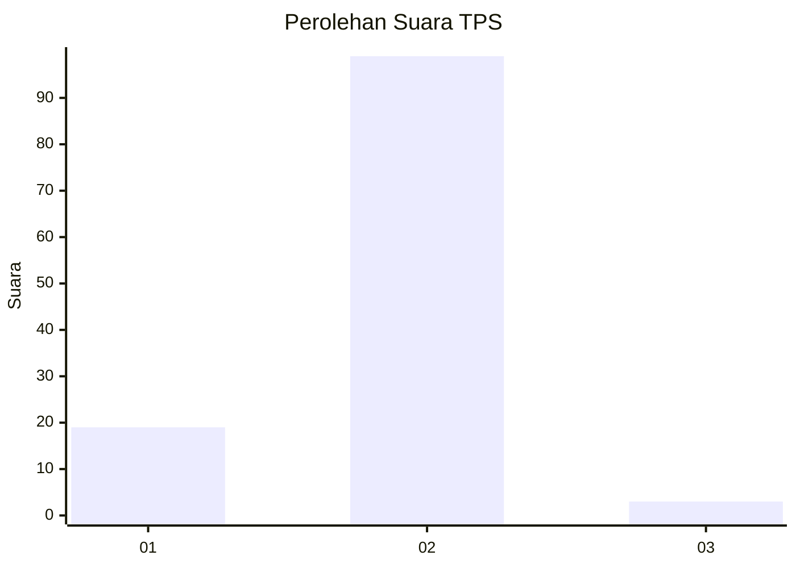
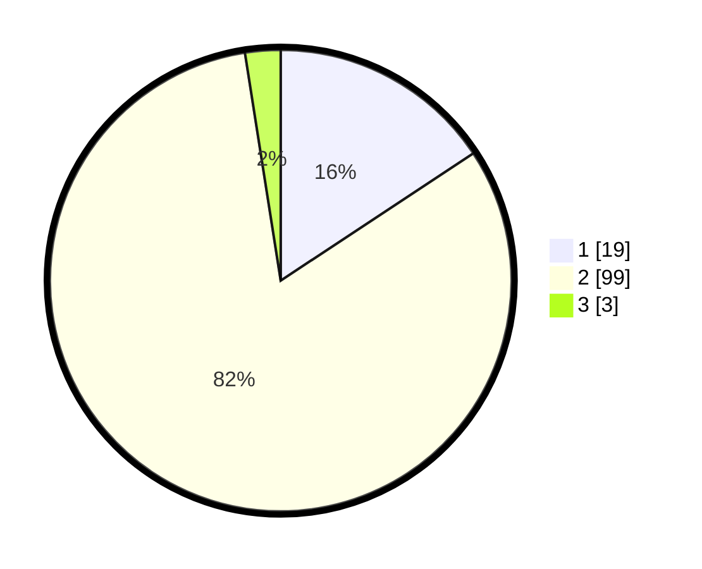

# Hasil

## Grafik

## Tabel

| No. | Nama Paslon    | Suara | Suara (raw) | Persentase |
|:--- |:-------------- | -----:| -----------:| ----------:|
| 1   | ANIES MUHAIMIN | 19    | [19][p-1]   | 15,70      |
| 2   | PRABOWO GIBRAN | 99    | [99][p-2]   | 81,82      |
| 3   | GANJAR MAHFUD  | 3     | [3][p-3]    | 2,48       |

[p-1]: https://github.com/gigit-pemilu/pemilu-2024-16-sumatera-selatan/blob/main/pilpres/hitung-suara/sub/16-sumatera-selatan/sub/04-lahat/sub/22-pagar-gunung/sub/2009-sawah-darat/sub/001-tps/sub/paslon-1.txt
[p-2]: https://github.com/gigit-pemilu/pemilu-2024-16-sumatera-selatan/blob/main/pilpres/hitung-suara/sub/16-sumatera-selatan/sub/04-lahat/sub/22-pagar-gunung/sub/2009-sawah-darat/sub/001-tps/sub/paslon-2.txt
[p-3]: https://github.com/gigit-pemilu/pemilu-2024-16-sumatera-selatan/blob/main/pilpres/hitung-suara/sub/16-sumatera-selatan/sub/04-lahat/sub/22-pagar-gunung/sub/2009-sawah-darat/sub/001-tps/sub/paslon-3.txt

## Foto C Plano

https://sirekap-obj-formc.kpu.go.id/226c/pemilu/ppwp/16/04/22/20/09/1604222009001-20240215-042846--bc634ed8-9bd9-43c9-a184-61e65c1a941d.jpg

https://sirekap-obj-formc.kpu.go.id/226c/pemilu/ppwp/16/04/22/20/09/1604222009001-20240215-043008--38739c52-e8d0-4885-81ea-7006d00ddbe1.jpg

https://sirekap-obj-formc.kpu.go.id/226c/pemilu/ppwp/16/04/22/20/09/1604222009001-20240215-043204--fe3becbb-4e47-4098-9731-d87d47f54db6.jpg

## Metadata

| Key        | Value               |
| ---------- | ------------------- |
| Time Stamp | 2024-02-15 21:30:27 |

