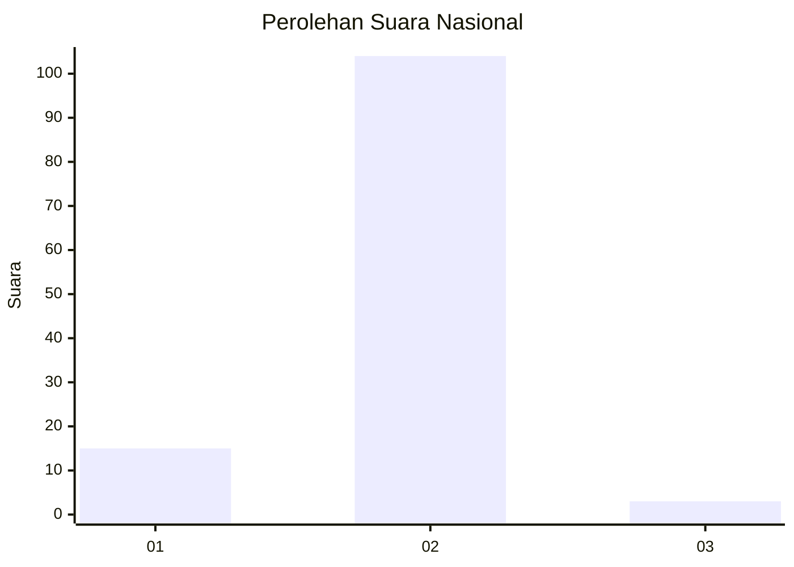
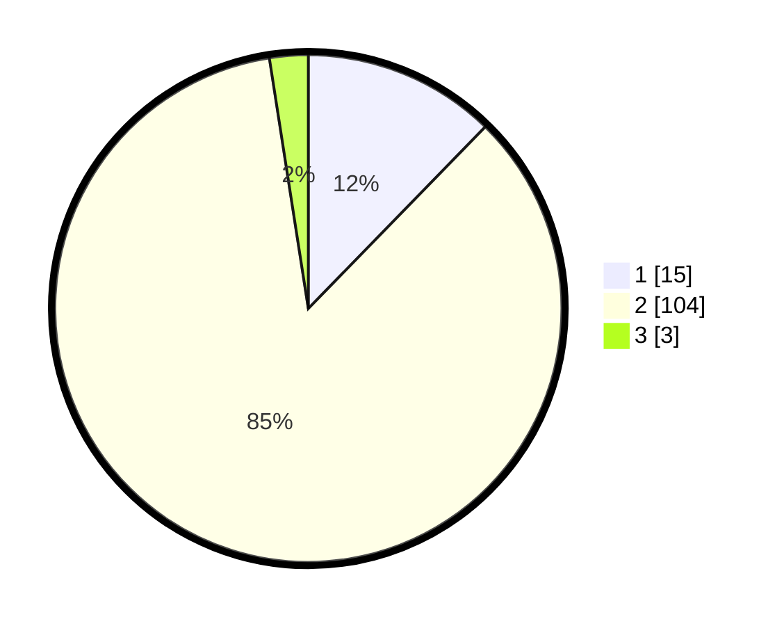

# Hasil

## Grafik

## Tabel

| No. | Nama Paslon    | Suara | Suara (raw) | Persentase |
|:--- |:-------------- | -----:| -----------:| ----------:|
| 1   | ANIES MUHAIMIN | 15    | [15][p-1]   | 12,30      |
| 2   | PRABOWO GIBRAN | 104   | [104][p-2]  | 85,25      |
| 3   | GANJAR MAHFUD  | 3     | [3][p-3]    | 2,46       |

[p-1]: https://github.com/gigit-pemilu/pemilu-2024/blob/main/pilpres/hitung-suara/sub/16-sumatera-selatan/sub/04-lahat/sub/22-pagar-gunung/sub/2009-sawah-darat/sub/002-tps/sub/paslon-1.txt
[p-2]: https://github.com/gigit-pemilu/pemilu-2024/blob/main/pilpres/hitung-suara/sub/16-sumatera-selatan/sub/04-lahat/sub/22-pagar-gunung/sub/2009-sawah-darat/sub/002-tps/sub/paslon-2.txt
[p-3]: https://github.com/gigit-pemilu/pemilu-2024/blob/main/pilpres/hitung-suara/sub/16-sumatera-selatan/sub/04-lahat/sub/22-pagar-gunung/sub/2009-sawah-darat/sub/002-tps/sub/paslon-3.txt

## Foto C Plano

https://sirekap-obj-formc.kpu.go.id/03fb/pemilu/ppwp/16/04/22/20/09/1604222009002-20240215-034402--ff45d9ef-5b4b-4df7-b60b-f2d98bb721e4.jpg

https://sirekap-obj-formc.kpu.go.id/03fb/pemilu/ppwp/16/04/22/20/09/1604222009002-20240215-033523--716fcec2-9f2f-415f-99c6-ebf587f6a8a6.jpg

https://sirekap-obj-formc.kpu.go.id/03fb/pemilu/ppwp/16/04/22/20/09/1604222009002-20240215-034212--803981eb-de11-4ccf-969c-d78baa01f965.jpg

## Metadata

| Key        | Value               |
| ---------- | ------------------- |
| Time Stamp | 2024-02-15 15:00:29 |

