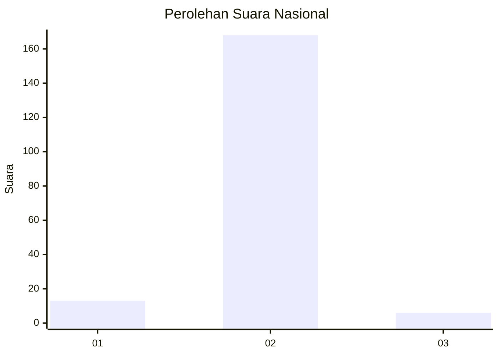
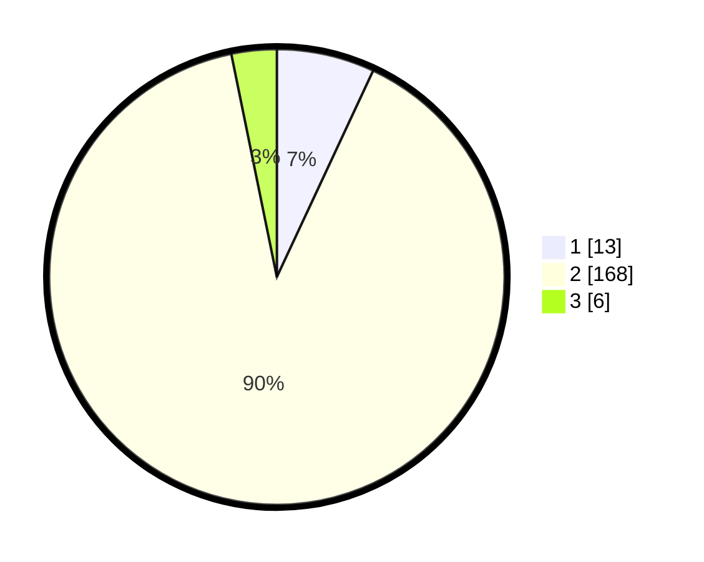

# Hasil

## Grafik

## Tabel

| No. | Nama Paslon    | Suara | Suara (raw) | Persentase |
|:--- |:-------------- | -----:| -----------:| ----------:|
| 1   | ANIES MUHAIMIN | 13    | [13][p-1]   | 6,95       |
| 2   | PRABOWO GIBRAN | 168   | [168][p-2]  | 89,84      |
| 3   | GANJAR MAHFUD  | 6     | [6][p-3]    | 3,21       |

[p-1]: https://github.com/gigit-pemilu/pemilu-2024/blob/main/pilpres/hitung-suara/sub/16-sumatera-selatan/sub/04-lahat/sub/22-pagar-gunung/sub/2011-siring-agung/sub/002-tps/sub/paslon-1.txt
[p-2]: https://github.com/gigit-pemilu/pemilu-2024/blob/main/pilpres/hitung-suara/sub/16-sumatera-selatan/sub/04-lahat/sub/22-pagar-gunung/sub/2011-siring-agung/sub/002-tps/sub/paslon-2.txt
[p-3]: https://github.com/gigit-pemilu/pemilu-2024/blob/main/pilpres/hitung-suara/sub/16-sumatera-selatan/sub/04-lahat/sub/22-pagar-gunung/sub/2011-siring-agung/sub/002-tps/sub/paslon-3.txt

## Foto C Plano

https://sirekap-obj-formc.kpu.go.id/24a8/pemilu/ppwp/16/04/22/20/11/1604222011002-20240221-231943--e04e568a-1079-4e55-bf66-e4e4b44c9125.jpg

https://sirekap-obj-formc.kpu.go.id/24a8/pemilu/ppwp/16/04/22/20/11/1604222011002-20240221-232057--25785f84-42c9-44e0-ab94-f1cda1b247a4.jpg

https://sirekap-obj-formc.kpu.go.id/24a8/pemilu/ppwp/16/04/22/20/11/1604222011002-20240221-232213--41fca4f7-8ee5-40d1-960c-64b39e5fd35f.jpg

## Metadata

| Key        | Value               |
| ---------- | ------------------- |
| Time Stamp | 2024-02-25 00:00:00 |

