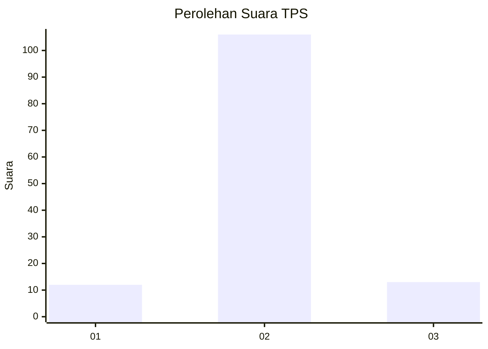
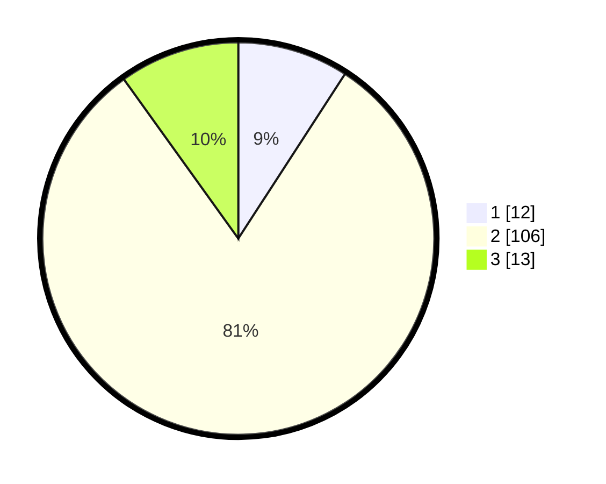

# Hasil

## Grafik

## Tabel

| No. | Nama Paslon    | Suara | Suara (raw) | Persentase |
|:--- |:-------------- | -----:| -----------:| ----------:|
| 1   | ANIES MUHAIMIN | 12    | [12][p-1]   | 9,16       |
| 2   | PRABOWO GIBRAN | 106   | [106][p-2]  | 80,92      |
| 3   | GANJAR MAHFUD  | 13    | [13][p-3]   | 9,92       |

[p-1]: https://github.com/gigit-pemilu/pemilu-2024-16-sumatera-selatan/blob/main/pilpres/hitung-suara/sub/16-sumatera-selatan/sub/04-lahat/sub/22-pagar-gunung/sub/2013-rimba-sujud/sub/002-tps/sub/paslon-1.txt
[p-2]: https://github.com/gigit-pemilu/pemilu-2024-16-sumatera-selatan/blob/main/pilpres/hitung-suara/sub/16-sumatera-selatan/sub/04-lahat/sub/22-pagar-gunung/sub/2013-rimba-sujud/sub/002-tps/sub/paslon-2.txt
[p-3]: https://github.com/gigit-pemilu/pemilu-2024-16-sumatera-selatan/blob/main/pilpres/hitung-suara/sub/16-sumatera-selatan/sub/04-lahat/sub/22-pagar-gunung/sub/2013-rimba-sujud/sub/002-tps/sub/paslon-3.txt

## Foto C Plano

https://sirekap-obj-formc.kpu.go.id/7069/pemilu/ppwp/16/04/22/20/13/1604222013002-20240215-000337--a7f48e9f-cfae-4b2a-88d4-d3e56cefe56f.jpg

https://sirekap-obj-formc.kpu.go.id/7069/pemilu/ppwp/16/04/22/20/13/1604222013002-20240215-025058--40f668f1-4911-41d5-96b5-626c9cf609b2.jpg

https://sirekap-obj-formc.kpu.go.id/7069/pemilu/ppwp/16/04/22/20/13/1604222013002-20240215-025307--4a2ada05-a130-4dad-9c42-60ab6c175bcf.jpg

## Metadata

| Key        | Value               |
| ---------- | ------------------- |
| Time Stamp | 2024-02-25 01:00:00 |

