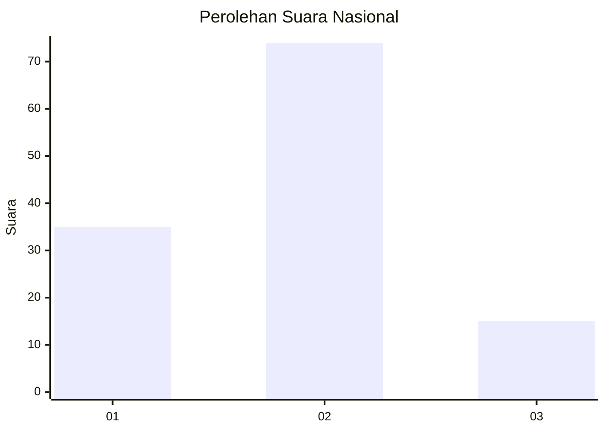
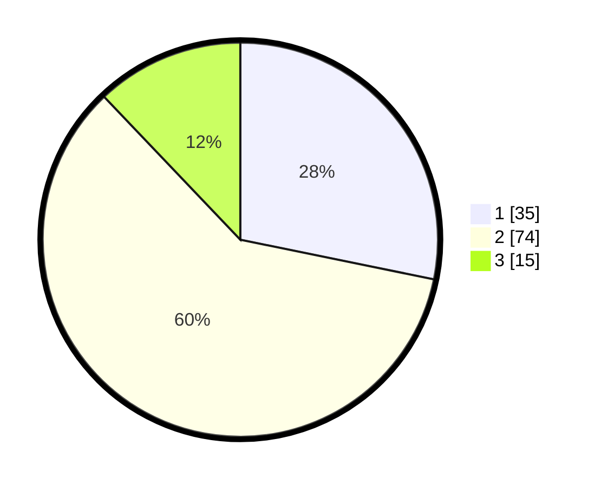

# Hasil

## Grafik

## Tabel

| No. | Nama Paslon    | Suara | Suara (raw) | Persentase |
|:--- |:-------------- | -----:| -----------:| ----------:|
| 1   | ANIES MUHAIMIN | 35    | [35][p-1]   | 28,23      |
| 2   | PRABOWO GIBRAN | 74    | [74][p-2]   | 59,68      |
| 3   | GANJAR MAHFUD  | 15    | [15][p-3]   | 12,10      |

[p-1]: https://github.com/gigit-pemilu/pemilu-2024/blob/main/pilpres/hitung-suara/sub/16-sumatera-selatan/sub/04-lahat/sub/22-pagar-gunung/sub/2014-germidar-ilir/sub/002-tps/sub/paslon-1.txt
[p-2]: https://github.com/gigit-pemilu/pemilu-2024/blob/main/pilpres/hitung-suara/sub/16-sumatera-selatan/sub/04-lahat/sub/22-pagar-gunung/sub/2014-germidar-ilir/sub/002-tps/sub/paslon-2.txt
[p-3]: https://github.com/gigit-pemilu/pemilu-2024/blob/main/pilpres/hitung-suara/sub/16-sumatera-selatan/sub/04-lahat/sub/22-pagar-gunung/sub/2014-germidar-ilir/sub/002-tps/sub/paslon-3.txt

## Foto C Plano

https://sirekap-obj-formc.kpu.go.id/cf45/pemilu/ppwp/16/04/22/20/14/1604222014002-20240220-151815--41544d00-5de7-4d66-a54f-f08f8295a635.jpg

https://sirekap-obj-formc.kpu.go.id/cf45/pemilu/ppwp/16/04/22/20/14/1604222014002-20240220-151917--ef2d393c-b4fa-479c-b405-7e60f0dcd7df.jpg

https://sirekap-obj-formc.kpu.go.id/cf45/pemilu/ppwp/16/04/22/20/14/1604222014002-20240220-152008--6222748f-d188-486b-9911-b69770930150.jpg

## Metadata

| Key        | Value               |
| ---------- | ------------------- |
| Time Stamp | 2024-02-25 09:00:00 |

