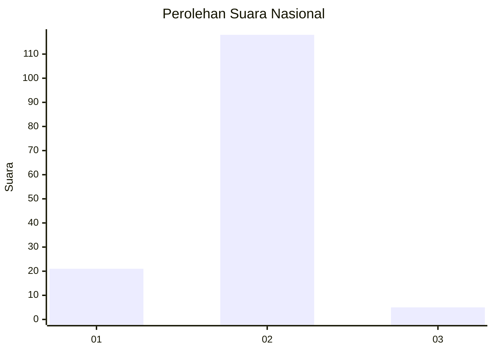
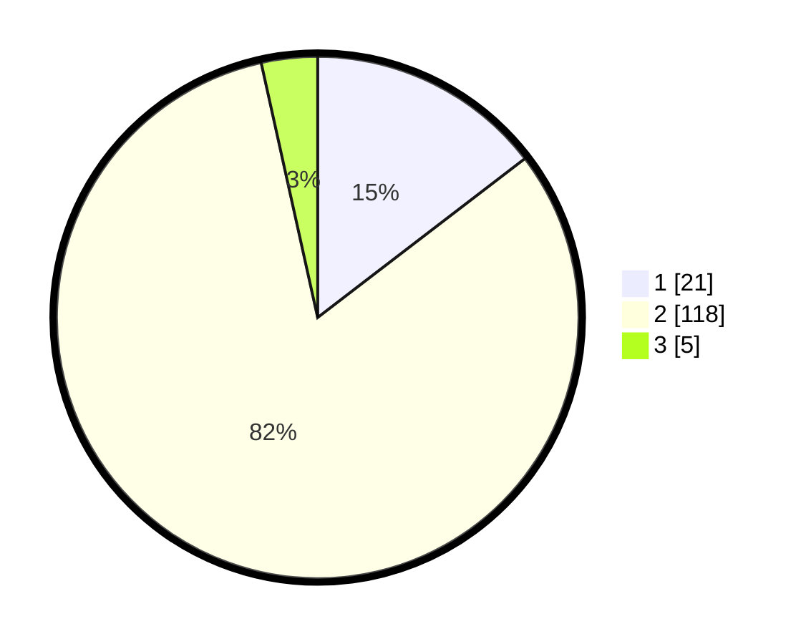

# Hasil

## Grafik

## Tabel

| No. | Nama Paslon    | Suara | Suara (raw) | Persentase |
|:--- |:-------------- | -----:| -----------:| ----------:|
| 1   | ANIES MUHAIMIN | 21    | [21][p-1]   | 14,58      |
| 2   | PRABOWO GIBRAN | 118   | [118][p-2]  | 81,94      |
| 3   | GANJAR MAHFUD  | 5     | [5][p-3]    | 3,47       |

[p-1]: https://github.com/gigit-pemilu/pemilu-2024/blob/main/pilpres/hitung-suara/sub/16-sumatera-selatan/sub/04-lahat/sub/22-pagar-gunung/sub/2016-germidar-ulu/sub/001-tps/sub/paslon-1.txt
[p-2]: https://github.com/gigit-pemilu/pemilu-2024/blob/main/pilpres/hitung-suara/sub/16-sumatera-selatan/sub/04-lahat/sub/22-pagar-gunung/sub/2016-germidar-ulu/sub/001-tps/sub/paslon-2.txt
[p-3]: https://github.com/gigit-pemilu/pemilu-2024/blob/main/pilpres/hitung-suara/sub/16-sumatera-selatan/sub/04-lahat/sub/22-pagar-gunung/sub/2016-germidar-ulu/sub/001-tps/sub/paslon-3.txt

## Foto C Plano

https://sirekap-obj-formc.kpu.go.id/d21f/pemilu/ppwp/16/04/22/20/16/1604222016001-20240221-154221--46f0ddbd-f926-48ce-b09f-3f39d8e7f203.jpg

https://sirekap-obj-formc.kpu.go.id/d21f/pemilu/ppwp/16/04/22/20/16/1604222016001-20240221-154256--3aa6b243-a575-4188-83b4-aeb18ce39c3f.jpg

https://sirekap-obj-formc.kpu.go.id/d21f/pemilu/ppwp/16/04/22/20/16/1604222016001-20240221-154341--079f85dd-08df-4d66-b55d-71d0b989b2cd.jpg

## Metadata

| Key        | Value               |
| ---------- | ------------------- |
| Time Stamp | 2024-02-26 12:00:00 |

