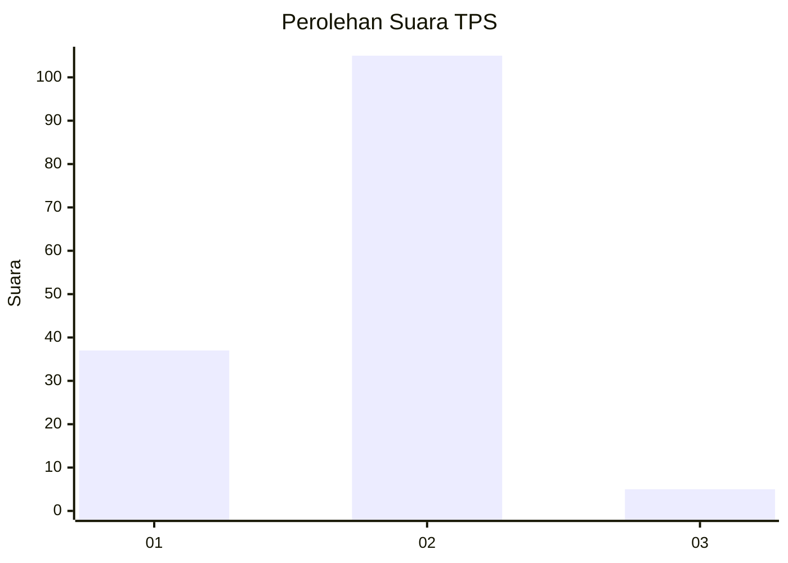
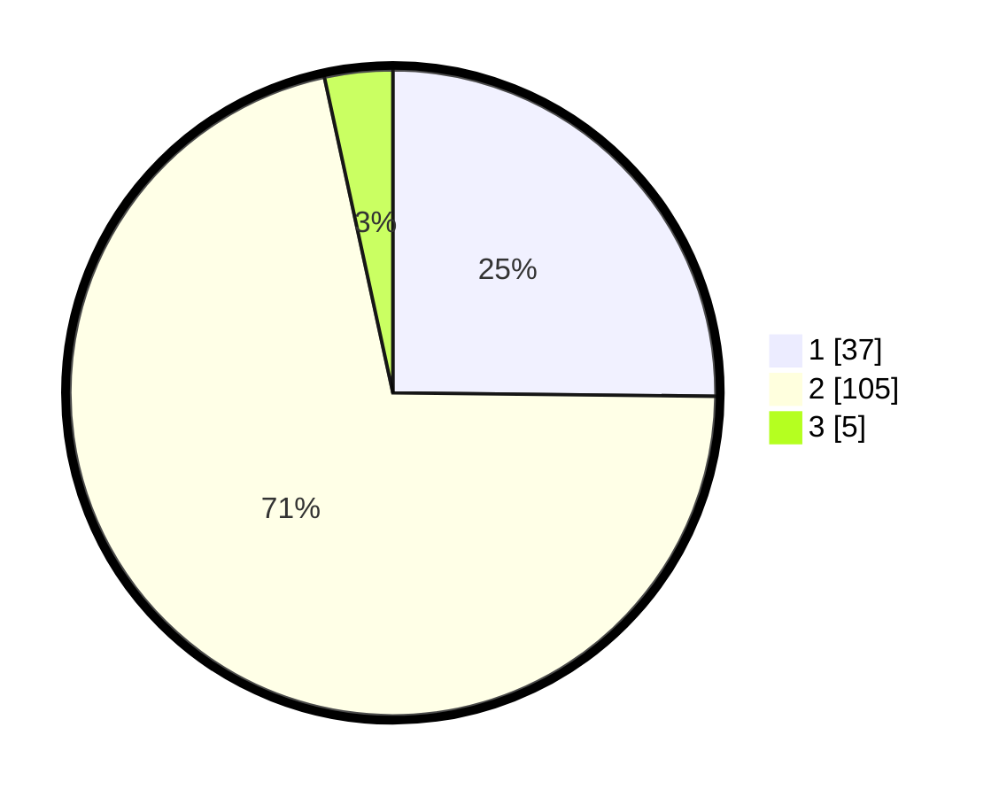

# Hasil

## Grafik

## Tabel

| No. | Nama Paslon    | Suara | Suara (raw) | Persentase |
|:--- |:-------------- | -----:| -----------:| ----------:|
| 1   | ANIES MUHAIMIN | 37    | [37][p-1]   | 25,17      |
| 2   | PRABOWO GIBRAN | 105   | [105][p-2]  | 71,43      |
| 3   | GANJAR MAHFUD  | 5     | [5][p-3]    | 3,40       |

[p-1]: https://github.com/gigit-pemilu/pemilu-2024-16-sumatera-selatan/blob/main/pilpres/hitung-suara/sub/16-sumatera-selatan/sub/04-lahat/sub/22-pagar-gunung/sub/2016-germidar-ulu/sub/002-tps/sub/paslon-1.txt
[p-2]: https://github.com/gigit-pemilu/pemilu-2024-16-sumatera-selatan/blob/main/pilpres/hitung-suara/sub/16-sumatera-selatan/sub/04-lahat/sub/22-pagar-gunung/sub/2016-germidar-ulu/sub/002-tps/sub/paslon-2.txt
[p-3]: https://github.com/gigit-pemilu/pemilu-2024-16-sumatera-selatan/blob/main/pilpres/hitung-suara/sub/16-sumatera-selatan/sub/04-lahat/sub/22-pagar-gunung/sub/2016-germidar-ulu/sub/002-tps/sub/paslon-3.txt

## Foto C Plano

https://sirekap-obj-formc.kpu.go.id/664e/pemilu/ppwp/16/04/22/20/16/1604222016002-20240221-163855--49fc0d99-94de-4731-b807-f921a5f6e1ec.jpg

https://sirekap-obj-formc.kpu.go.id/664e/pemilu/ppwp/16/04/22/20/16/1604222016002-20240221-163939--a855f4ba-f850-4375-8871-bfe8ccb5fe8b.jpg

https://sirekap-obj-formc.kpu.go.id/664e/pemilu/ppwp/16/04/22/20/16/1604222016002-20240221-164025--2661a11b-c78c-4c27-a757-a541399f7475.jpg

## Metadata

| Key        | Value               |
| ---------- | ------------------- |
| Time Stamp | 2024-02-24 22:31:28 |

