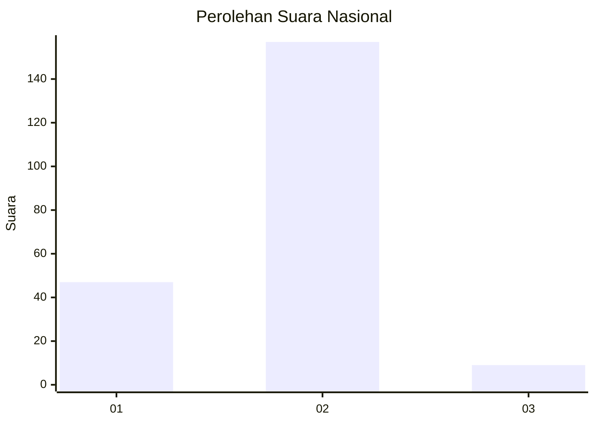
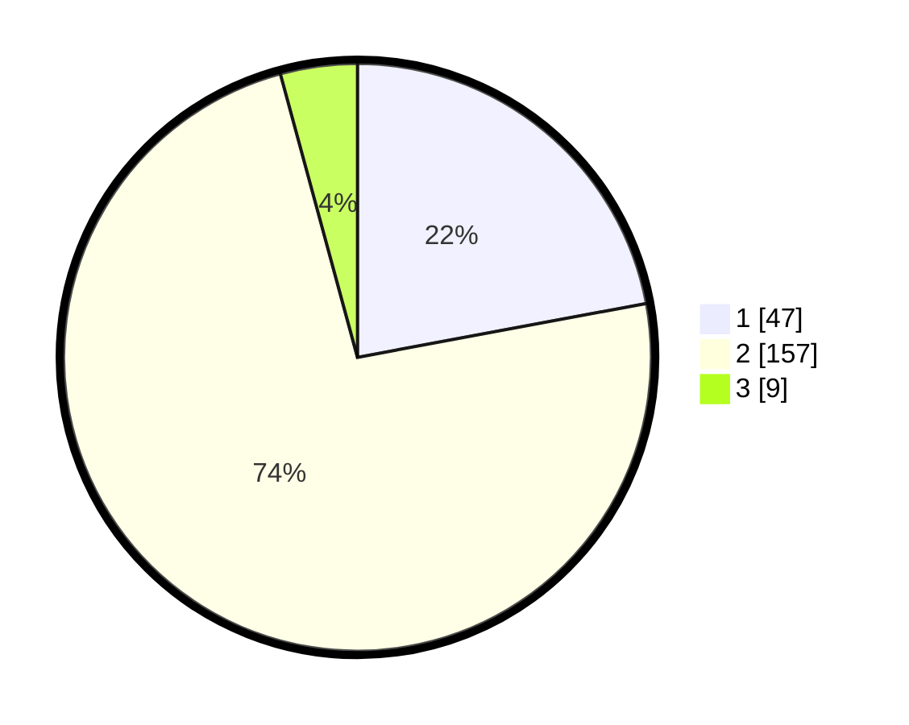

# Hasil

## Grafik

## Tabel

| No. | Nama Paslon    | Suara | Suara (raw) | Persentase |
|:--- |:-------------- | -----:| -----------:| ----------:|
| 1   | ANIES MUHAIMIN | 47    | [47][p-1]   | 22,07      |
| 2   | PRABOWO GIBRAN | 157   | [157][p-2]  | 73,71      |
| 3   | GANJAR MAHFUD  | 9     | [9][p-3]    | 4,23       |

[p-1]: https://github.com/gigit-pemilu/pemilu-2024/blob/main/pilpres/hitung-suara/sub/16-sumatera-selatan/sub/04-lahat/sub/22-pagar-gunung/sub/2017-padang-pagun/sub/003-tps/sub/paslon-1.txt
[p-2]: https://github.com/gigit-pemilu/pemilu-2024/blob/main/pilpres/hitung-suara/sub/16-sumatera-selatan/sub/04-lahat/sub/22-pagar-gunung/sub/2017-padang-pagun/sub/003-tps/sub/paslon-2.txt
[p-3]: https://github.com/gigit-pemilu/pemilu-2024/blob/main/pilpres/hitung-suara/sub/16-sumatera-selatan/sub/04-lahat/sub/22-pagar-gunung/sub/2017-padang-pagun/sub/003-tps/sub/paslon-3.txt

## Foto C Plano

https://sirekap-obj-formc.kpu.go.id/4771/pemilu/ppwp/16/04/22/20/17/1604222017003-20240222-103423--ff410219-d67b-4ba5-9bf5-e9499dc7c32e.jpg

https://sirekap-obj-formc.kpu.go.id/4771/pemilu/ppwp/16/04/22/20/17/1604222017003-20240222-103452--652b27ef-b7e1-42ee-a35a-1c6a87603e7d.jpg

https://sirekap-obj-formc.kpu.go.id/4771/pemilu/ppwp/16/04/22/20/17/1604222017003-20240222-103536--4e1a27d0-9735-43bf-bc34-dfc79efa77cd.jpg

## Metadata

| Key        | Value               |
| ---------- | ------------------- |
| Time Stamp | 2024-02-25 18:00:00 |

