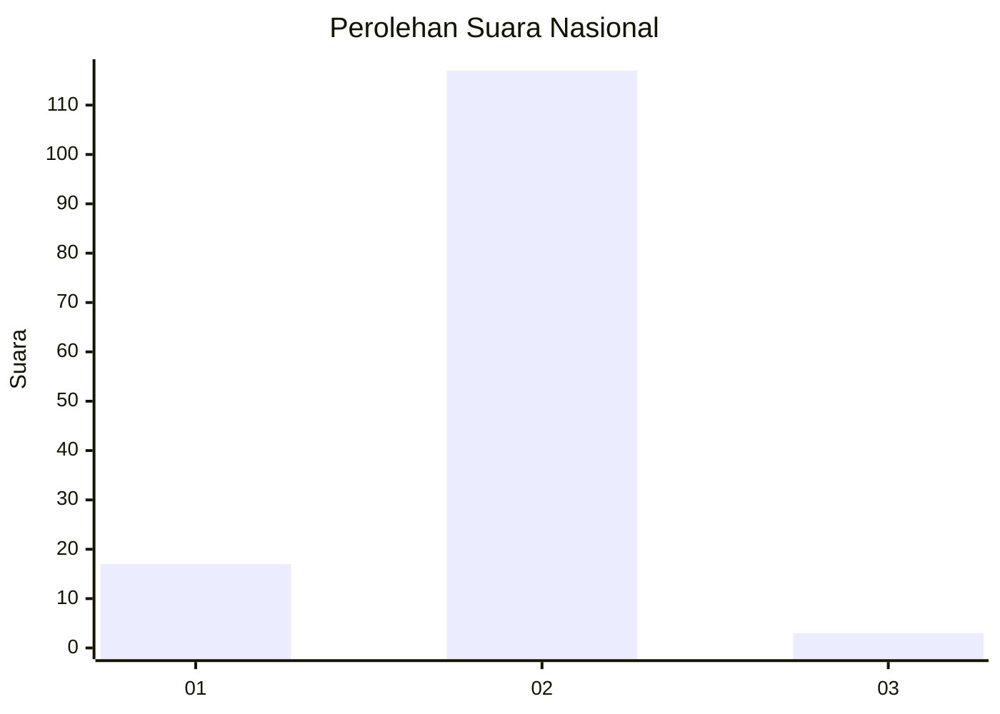
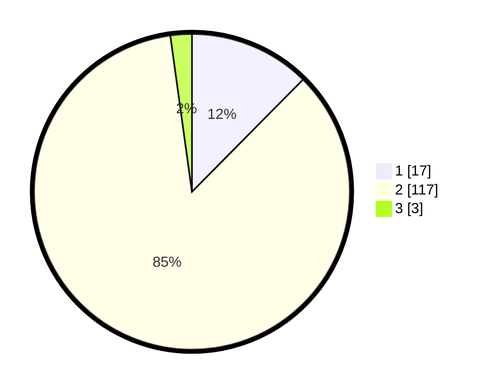

# Hasil

## Grafik

## Tabel

| No. | Nama Paslon    | Suara | Suara (raw) | Persentase |
|:--- |:-------------- | -----:| -----------:| ----------:|
| 1   | ANIES MUHAIMIN | 17    | [17][p-1]   | 12,41      |
| 2   | PRABOWO GIBRAN | 117   | [117][p-2]  | 85,40      |
| 3   | GANJAR MAHFUD  | 3     | [3][p-3]    | 2,19       |

[p-1]: https://github.com/gigit-pemilu/pemilu-2024/blob/main/pilpres/hitung-suara/sub/16-sumatera-selatan/sub/04-lahat/sub/22-pagar-gunung/sub/2020-merindu/sub/001-tps/sub/paslon-1.txt
[p-2]: https://github.com/gigit-pemilu/pemilu-2024/blob/main/pilpres/hitung-suara/sub/16-sumatera-selatan/sub/04-lahat/sub/22-pagar-gunung/sub/2020-merindu/sub/001-tps/sub/paslon-2.txt
[p-3]: https://github.com/gigit-pemilu/pemilu-2024/blob/main/pilpres/hitung-suara/sub/16-sumatera-selatan/sub/04-lahat/sub/22-pagar-gunung/sub/2020-merindu/sub/001-tps/sub/paslon-3.txt

## Foto C Plano

https://sirekap-obj-formc.kpu.go.id/7b3a/pemilu/ppwp/16/04/22/20/20/1604222020001-20240220-224548--b5ce6245-4967-4b4e-958d-d9852dc89f2b.jpg

https://sirekap-obj-formc.kpu.go.id/7b3a/pemilu/ppwp/16/04/22/20/20/1604222020001-20240220-225025--91fef62b-5ab8-4742-8e99-74ce676d5dd3.jpg

https://sirekap-obj-formc.kpu.go.id/7b3a/pemilu/ppwp/16/04/22/20/20/1604222020001-20240220-224727--c15b8119-210c-4ef3-a489-574cc38a17c6.jpg

## Metadata

| Key        | Value               |
| ---------- | ------------------- |
| Time Stamp | 2024-02-25 11:00:00 |

