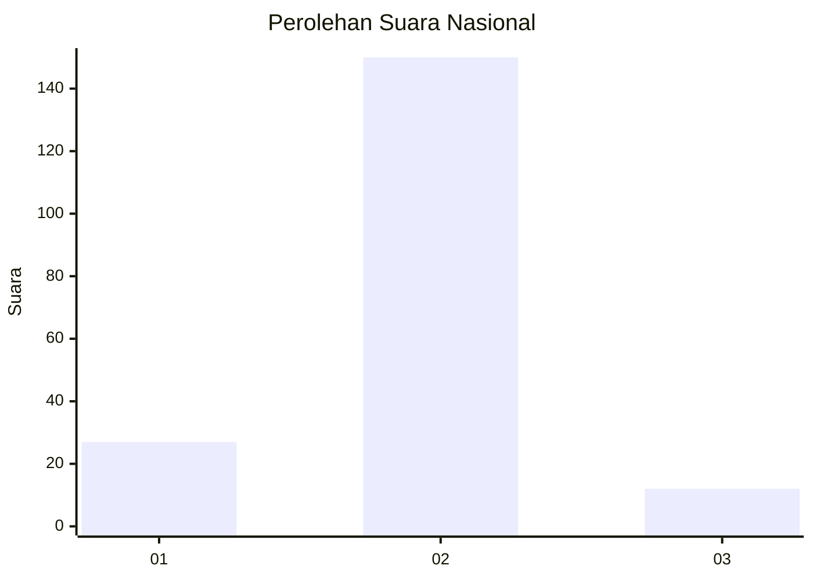
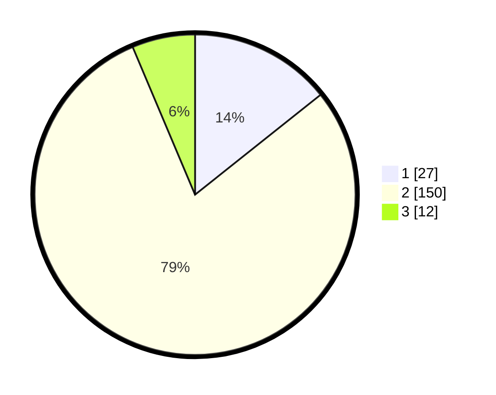

# Hasil

## Grafik

## Tabel

| No. | Nama Paslon    | Suara | Suara (raw) | Persentase |
|:--- |:-------------- | -----:| -----------:| ----------:|
| 1   | ANIES MUHAIMIN | 27    | [27][p-1]   | 14,29      |
| 2   | PRABOWO GIBRAN | 150   | [150][p-2]  | 79,37      |
| 3   | GANJAR MAHFUD  | 12    | [12][p-3]   | 6,35       |

[p-1]: https://github.com/gigit-pemilu/pemilu-2024/blob/main/pilpres/hitung-suara/sub/16-sumatera-selatan/sub/04-lahat/sub/24-tanjung-sakti-pumi/sub/2003-gunung-kembang/sub/002-tps/sub/paslon-1.txt
[p-2]: https://github.com/gigit-pemilu/pemilu-2024/blob/main/pilpres/hitung-suara/sub/16-sumatera-selatan/sub/04-lahat/sub/24-tanjung-sakti-pumi/sub/2003-gunung-kembang/sub/002-tps/sub/paslon-2.txt
[p-3]: https://github.com/gigit-pemilu/pemilu-2024/blob/main/pilpres/hitung-suara/sub/16-sumatera-selatan/sub/04-lahat/sub/24-tanjung-sakti-pumi/sub/2003-gunung-kembang/sub/002-tps/sub/paslon-3.txt

## Foto C Plano

https://sirekap-obj-formc.kpu.go.id/0264/pemilu/ppwp/16/04/24/20/03/1604242003002-20240220-222347--d9da9ee7-d1e5-4143-96b0-bb0c4147a53e.jpg

https://sirekap-obj-formc.kpu.go.id/0264/pemilu/ppwp/16/04/24/20/03/1604242003002-20240220-222459--25714d05-2add-4518-b27a-5a733cb25edf.jpg

https://sirekap-obj-formc.kpu.go.id/0264/pemilu/ppwp/16/04/24/20/03/1604242003002-20240220-222802--97af32d8-0fa5-4f31-9ef7-9f79f22e8240.jpg

## Metadata

| Key        | Value               |
| ---------- | ------------------- |
| Time Stamp | 2024-02-25 14:00:00 |

