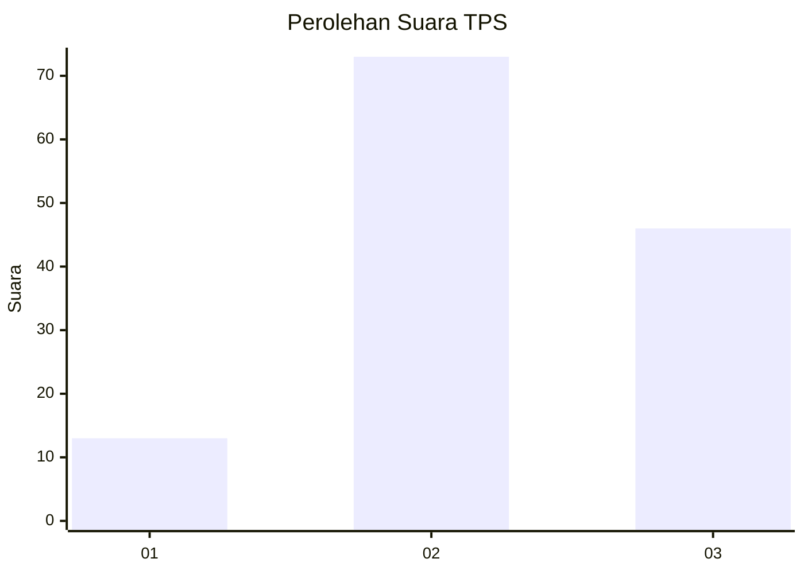
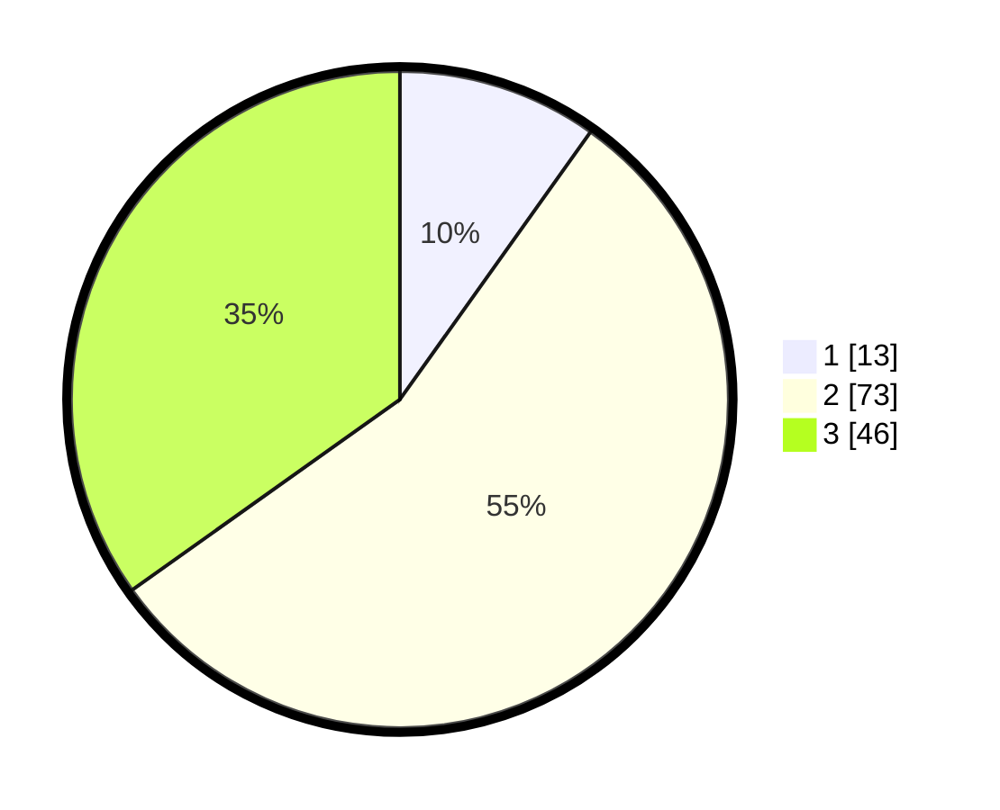

# Hasil

## Grafik

## Tabel

| No. | Nama Paslon    | Suara | Suara (raw) | Persentase |
|:--- |:-------------- | -----:| -----------:| ----------:|
| 1   | ANIES MUHAIMIN | 13    | [13][p-1]   | 9,85       |
| 2   | PRABOWO GIBRAN | 73    | [73][p-2]   | 55,30      |
| 3   | GANJAR MAHFUD  | 46    | [46][p-3]   | 34,85      |

[p-1]: https://github.com/gigit-pemilu/pemilu-2024-16-sumatera-selatan/blob/main/pilpres/hitung-suara/sub/16-sumatera-selatan/sub/04-lahat/sub/25-gumay-ulu/sub/2003-sinjar-bulan/sub/002-tps/sub/paslon-1.txt
[p-2]: https://github.com/gigit-pemilu/pemilu-2024-16-sumatera-selatan/blob/main/pilpres/hitung-suara/sub/16-sumatera-selatan/sub/04-lahat/sub/25-gumay-ulu/sub/2003-sinjar-bulan/sub/002-tps/sub/paslon-2.txt
[p-3]: https://github.com/gigit-pemilu/pemilu-2024-16-sumatera-selatan/blob/main/pilpres/hitung-suara/sub/16-sumatera-selatan/sub/04-lahat/sub/25-gumay-ulu/sub/2003-sinjar-bulan/sub/002-tps/sub/paslon-3.txt

## Foto C Plano

https://sirekap-obj-formc.kpu.go.id/5993/pemilu/ppwp/16/04/25/20/03/1604252003002-20240220-195211--bf575466-9ce0-4488-b208-4400196d813c.jpg

https://sirekap-obj-formc.kpu.go.id/5993/pemilu/ppwp/16/04/25/20/03/1604252003002-20240220-201517--3b152d12-eeba-4411-8c9a-5ef476825b79.jpg

https://sirekap-obj-formc.kpu.go.id/5993/pemilu/ppwp/16/04/25/20/03/1604252003002-20240220-201718--1ed1b5ef-f5ba-4c88-9649-e2a49256514a.jpg

## Metadata

| Key        | Value               |
| ---------- | ------------------- |
| Time Stamp | 2024-02-20 23:00:00 |

## DATA PEMILIH TETAP

Jumlah pemilih dalam DPT: **144**.
 * L: **76**.
 * P: **68**.

## DATA PENGGUNA HAK PILIH

Jumlah pengguna hak pilih dalam DPT: **129**.
 * L: **66**.
 * P: **63**.

Jumlah pengguna hak pilih dalam DPTb: **4**.
 * L: **2**.
 * P: **2**.

Jumlah pengguna hak pilih dalam DPK: **0**.
 * L: **0**.
 * P: **0**.

Jumlah pengguna hak pilih: **133**.
 * L: **68**.
 * P: **65**.

## JUMLAH SUARA SAH DAN TIDAK SAH

JUMLAH SELURUH SUARA SAH: **132**.

JUMLAH SUARA TIDAK SAH: **1**.

JUMLAH SELURUH SUARA SAH DAN SUARA TIDAK SAH: **133**.

