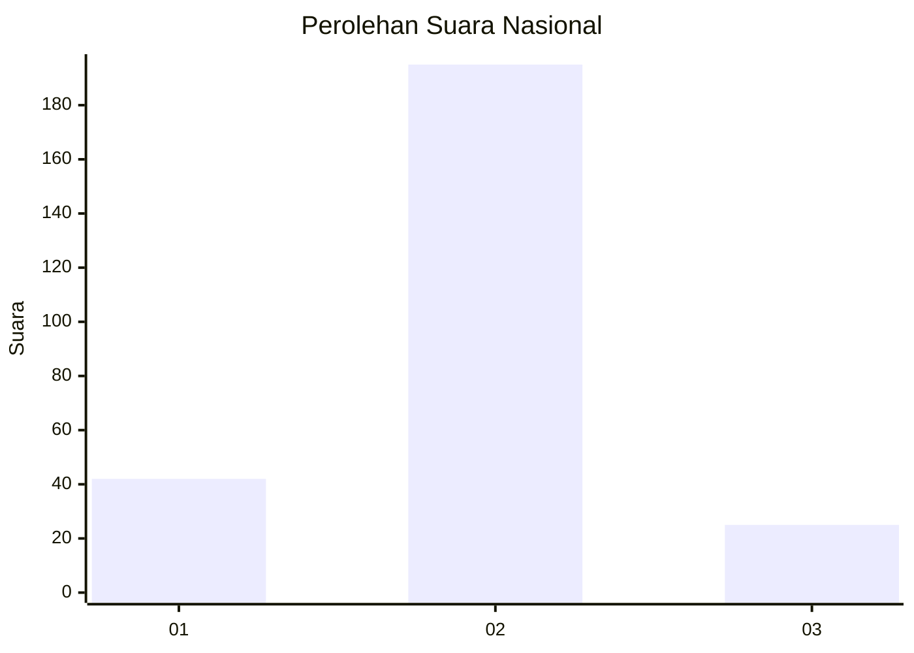
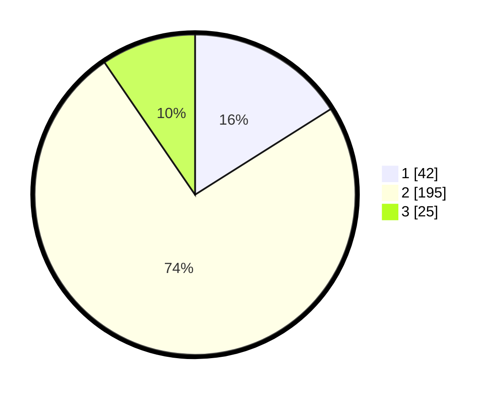

# Hasil

## Grafik

## Tabel

| No. | Nama Paslon    | Suara | Suara (raw) | Persentase |
|:--- |:-------------- | -----:| -----------:| ----------:|
| 1   | ANIES MUHAIMIN | 42    | [42][p-1]   | 16,03      |
| 2   | PRABOWO GIBRAN | 195   | [195][p-2]  | 74,43      |
| 3   | GANJAR MAHFUD  | 25    | [25][p-3]   | 9,54       |

[p-1]: https://github.com/gigit-pemilu/pemilu-2024/blob/main/pilpres/hitung-suara/sub/16-sumatera-selatan/sub/04-lahat/sub/26-merapi-selatan/sub/2008-perangai/sub/004-tps/sub/paslon-1.txt
[p-2]: https://github.com/gigit-pemilu/pemilu-2024/blob/main/pilpres/hitung-suara/sub/16-sumatera-selatan/sub/04-lahat/sub/26-merapi-selatan/sub/2008-perangai/sub/004-tps/sub/paslon-2.txt
[p-3]: https://github.com/gigit-pemilu/pemilu-2024/blob/main/pilpres/hitung-suara/sub/16-sumatera-selatan/sub/04-lahat/sub/26-merapi-selatan/sub/2008-perangai/sub/004-tps/sub/paslon-3.txt

## Foto C Plano

https://sirekap-obj-formc.kpu.go.id/2c77/pemilu/ppwp/16/04/26/20/08/1604262008004-20240215-114248--3de04cb7-b950-4459-85e1-f60352c7eb76.jpg

https://sirekap-obj-formc.kpu.go.id/2c77/pemilu/ppwp/16/04/26/20/08/1604262008004-20240215-114408--9d308746-093e-4d7b-b222-7336b4712f51.jpg

https://sirekap-obj-formc.kpu.go.id/2c77/pemilu/ppwp/16/04/26/20/08/1604262008004-20240215-114555--ec77f67e-5b5c-4330-97d3-fa33b3cdc9f6.jpg

## Metadata

| Key        | Value               |
| ---------- | ------------------- |
| Time Stamp | 2024-02-25 12:00:00 |

