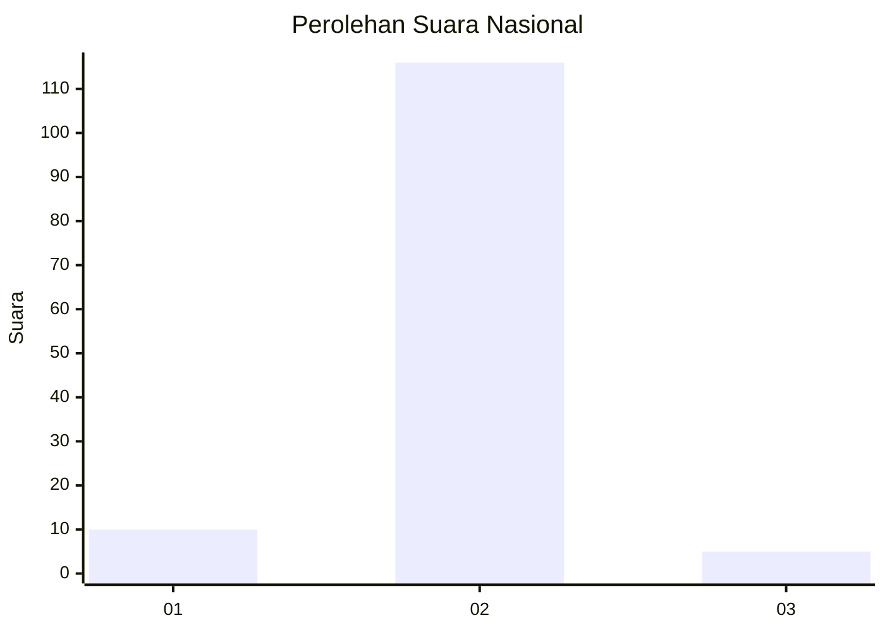
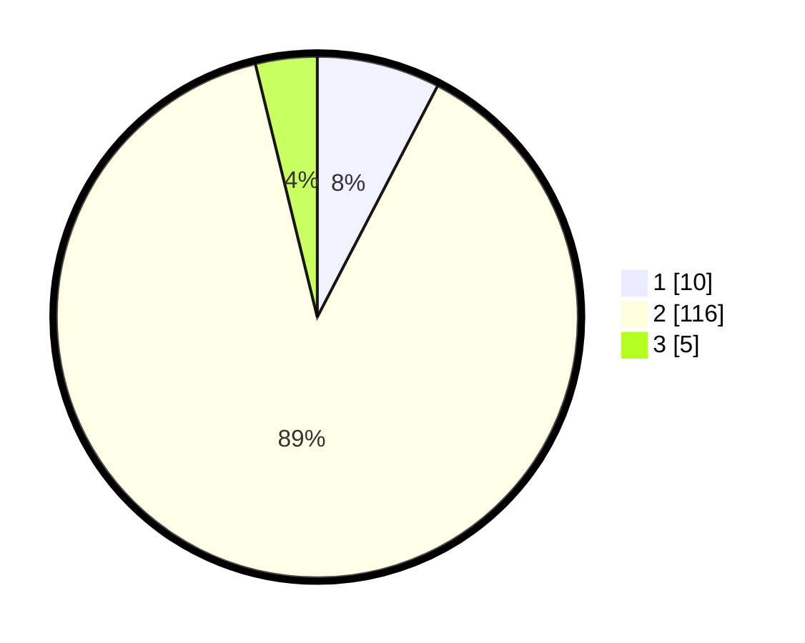

# Hasil

## Grafik

## Tabel

| No. | Nama Paslon    | Suara | Suara (raw) | Persentase |
|:--- |:-------------- | -----:| -----------:| ----------:|
| 1   | ANIES MUHAIMIN | 10    | [10][p-1]   | 7,63       |
| 2   | PRABOWO GIBRAN | 116   | [116][p-2]  | 88,55      |
| 3   | GANJAR MAHFUD  | 5     | [5][p-3]    | 3,82       |

[p-1]: https://github.com/gigit-pemilu/pemilu-2024/blob/main/pilpres/hitung-suara/sub/16-sumatera-selatan/sub/04-lahat/sub/27-tanjungtebat/sub/2001-pandan-arang-ilir/sub/002-tps/sub/paslon-1.txt
[p-2]: https://github.com/gigit-pemilu/pemilu-2024/blob/main/pilpres/hitung-suara/sub/16-sumatera-selatan/sub/04-lahat/sub/27-tanjungtebat/sub/2001-pandan-arang-ilir/sub/002-tps/sub/paslon-2.txt
[p-3]: https://github.com/gigit-pemilu/pemilu-2024/blob/main/pilpres/hitung-suara/sub/16-sumatera-selatan/sub/04-lahat/sub/27-tanjungtebat/sub/2001-pandan-arang-ilir/sub/002-tps/sub/paslon-3.txt

## Foto C Plano

https://sirekap-obj-formc.kpu.go.id/ed63/pemilu/ppwp/16/04/27/20/01/1604272001002-20240215-112441--9b0e6156-774e-4861-8777-d168d7634054.jpg

https://sirekap-obj-formc.kpu.go.id/ed63/pemilu/ppwp/16/04/27/20/01/1604272001002-20240215-113054--1e88dc0c-3dc6-4dd6-b3c0-df2a93a6bf8d.jpg

https://sirekap-obj-formc.kpu.go.id/ed63/pemilu/ppwp/16/04/27/20/01/1604272001002-20240215-114025--1f57c519-9cfa-4f57-96b3-7687637c1daf.jpg

## Metadata

| Key        | Value               |
| ---------- | ------------------- |
| Time Stamp | 2024-02-15 17:30:25 |

