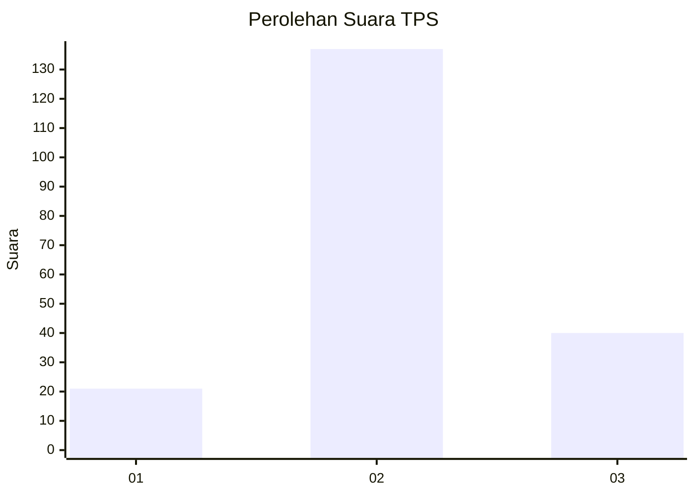
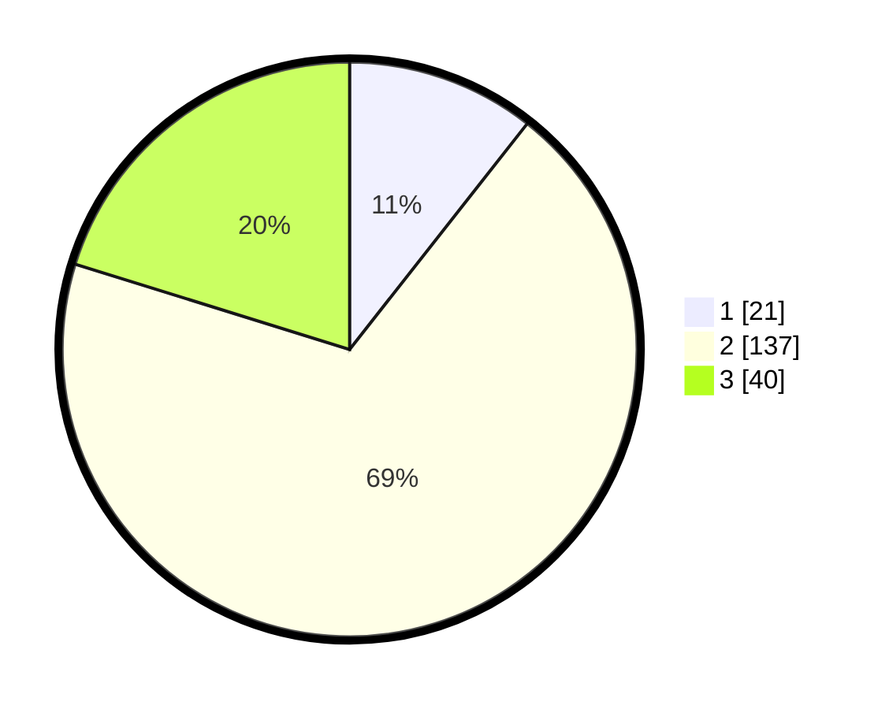

# Hasil

## Grafik

## Tabel

| No. | Nama Paslon    | Suara | Suara (raw) | Persentase |
|:--- |:-------------- | -----:| -----------:| ----------:|
| 1   | ANIES MUHAIMIN | 21    | [21][p-1]   | 10,61      |
| 2   | PRABOWO GIBRAN | 137   | [137][p-2]  | 69,19      |
| 3   | GANJAR MAHFUD  | 40    | [40][p-3]   | 20,20      |

[p-1]: https://github.com/gigit-pemilu/pemilu-2024-16-sumatera-selatan/blob/main/pilpres/hitung-suara/sub/16-sumatera-selatan/sub/04-lahat/sub/27-tanjungtebat/sub/2002-tanjung-kurung-ulu/sub/002-tps/sub/paslon-1.txt
[p-2]: https://github.com/gigit-pemilu/pemilu-2024-16-sumatera-selatan/blob/main/pilpres/hitung-suara/sub/16-sumatera-selatan/sub/04-lahat/sub/27-tanjungtebat/sub/2002-tanjung-kurung-ulu/sub/002-tps/sub/paslon-2.txt
[p-3]: https://github.com/gigit-pemilu/pemilu-2024-16-sumatera-selatan/blob/main/pilpres/hitung-suara/sub/16-sumatera-selatan/sub/04-lahat/sub/27-tanjungtebat/sub/2002-tanjung-kurung-ulu/sub/002-tps/sub/paslon-3.txt

## Foto C Plano

https://sirekap-obj-formc.kpu.go.id/3311/pemilu/ppwp/16/04/27/20/02/1604272002002-20240215-012607--f258fa60-ee25-46e2-98b6-6afc14ee7c3f.jpg

https://sirekap-obj-formc.kpu.go.id/3311/pemilu/ppwp/16/04/27/20/02/1604272002002-20240215-012915--357d3cb1-15ce-45c3-92d3-45d3de8b843b.jpg

https://sirekap-obj-formc.kpu.go.id/3311/pemilu/ppwp/16/04/27/20/02/1604272002002-20240215-034858--de4b4b63-9d96-4018-aa1c-fc9aa9d26842.jpg

## Metadata

| Key        | Value               |
| ---------- | ------------------- |
| Time Stamp | 2024-02-16 16:25:10 |

