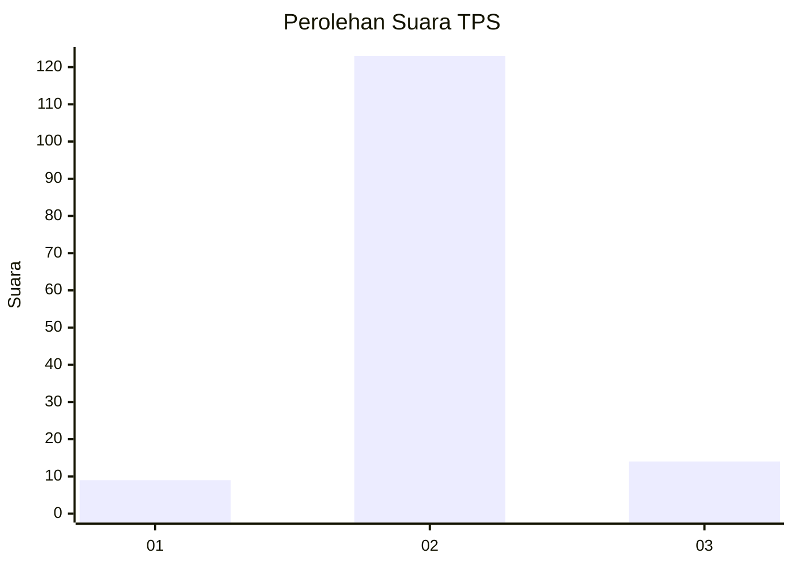
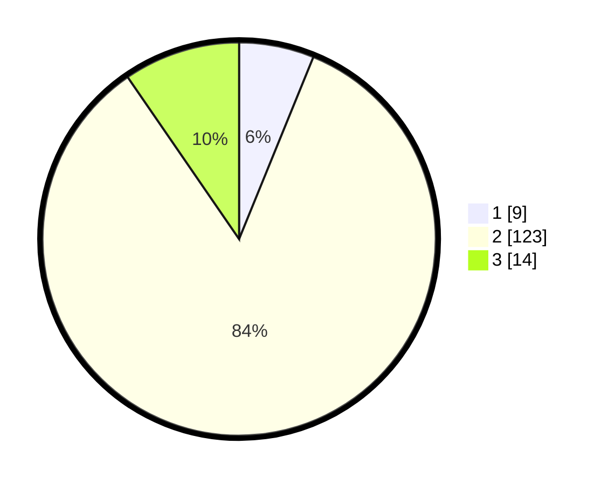

# Hasil

## Grafik

## Tabel

| No. | Nama Paslon    | Suara | Suara (raw) | Persentase |
|:--- |:-------------- | -----:| -----------:| ----------:|
| 1   | ANIES MUHAIMIN | 9     | [9][p-1]    | 6,16       |
| 2   | PRABOWO GIBRAN | 123   | [123][p-2]  | 84,25      |
| 3   | GANJAR MAHFUD  | 14    | [14][p-3]   | 9,59       |

[p-1]: https://github.com/gigit-pemilu/pemilu-2024-16-sumatera-selatan/blob/main/pilpres/hitung-suara/sub/16-sumatera-selatan/sub/04-lahat/sub/27-tanjungtebat/sub/2005-tanjung-nibung/sub/002-tps/sub/paslon-1.txt
[p-2]: https://github.com/gigit-pemilu/pemilu-2024-16-sumatera-selatan/blob/main/pilpres/hitung-suara/sub/16-sumatera-selatan/sub/04-lahat/sub/27-tanjungtebat/sub/2005-tanjung-nibung/sub/002-tps/sub/paslon-2.txt
[p-3]: https://github.com/gigit-pemilu/pemilu-2024-16-sumatera-selatan/blob/main/pilpres/hitung-suara/sub/16-sumatera-selatan/sub/04-lahat/sub/27-tanjungtebat/sub/2005-tanjung-nibung/sub/002-tps/sub/paslon-3.txt

## Foto C Plano

https://sirekap-obj-formc.kpu.go.id/ff07/pemilu/ppwp/16/04/27/20/05/1604272005002-20240214-210754--47d9aa70-93d7-486b-82be-1e183fc5dd6a.jpg

https://sirekap-obj-formc.kpu.go.id/ff07/pemilu/ppwp/16/04/27/20/05/1604272005002-20240214-211556--f9ca8674-f592-4c72-858d-cf42b0c7e9cc.jpg

https://sirekap-obj-formc.kpu.go.id/ff07/pemilu/ppwp/16/04/27/20/05/1604272005002-20240214-211812--bb1db151-14f6-4c47-86ee-1af6fbe8d92f.jpg

## Metadata

| Key        | Value               |
| ---------- | ------------------- |
| Time Stamp | 2024-02-15 15:30:25 |

