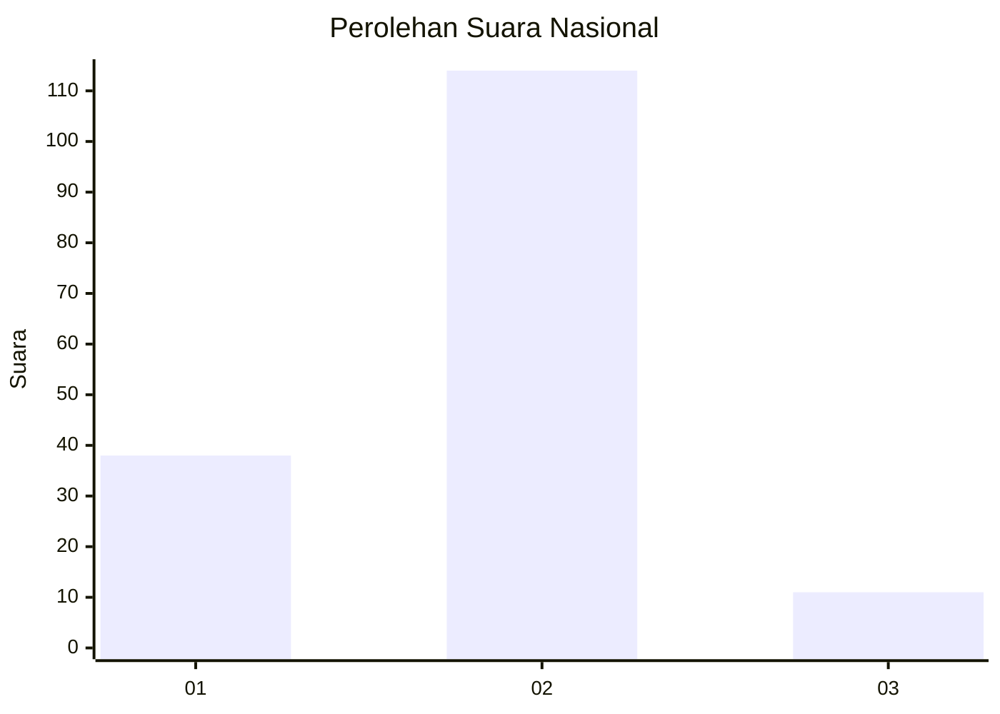

# Hasil

## Grafik

## Tabel

| No. | Nama Paslon    | Suara | Suara (raw) | Persentase |
|:--- |:-------------- | -----:| -----------:| ----------:|
| 1   | ANIES MUHAIMIN | 38    | [38][p-1]   | 23,31      |
| 2   | PRABOWO GIBRAN | 114   | [114][p-2]  | 69,94      |
| 3   | GANJAR MAHFUD  | 11    | [11][p-3]   | 6,75       |

[p-1]: https://github.com/gigit-pemilu/pemilu-2024/blob/main/pilpres/hitung-suara/sub/16-sumatera-selatan/sub/04-lahat/sub/27-tanjungtebat/sub/2007-tanjung-bai/sub/002-tps/sub/paslon-1.txt
[p-2]: https://github.com/gigit-pemilu/pemilu-2024/blob/main/pilpres/hitung-suara/sub/16-sumatera-selatan/sub/04-lahat/sub/27-tanjungtebat/sub/2007-tanjung-bai/sub/002-tps/sub/paslon-2.txt
[p-3]: https://github.com/gigit-pemilu/pemilu-2024/blob/main/pilpres/hitung-suara/sub/16-sumatera-selatan/sub/04-lahat/sub/27-tanjungtebat/sub/2007-tanjung-bai/sub/002-tps/sub/paslon-3.txt

## Foto C Plano

https://sirekap-obj-formc.kpu.go.id/a32c/pemilu/ppwp/16/04/27/20/07/1604272007002-20240222-142150--87e4ae86-cf28-47a2-a2e4-1bbf5cfbf1bd.jpg

https://sirekap-obj-formc.kpu.go.id/a32c/pemilu/ppwp/16/04/27/20/07/1604272007002-20240222-142158--8db31901-24f6-43d9-a762-168aaf8ceede.jpg

https://sirekap-obj-formc.kpu.go.id/a32c/pemilu/ppwp/16/04/27/20/07/1604272007002-20240222-142207--d2cee221-6021-4c3f-894d-dd07f02a8e9c.jpg

## Metadata

| Key        | Value               |
| ---------- | ------------------- |
| Time Stamp | 2024-02-25 01:00:00 |

