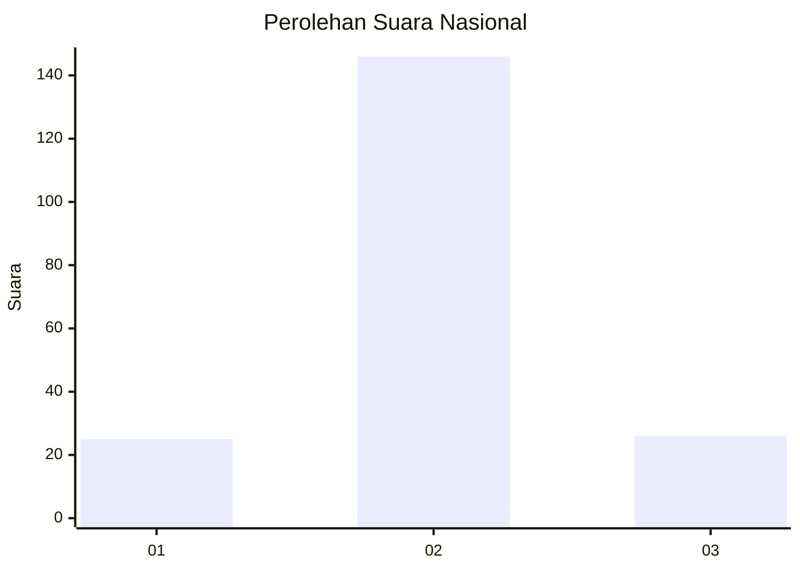
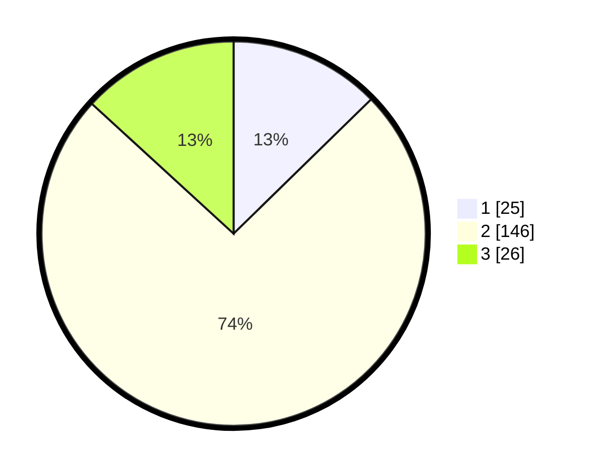

# Hasil

## Grafik

## Tabel

| No. | Nama Paslon    | Suara | Suara (raw) | Persentase |
|:--- |:-------------- | -----:| -----------:| ----------:|
| 1   | ANIES MUHAIMIN | 25    | [25][p-1]   | 12,69      |
| 2   | PRABOWO GIBRAN | 146   | [146][p-2]  | 74,11      |
| 3   | GANJAR MAHFUD  | 26    | [26][p-3]   | 13,20      |

[p-1]: https://github.com/gigit-pemilu/pemilu-2024/blob/main/pilpres/hitung-suara/sub/16-sumatera-selatan/sub/04-lahat/sub/28-muarapayang/sub/2001-muara-payang/sub/001-tps/sub/paslon-1.txt
[p-2]: https://github.com/gigit-pemilu/pemilu-2024/blob/main/pilpres/hitung-suara/sub/16-sumatera-selatan/sub/04-lahat/sub/28-muarapayang/sub/2001-muara-payang/sub/001-tps/sub/paslon-2.txt
[p-3]: https://github.com/gigit-pemilu/pemilu-2024/blob/main/pilpres/hitung-suara/sub/16-sumatera-selatan/sub/04-lahat/sub/28-muarapayang/sub/2001-muara-payang/sub/001-tps/sub/paslon-3.txt

## Foto C Plano

https://sirekap-obj-formc.kpu.go.id/8dd1/pemilu/ppwp/16/04/28/20/01/1604282001001-20240220-104045--aa6d1a78-ab31-4fa7-998b-70c93fb8cb70.jpg

https://sirekap-obj-formc.kpu.go.id/8dd1/pemilu/ppwp/16/04/28/20/01/1604282001001-20240220-104119--cc53c255-6521-4157-8e00-3fa71c41069c.jpg

https://sirekap-obj-formc.kpu.go.id/8dd1/pemilu/ppwp/16/04/28/20/01/1604282001001-20240220-104138--5e12f962-f51f-439f-a5e9-9a706476a35e.jpg

## Metadata

| Key        | Value               |
| ---------- | ------------------- |
| Time Stamp | 2024-02-24 22:31:28 |

