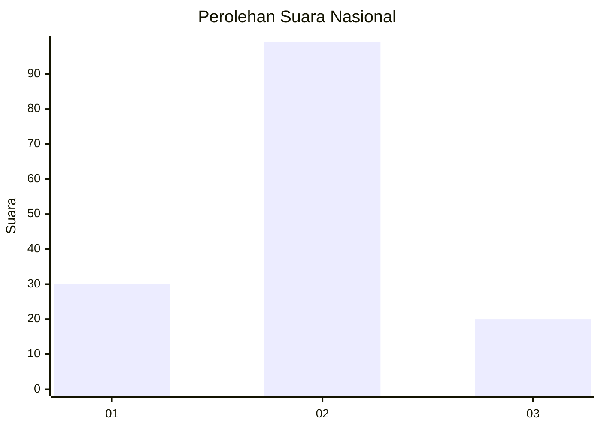
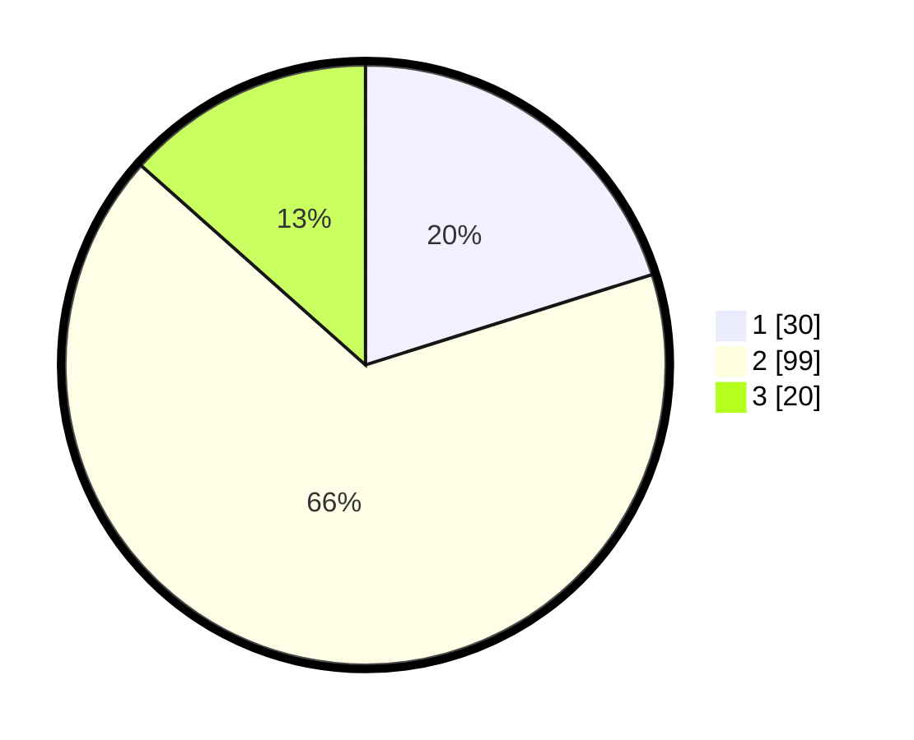

# Hasil

## Grafik

## Tabel

| No. | Nama Paslon    | Suara | Suara (raw) | Persentase |
|:--- |:-------------- | -----:| -----------:| ----------:|
| 1   | ANIES MUHAIMIN | 30    | [30][p-1]   | 20,13      |
| 2   | PRABOWO GIBRAN | 99    | [99][p-2]   | 66,44      |
| 3   | GANJAR MAHFUD  | 20    | [20][p-3]   | 13,42      |

[p-1]: https://github.com/gigit-pemilu/pemilu-2024/blob/main/pilpres/hitung-suara/sub/16-sumatera-selatan/sub/04-lahat/sub/28-muarapayang/sub/2001-muara-payang/sub/002-tps/sub/paslon-1.txt
[p-2]: https://github.com/gigit-pemilu/pemilu-2024/blob/main/pilpres/hitung-suara/sub/16-sumatera-selatan/sub/04-lahat/sub/28-muarapayang/sub/2001-muara-payang/sub/002-tps/sub/paslon-2.txt
[p-3]: https://github.com/gigit-pemilu/pemilu-2024/blob/main/pilpres/hitung-suara/sub/16-sumatera-selatan/sub/04-lahat/sub/28-muarapayang/sub/2001-muara-payang/sub/002-tps/sub/paslon-3.txt

## Foto C Plano

https://sirekap-obj-formc.kpu.go.id/a0c8/pemilu/ppwp/16/04/28/20/01/1604282001002-20240220-105018--b3508089-2f42-4776-b545-c2075acd6d23.jpg

https://sirekap-obj-formc.kpu.go.id/a0c8/pemilu/ppwp/16/04/28/20/01/1604282001002-20240220-105103--2b0a8a63-53d9-4242-900a-1898be5dea53.jpg

https://sirekap-obj-formc.kpu.go.id/a0c8/pemilu/ppwp/16/04/28/20/01/1604282001002-20240220-105317--0db48645-db27-4c88-b5f8-ab740f8616b0.jpg

## Metadata

| Key        | Value               |
| ---------- | ------------------- |
| Time Stamp | 2024-02-24 23:00:00 |

