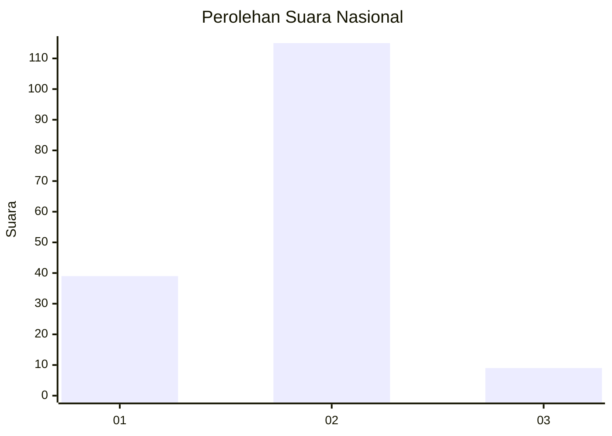
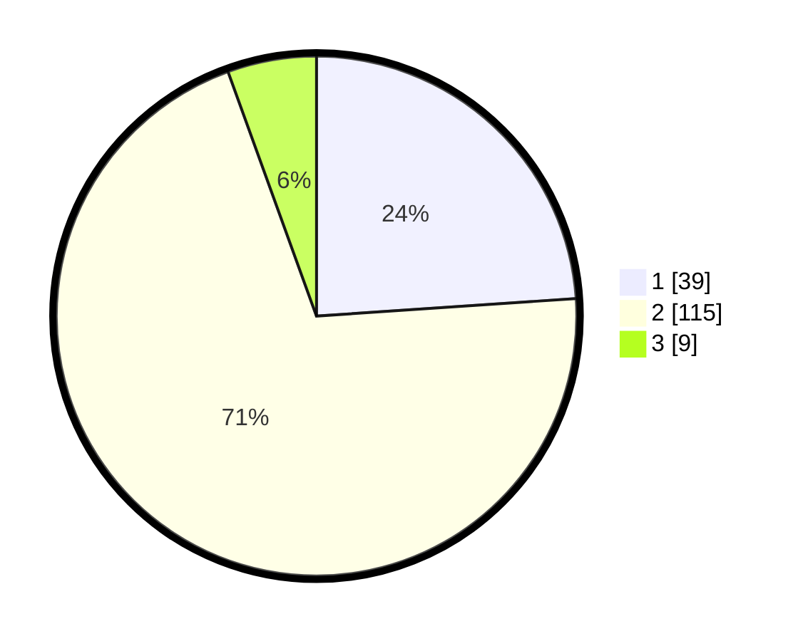

# Hasil

## Grafik

## Tabel

| No. | Nama Paslon    | Suara | Suara (raw) | Persentase |
|:--- |:-------------- | -----:| -----------:| ----------:|
| 1   | ANIES MUHAIMIN | 39    | [39][p-1]   | 23,93      |
| 2   | PRABOWO GIBRAN | 115   | [115][p-2]  | 70,55      |
| 3   | GANJAR MAHFUD  | 9     | [9][p-3]    | 5,52       |

[p-1]: https://github.com/gigit-pemilu/pemilu-2024/blob/main/pilpres/hitung-suara/sub/16-sumatera-selatan/sub/04-lahat/sub/28-muarapayang/sub/2001-muara-payang/sub/003-tps/sub/paslon-1.txt
[p-2]: https://github.com/gigit-pemilu/pemilu-2024/blob/main/pilpres/hitung-suara/sub/16-sumatera-selatan/sub/04-lahat/sub/28-muarapayang/sub/2001-muara-payang/sub/003-tps/sub/paslon-2.txt
[p-3]: https://github.com/gigit-pemilu/pemilu-2024/blob/main/pilpres/hitung-suara/sub/16-sumatera-selatan/sub/04-lahat/sub/28-muarapayang/sub/2001-muara-payang/sub/003-tps/sub/paslon-3.txt

## Foto C Plano

https://sirekap-obj-formc.kpu.go.id/b57f/pemilu/ppwp/16/04/28/20/01/1604282001003-20240220-111115--8c758281-6d9a-4f63-af85-081fa7346783.jpg

https://sirekap-obj-formc.kpu.go.id/b57f/pemilu/ppwp/16/04/28/20/01/1604282001003-20240220-111132--946b3d03-fd84-49bd-867f-fef1de07b943.jpg

https://sirekap-obj-formc.kpu.go.id/b57f/pemilu/ppwp/16/04/28/20/01/1604282001003-20240214-155905--d04ba659-6151-46f7-9bcd-9d47ef177859.jpg

## Metadata

| Key        | Value               |
| ---------- | ------------------- |
| Time Stamp | 2024-02-24 22:31:28 |

