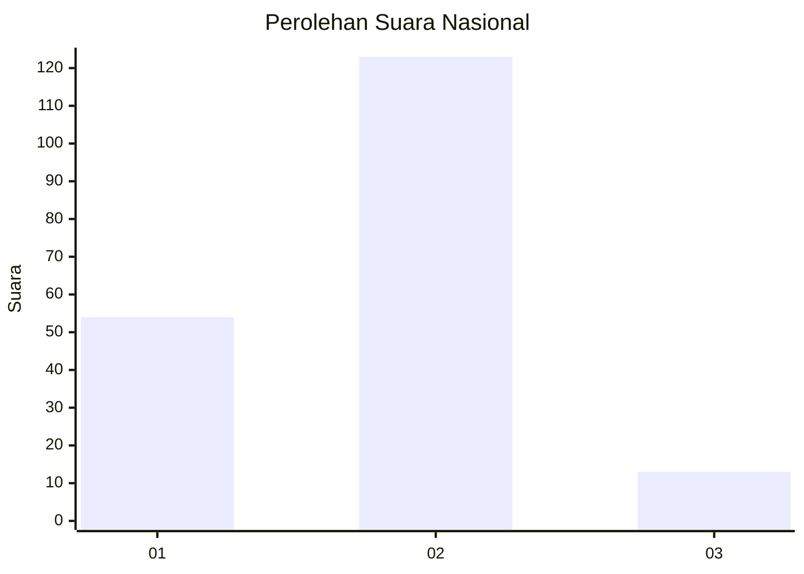
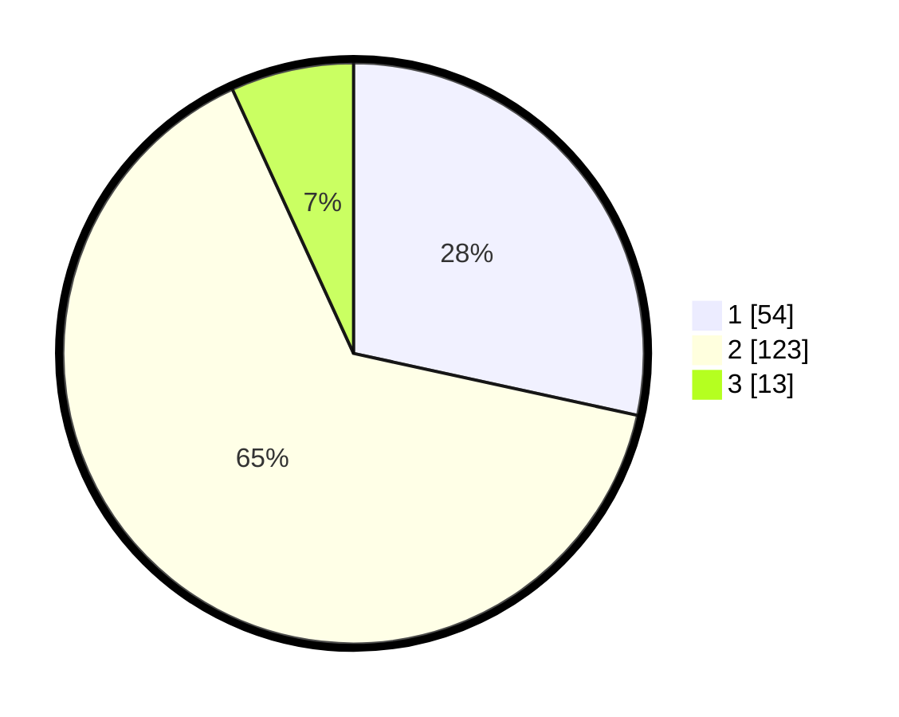

# Hasil

## Grafik

## Tabel

| No. | Nama Paslon    | Suara | Suara (raw) | Persentase |
|:--- |:-------------- | -----:| -----------:| ----------:|
| 1   | ANIES MUHAIMIN | 54    | [54][p-1]   | 28,42      |
| 2   | PRABOWO GIBRAN | 123   | [123][p-2]  | 64,74      |
| 3   | GANJAR MAHFUD  | 13    | [13][p-3]   | 6,84       |

[p-1]: https://github.com/gigit-pemilu/pemilu-2024/blob/main/pilpres/hitung-suara/sub/16-sumatera-selatan/sub/04-lahat/sub/28-muarapayang/sub/2001-muara-payang/sub/004-tps/sub/paslon-1.txt
[p-2]: https://github.com/gigit-pemilu/pemilu-2024/blob/main/pilpres/hitung-suara/sub/16-sumatera-selatan/sub/04-lahat/sub/28-muarapayang/sub/2001-muara-payang/sub/004-tps/sub/paslon-2.txt
[p-3]: https://github.com/gigit-pemilu/pemilu-2024/blob/main/pilpres/hitung-suara/sub/16-sumatera-selatan/sub/04-lahat/sub/28-muarapayang/sub/2001-muara-payang/sub/004-tps/sub/paslon-3.txt

## Foto C Plano

https://sirekap-obj-formc.kpu.go.id/b613/pemilu/ppwp/16/04/28/20/01/1604282001004-20240220-112958--07914dcd-43e9-499d-ace7-6b42570ebbd6.jpg

https://sirekap-obj-formc.kpu.go.id/b613/pemilu/ppwp/16/04/28/20/01/1604282001004-20240220-113017--7d3c2d6b-a146-4987-ae79-2fb75ff343ad.jpg

https://sirekap-obj-formc.kpu.go.id/b613/pemilu/ppwp/16/04/28/20/01/1604282001004-20240220-113044--96b3331e-df78-4e18-af56-a5f169dc63e4.jpg

## Metadata

| Key        | Value               |
| ---------- | ------------------- |
| Time Stamp | 2024-02-24 22:31:28 |

