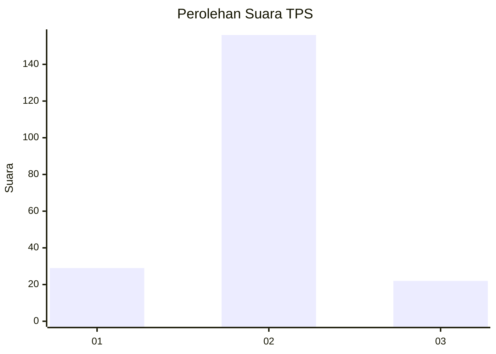
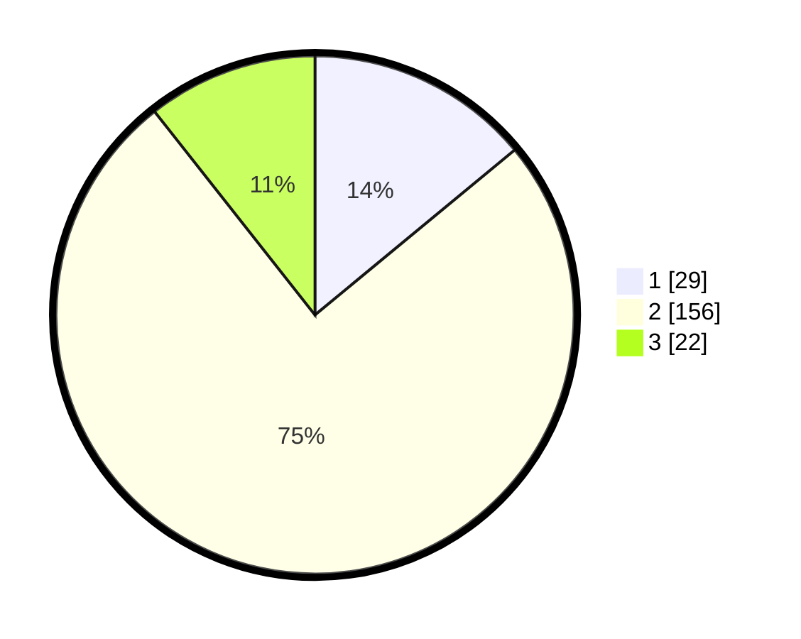

# Hasil

## Grafik

## Tabel

| No. | Nama Paslon    | Suara | Suara (raw) | Persentase |
|:--- |:-------------- | -----:| -----------:| ----------:|
| 1   | ANIES MUHAIMIN | 29    | [29][p-1]   | 14,01      |
| 2   | PRABOWO GIBRAN | 156   | [156][p-2]  | 75,36      |
| 3   | GANJAR MAHFUD  | 22    | [22][p-3]   | 10,63      |

[p-1]: https://github.com/gigit-pemilu/pemilu-2024-16-sumatera-selatan/blob/main/pilpres/hitung-suara/sub/16-sumatera-selatan/sub/04-lahat/sub/28-muarapayang/sub/2001-muara-payang/sub/005-tps/sub/paslon-1.txt
[p-2]: https://github.com/gigit-pemilu/pemilu-2024-16-sumatera-selatan/blob/main/pilpres/hitung-suara/sub/16-sumatera-selatan/sub/04-lahat/sub/28-muarapayang/sub/2001-muara-payang/sub/005-tps/sub/paslon-2.txt
[p-3]: https://github.com/gigit-pemilu/pemilu-2024-16-sumatera-selatan/blob/main/pilpres/hitung-suara/sub/16-sumatera-selatan/sub/04-lahat/sub/28-muarapayang/sub/2001-muara-payang/sub/005-tps/sub/paslon-3.txt

## Foto C Plano

https://sirekap-obj-formc.kpu.go.id/b299/pemilu/ppwp/16/04/28/20/01/1604282001005-20240220-114903--28e1be5a-44a3-4401-8330-e2428b3e91de.jpg

https://sirekap-obj-formc.kpu.go.id/b299/pemilu/ppwp/16/04/28/20/01/1604282001005-20240220-114930--958705ff-9b38-4db5-acdc-573a186439a5.jpg

https://sirekap-obj-formc.kpu.go.id/b299/pemilu/ppwp/16/04/28/20/01/1604282001005-20240220-115110--a65211c1-79e2-441a-8a58-ee7233622ae6.jpg

## Metadata

| Key        | Value               |
| ---------- | ------------------- |
| Time Stamp | 2024-02-24 22:31:28 |

