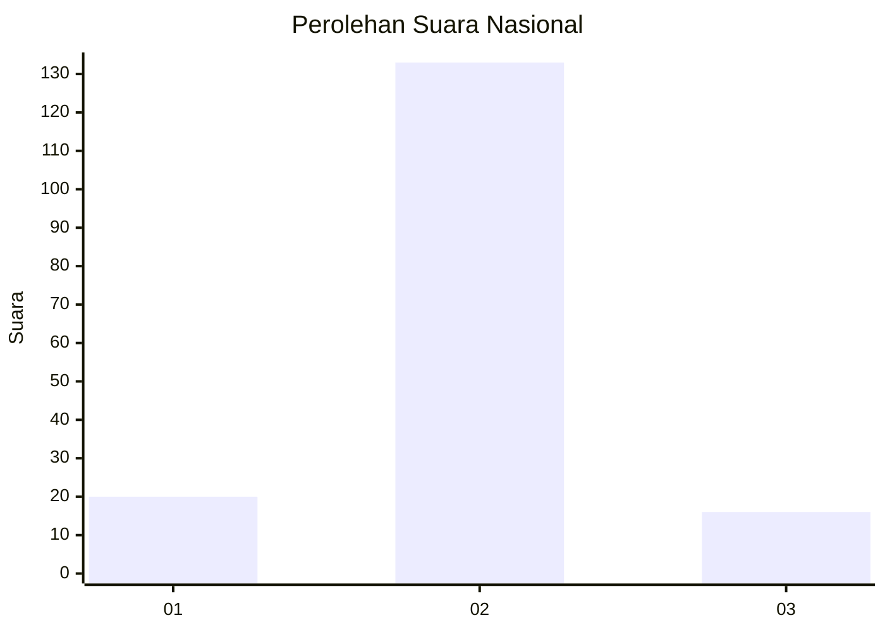
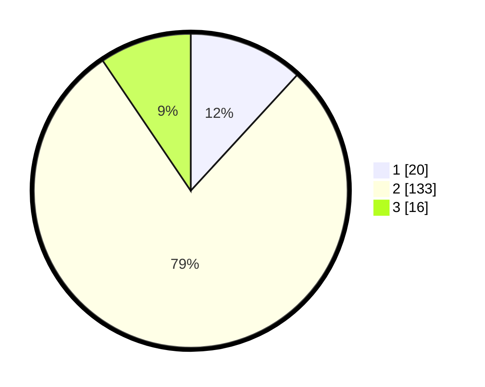

# Hasil

## Grafik

## Tabel

| No. | Nama Paslon    | Suara | Suara (raw) | Persentase |
|:--- |:-------------- | -----:| -----------:| ----------:|
| 1   | ANIES MUHAIMIN | 20    | [20][p-1]   | 11,83      |
| 2   | PRABOWO GIBRAN | 133   | [133][p-2]  | 78,70      |
| 3   | GANJAR MAHFUD  | 16    | [16][p-3]   | 9,47       |

[p-1]: https://github.com/gigit-pemilu/pemilu-2024/blob/main/pilpres/hitung-suara/sub/16-sumatera-selatan/sub/04-lahat/sub/28-muarapayang/sub/2002-muara-gelumpai/sub/004-tps/sub/paslon-1.txt
[p-2]: https://github.com/gigit-pemilu/pemilu-2024/blob/main/pilpres/hitung-suara/sub/16-sumatera-selatan/sub/04-lahat/sub/28-muarapayang/sub/2002-muara-gelumpai/sub/004-tps/sub/paslon-2.txt
[p-3]: https://github.com/gigit-pemilu/pemilu-2024/blob/main/pilpres/hitung-suara/sub/16-sumatera-selatan/sub/04-lahat/sub/28-muarapayang/sub/2002-muara-gelumpai/sub/004-tps/sub/paslon-3.txt

## Foto C Plano

https://sirekap-obj-formc.kpu.go.id/c01a/pemilu/ppwp/16/04/28/20/02/1604282002004-20240214-155534--e499bf12-1bfe-48f9-a9d3-23460881a6e9.jpg

https://sirekap-obj-formc.kpu.go.id/c01a/pemilu/ppwp/16/04/28/20/02/1604282002004-20240214-155607--7b143004-c6ce-47e0-b046-29309543b73f.jpg

https://sirekap-obj-formc.kpu.go.id/c01a/pemilu/ppwp/16/04/28/20/02/1604282002004-20240214-155642--89d7b19d-66ef-47ef-9320-4d7b5bd860df.jpg

## Metadata

| Key        | Value               |
| ---------- | ------------------- |
| Time Stamp | 2024-02-15 20:30:46 |

