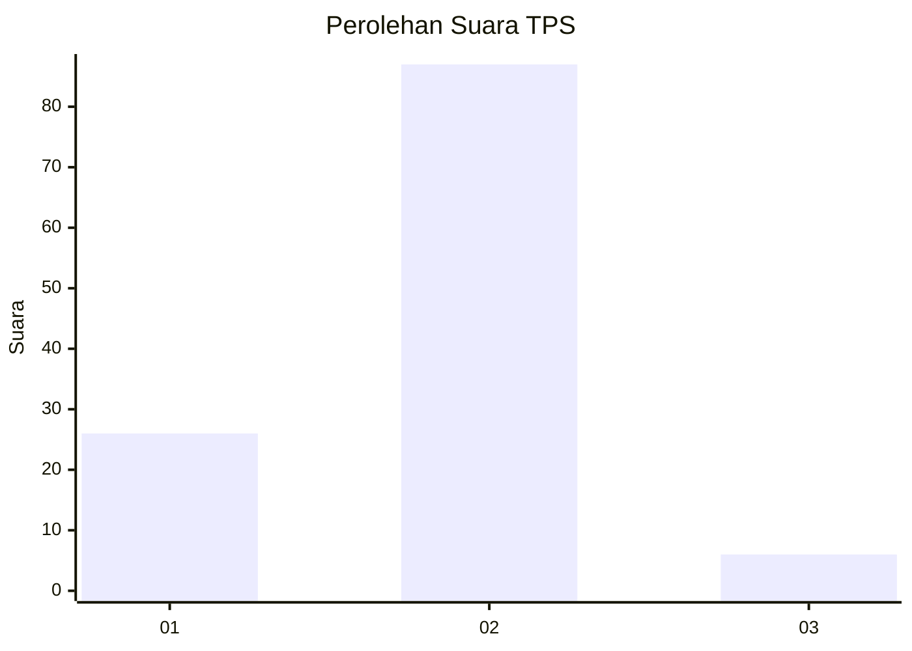
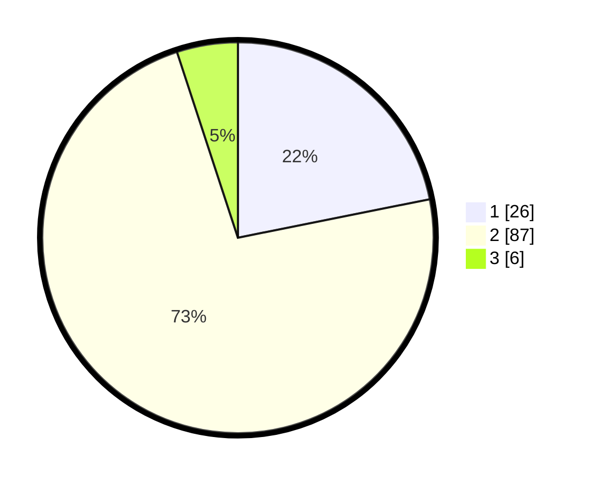

# Hasil

## Grafik

## Tabel

| No. | Nama Paslon    | Suara | Suara (raw) | Persentase |
|:--- |:-------------- | -----:| -----------:| ----------:|
| 1   | ANIES MUHAIMIN | 26    | [26][p-1]   | 21,85      |
| 2   | PRABOWO GIBRAN | 87    | [87][p-2]   | 73,11      |
| 3   | GANJAR MAHFUD  | 6     | [6][p-3]    | 5,04       |

[p-1]: https://github.com/gigit-pemilu/pemilu-2024-16-sumatera-selatan/blob/main/pilpres/hitung-suara/sub/16-sumatera-selatan/sub/04-lahat/sub/29-sukamerindu/sub/2001-sukamerindu/sub/002-tps/sub/paslon-1.txt
[p-2]: https://github.com/gigit-pemilu/pemilu-2024-16-sumatera-selatan/blob/main/pilpres/hitung-suara/sub/16-sumatera-selatan/sub/04-lahat/sub/29-sukamerindu/sub/2001-sukamerindu/sub/002-tps/sub/paslon-2.txt
[p-3]: https://github.com/gigit-pemilu/pemilu-2024-16-sumatera-selatan/blob/main/pilpres/hitung-suara/sub/16-sumatera-selatan/sub/04-lahat/sub/29-sukamerindu/sub/2001-sukamerindu/sub/002-tps/sub/paslon-3.txt

## Foto C Plano

https://sirekap-obj-formc.kpu.go.id/14bc/pemilu/ppwp/16/04/29/20/01/1604292001002-20240214-231025--eadc780e-8c55-452d-9269-72c070cc0783.jpg

https://sirekap-obj-formc.kpu.go.id/14bc/pemilu/ppwp/16/04/29/20/01/1604292001002-20240214-232337--66b26d55-cdf9-4ab0-9e2a-9db7dee6a01d.jpg

https://sirekap-obj-formc.kpu.go.id/14bc/pemilu/ppwp/16/04/29/20/01/1604292001002-20240214-233030--bdb149d6-1140-4f1f-ab4b-9b4aa982387e.jpg

## Metadata

| Key        | Value               |
| ---------- | ------------------- |
| Time Stamp | 2024-02-15 12:00:28 |

## DATA PEMILIH TETAP

Jumlah pemilih dalam DPT: **145**.
 * L: **79**.
 * P: **66**.

## DATA PENGGUNA HAK PILIH

Jumlah pengguna hak pilih dalam DPT: **122**.
 * L: **65**.
 * P: **57**.

Jumlah pengguna hak pilih dalam DPTb: **0**.
 * L: **0**.
 * P: **0**.

Jumlah pengguna hak pilih dalam DPK: **1**.
 * L: **1**.
 * P: **0**.

Jumlah pengguna hak pilih: **123**.
 * L: **66**.
 * P: **57**.

## JUMLAH SUARA SAH DAN TIDAK SAH

JUMLAH SELURUH SUARA SAH: **119**.

JUMLAH SUARA TIDAK SAH: **4**.

JUMLAH SELURUH SUARA SAH DAN SUARA TIDAK SAH: **123**.

