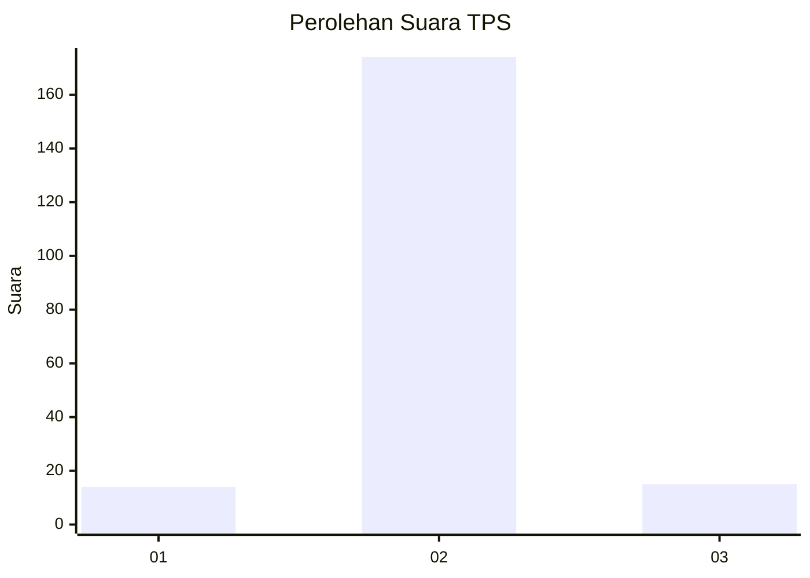
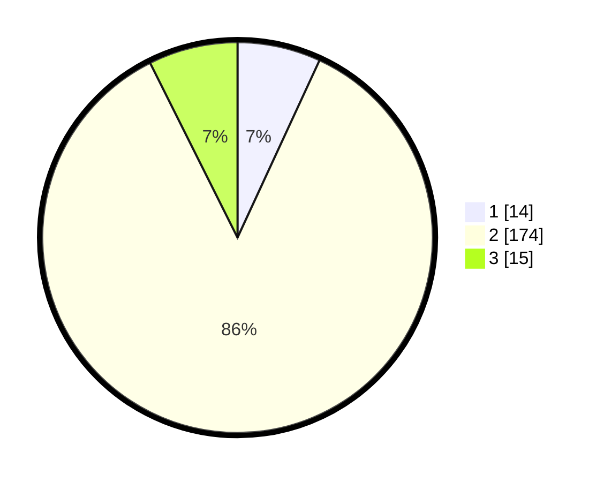

# Hasil

## Grafik

## Tabel

| No. | Nama Paslon    | Suara | Suara (raw) | Persentase |
|:--- |:-------------- | -----:| -----------:| ----------:|
| 1   | ANIES MUHAIMIN | 14    | [14][p-1]   | 6,90       |
| 2   | PRABOWO GIBRAN | 174   | [174][p-2]  | 85,71      |
| 3   | GANJAR MAHFUD  | 15    | [15][p-3]   | 7,39       |

[p-1]: https://github.com/gigit-pemilu/pemilu-2024-16-sumatera-selatan/blob/main/pilpres/hitung-suara/sub/16-sumatera-selatan/sub/04-lahat/sub/29-sukamerindu/sub/2002-guru-agung/sub/001-tps/sub/paslon-1.txt
[p-2]: https://github.com/gigit-pemilu/pemilu-2024-16-sumatera-selatan/blob/main/pilpres/hitung-suara/sub/16-sumatera-selatan/sub/04-lahat/sub/29-sukamerindu/sub/2002-guru-agung/sub/001-tps/sub/paslon-2.txt
[p-3]: https://github.com/gigit-pemilu/pemilu-2024-16-sumatera-selatan/blob/main/pilpres/hitung-suara/sub/16-sumatera-selatan/sub/04-lahat/sub/29-sukamerindu/sub/2002-guru-agung/sub/001-tps/sub/paslon-3.txt

## Foto C Plano

https://sirekap-obj-formc.kpu.go.id/1d04/pemilu/ppwp/16/04/29/20/02/1604292002001-20240215-034508--7a3d9a41-59a4-43c0-a880-b32d3218d835.jpg

https://sirekap-obj-formc.kpu.go.id/1d04/pemilu/ppwp/16/04/29/20/02/1604292002001-20240215-034512--809a508b-553f-4208-9f0e-0620dc341956.jpg

https://sirekap-obj-formc.kpu.go.id/1d04/pemilu/ppwp/16/04/29/20/02/1604292002001-20240215-034517--ff2c1b41-63bc-4ef8-b2c6-27e4024a20cf.jpg

## Metadata

| Key        | Value               |
| ---------- | ------------------- |
| Time Stamp | 2024-02-15 20:30:46 |

