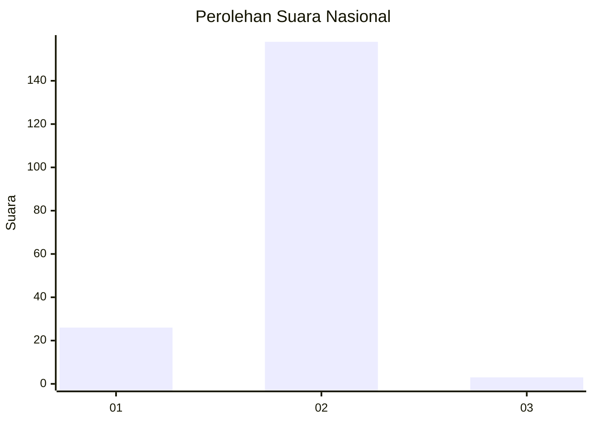
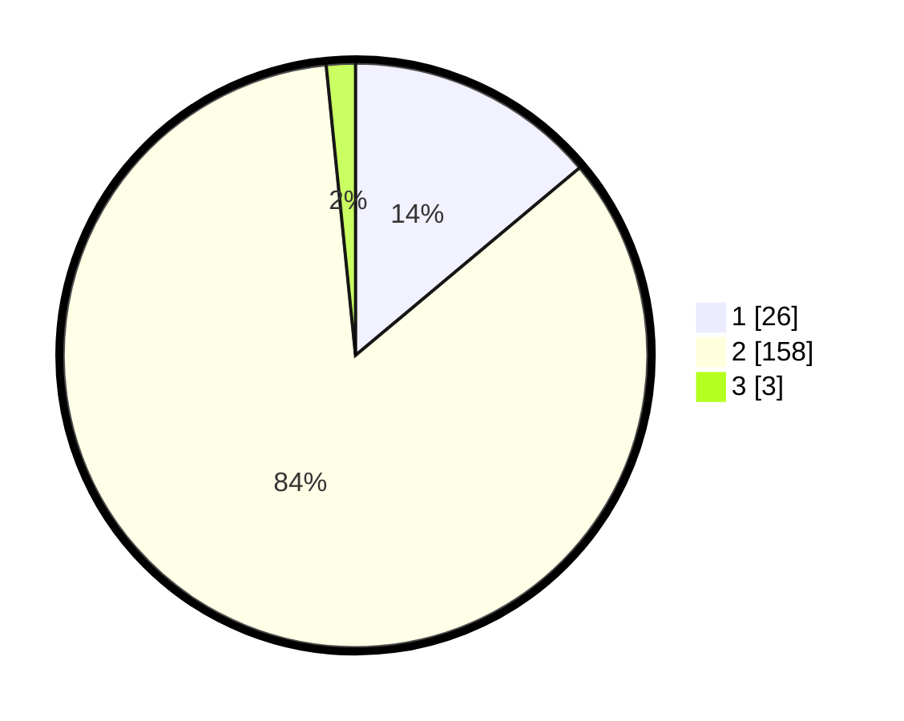

# Hasil

## Grafik

## Tabel

| No. | Nama Paslon    | Suara | Suara (raw) | Persentase |
|:--- |:-------------- | -----:| -----------:| ----------:|
| 1   | ANIES MUHAIMIN | 26    | [26][p-1]   | 13,90      |
| 2   | PRABOWO GIBRAN | 158   | [158][p-2]  | 84,49      |
| 3   | GANJAR MAHFUD  | 3     | [3][p-3]    | 1,60       |

[p-1]: https://github.com/gigit-pemilu/pemilu-2024/blob/main/pilpres/hitung-suara/sub/16-sumatera-selatan/sub/04-lahat/sub/29-sukamerindu/sub/2002-guru-agung/sub/002-tps/sub/paslon-1.txt
[p-2]: https://github.com/gigit-pemilu/pemilu-2024/blob/main/pilpres/hitung-suara/sub/16-sumatera-selatan/sub/04-lahat/sub/29-sukamerindu/sub/2002-guru-agung/sub/002-tps/sub/paslon-2.txt
[p-3]: https://github.com/gigit-pemilu/pemilu-2024/blob/main/pilpres/hitung-suara/sub/16-sumatera-selatan/sub/04-lahat/sub/29-sukamerindu/sub/2002-guru-agung/sub/002-tps/sub/paslon-3.txt

## Foto C Plano

https://sirekap-obj-formc.kpu.go.id/b2a0/pemilu/ppwp/16/04/29/20/02/1604292002002-20240215-070106--d9e1fc3f-2027-4c88-9db6-f0d105ddde09.jpg

https://sirekap-obj-formc.kpu.go.id/b2a0/pemilu/ppwp/16/04/29/20/02/1604292002002-20240215-070916--67c8e5d3-4fad-4b1e-b985-751ca06973ec.jpg

https://sirekap-obj-formc.kpu.go.id/b2a0/pemilu/ppwp/16/04/29/20/02/1604292002002-20240215-071157--d1a28dea-6ca1-4f3a-bb20-a0f2d4323ae8.jpg

## Metadata

| Key        | Value               |
| ---------- | ------------------- |
| Time Stamp | 2024-02-15 17:30:25 |

