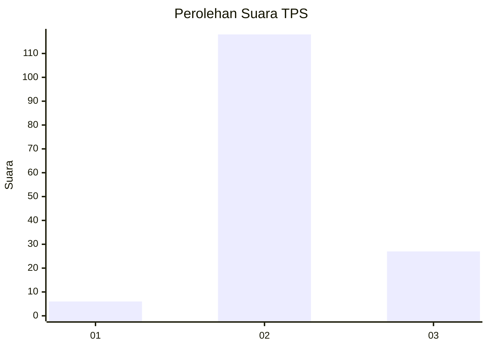

# Hasil

## Grafik

## Tabel

| No. | Nama Paslon    | Suara | Suara (raw) | Persentase |
|:--- |:-------------- | -----:| -----------:| ----------:|
| 1   | ANIES MUHAIMIN | 6     | [6][p-1]    | 3,97       |
| 2   | PRABOWO GIBRAN | 118   | [118][p-2]  | 78,15      |
| 3   | GANJAR MAHFUD  | 27    | [27][p-3]   | 17,88      |

[p-1]: https://github.com/gigit-pemilu/pemilu-2024-16-sumatera-selatan/blob/main/pilpres/hitung-suara/sub/16-sumatera-selatan/sub/04-lahat/sub/30-mulak-sebingkai/sub/2002-jadian-lama/sub/001-tps/sub/paslon-1.txt
[p-2]: https://github.com/gigit-pemilu/pemilu-2024-16-sumatera-selatan/blob/main/pilpres/hitung-suara/sub/16-sumatera-selatan/sub/04-lahat/sub/30-mulak-sebingkai/sub/2002-jadian-lama/sub/001-tps/sub/paslon-2.txt
[p-3]: https://github.com/gigit-pemilu/pemilu-2024-16-sumatera-selatan/blob/main/pilpres/hitung-suara/sub/16-sumatera-selatan/sub/04-lahat/sub/30-mulak-sebingkai/sub/2002-jadian-lama/sub/001-tps/sub/paslon-3.txt

## Foto C Plano

https://sirekap-obj-formc.kpu.go.id/ba05/pemilu/ppwp/16/04/30/20/02/1604302002001-20240215-102557--d9db1e78-a44d-444b-9e14-6dd122d74169.jpg

https://sirekap-obj-formc.kpu.go.id/ba05/pemilu/ppwp/16/04/30/20/02/1604302002001-20240215-102840--71890d42-223b-4c98-9603-66f8253bf495.jpg

https://sirekap-obj-formc.kpu.go.id/ba05/pemilu/ppwp/16/04/30/20/02/1604302002001-20240215-102935--9b1173f2-f8bc-41b7-b128-b07e8f69f1b8.jpg

## Metadata

| Key        | Value               |
| ---------- | ------------------- |
| Time Stamp | 2024-02-15 21:01:18 |

