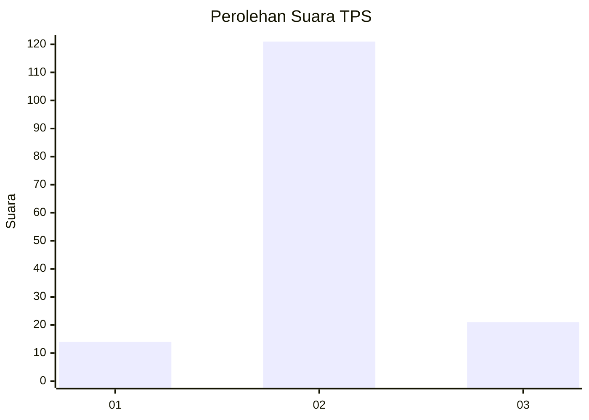
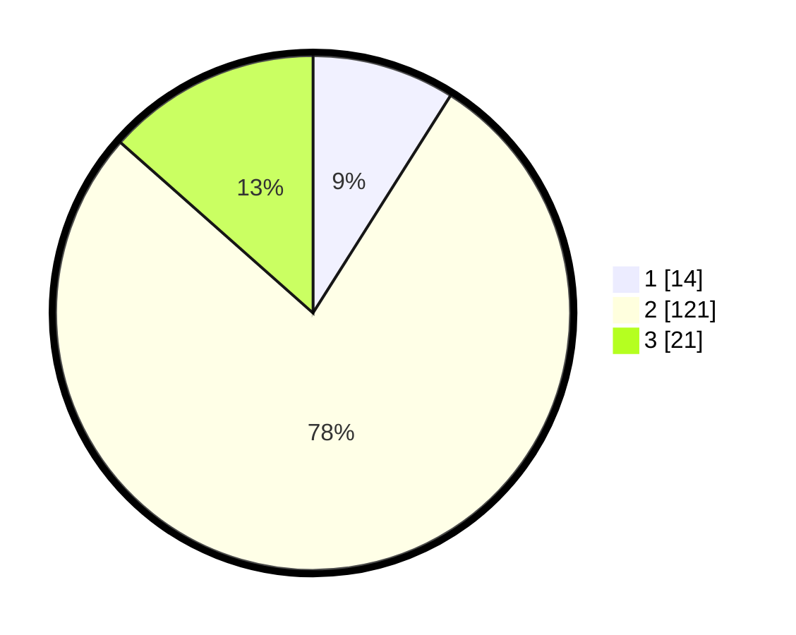

# Hasil

## Grafik

## Tabel

| No. | Nama Paslon    | Suara | Suara (raw) | Persentase |
|:--- |:-------------- | -----:| -----------:| ----------:|
| 1   | ANIES MUHAIMIN | 14    | [14][p-1]   | 8,97       |
| 2   | PRABOWO GIBRAN | 121   | [121][p-2]  | 77,56      |
| 3   | GANJAR MAHFUD  | 21    | [21][p-3]   | 13,46      |

[p-1]: https://github.com/gigit-pemilu/pemilu-2024-16-sumatera-selatan/blob/main/pilpres/hitung-suara/sub/16-sumatera-selatan/sub/04-lahat/sub/30-mulak-sebingkai/sub/2002-jadian-lama/sub/002-tps/sub/paslon-1.txt
[p-2]: https://github.com/gigit-pemilu/pemilu-2024-16-sumatera-selatan/blob/main/pilpres/hitung-suara/sub/16-sumatera-selatan/sub/04-lahat/sub/30-mulak-sebingkai/sub/2002-jadian-lama/sub/002-tps/sub/paslon-2.txt
[p-3]: https://github.com/gigit-pemilu/pemilu-2024-16-sumatera-selatan/blob/main/pilpres/hitung-suara/sub/16-sumatera-selatan/sub/04-lahat/sub/30-mulak-sebingkai/sub/2002-jadian-lama/sub/002-tps/sub/paslon-3.txt

## Foto C Plano

https://sirekap-obj-formc.kpu.go.id/26ad/pemilu/ppwp/16/04/30/20/02/1604302002002-20240215-144124--f32db2f1-4071-41d2-a270-20ac3130c4e0.jpg

https://sirekap-obj-formc.kpu.go.id/26ad/pemilu/ppwp/16/04/30/20/02/1604302002002-20240215-143938--b087df1e-20ac-4ef6-b9fb-d5669ecf0d0d.jpg

https://sirekap-obj-formc.kpu.go.id/26ad/pemilu/ppwp/16/04/30/20/02/1604302002002-20240215-144236--9f416953-189f-4901-8051-aa2f3f98e586.jpg

## Metadata

| Key        | Value               |
| ---------- | ------------------- |
| Time Stamp | 2024-02-15 21:01:18 |

