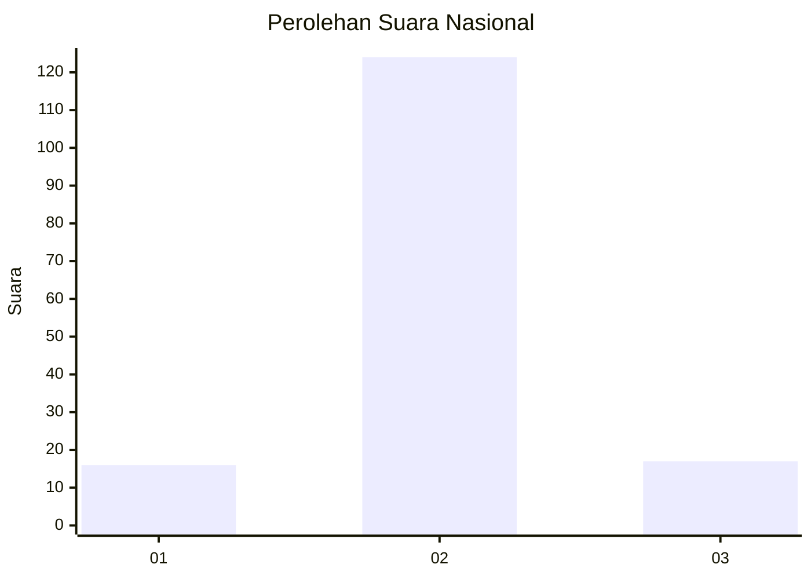
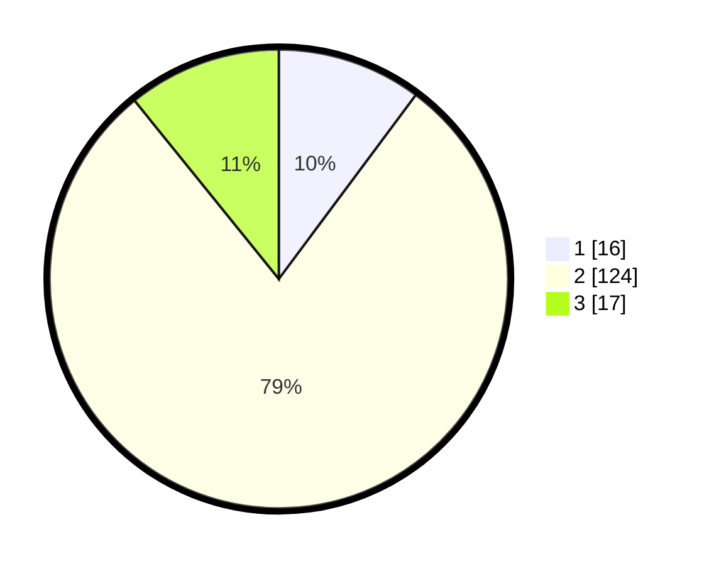

# Hasil

## Grafik

## Tabel

| No. | Nama Paslon    | Suara | Suara (raw) | Persentase |
|:--- |:-------------- | -----:| -----------:| ----------:|
| 1   | ANIES MUHAIMIN | 16    | [16][p-1]   | 10,19      |
| 2   | PRABOWO GIBRAN | 124   | [124][p-2]  | 78,98      |
| 3   | GANJAR MAHFUD  | 17    | [17][p-3]   | 10,83      |

[p-1]: https://github.com/gigit-pemilu/pemilu-2024/blob/main/pilpres/hitung-suara/sub/16-sumatera-selatan/sub/04-lahat/sub/30-mulak-sebingkai/sub/2005-keban-agung/sub/004-tps/sub/paslon-1.txt
[p-2]: https://github.com/gigit-pemilu/pemilu-2024/blob/main/pilpres/hitung-suara/sub/16-sumatera-selatan/sub/04-lahat/sub/30-mulak-sebingkai/sub/2005-keban-agung/sub/004-tps/sub/paslon-2.txt
[p-3]: https://github.com/gigit-pemilu/pemilu-2024/blob/main/pilpres/hitung-suara/sub/16-sumatera-selatan/sub/04-lahat/sub/30-mulak-sebingkai/sub/2005-keban-agung/sub/004-tps/sub/paslon-3.txt

## Foto C Plano

https://sirekap-obj-formc.kpu.go.id/7e86/pemilu/ppwp/16/04/30/20/05/1604302005004-20240215-111326--bfa54282-e420-40b2-aca4-a282dae7bd84.jpg

https://sirekap-obj-formc.kpu.go.id/7e86/pemilu/ppwp/16/04/30/20/05/1604302005004-20240215-112104--7f503507-454a-4adf-b138-2738bfa0dcfb.jpg

https://sirekap-obj-formc.kpu.go.id/7e86/pemilu/ppwp/16/04/30/20/05/1604302005004-20240215-112358--34c69cfa-5629-469c-b54b-9e0b972517f0.jpg

## Metadata

| Key        | Value               |
| ---------- | ------------------- |
| Time Stamp | 2024-02-15 17:30:25 |

