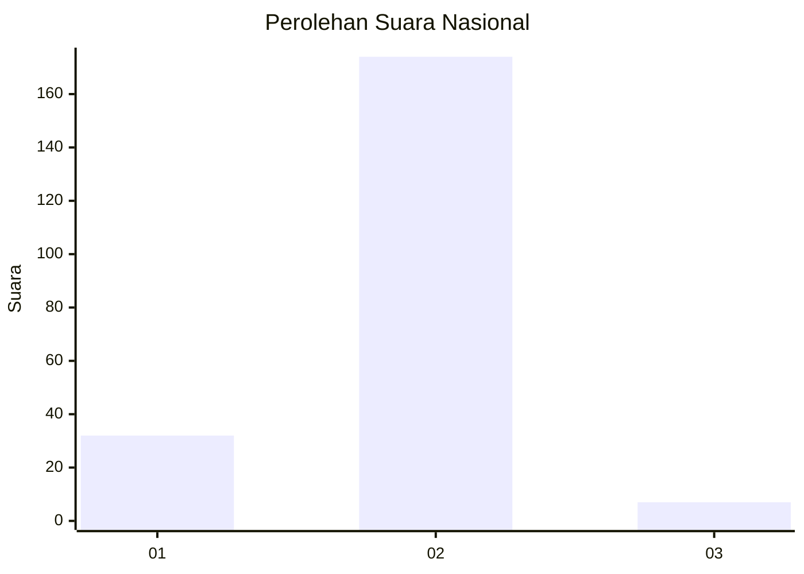
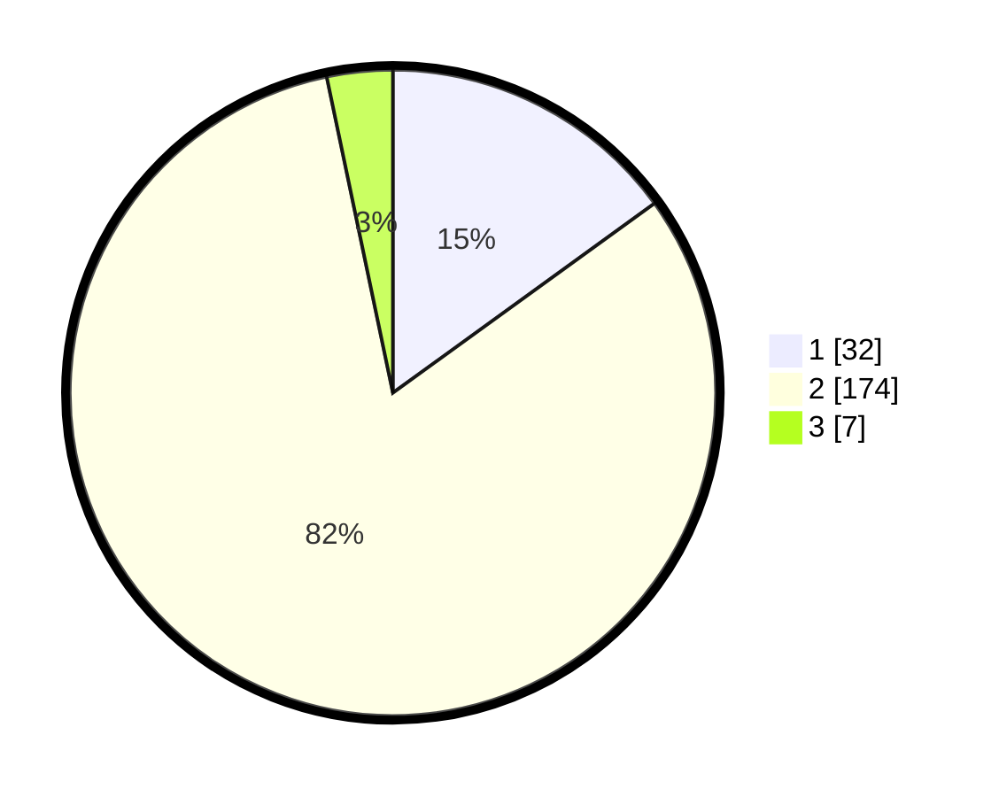

# Hasil

## Grafik

## Tabel

| No. | Nama Paslon    | Suara | Suara (raw) | Persentase |
|:--- |:-------------- | -----:| -----------:| ----------:|
| 1   | ANIES MUHAIMIN | 32    | [32][p-1]   | 15,02      |
| 2   | PRABOWO GIBRAN | 174   | [174][p-2]  | 81,69      |
| 3   | GANJAR MAHFUD  | 7     | [7][p-3]    | 3,29       |

[p-1]: https://github.com/gigit-pemilu/pemilu-2024/blob/main/pilpres/hitung-suara/sub/16-sumatera-selatan/sub/04-lahat/sub/31-lahat-selatan/sub/2001-banjar-negara/sub/001-tps/sub/paslon-1.txt
[p-2]: https://github.com/gigit-pemilu/pemilu-2024/blob/main/pilpres/hitung-suara/sub/16-sumatera-selatan/sub/04-lahat/sub/31-lahat-selatan/sub/2001-banjar-negara/sub/001-tps/sub/paslon-2.txt
[p-3]: https://github.com/gigit-pemilu/pemilu-2024/blob/main/pilpres/hitung-suara/sub/16-sumatera-selatan/sub/04-lahat/sub/31-lahat-selatan/sub/2001-banjar-negara/sub/001-tps/sub/paslon-3.txt

## Foto C Plano

https://sirekap-obj-formc.kpu.go.id/189b/pemilu/ppwp/16/04/31/20/01/1604312001001-20240214-212046--74d89f19-e055-4c46-8788-9ec77aad0c32.jpg

https://sirekap-obj-formc.kpu.go.id/189b/pemilu/ppwp/16/04/31/20/01/1604312001001-20240215-033139--da5ef395-3658-471c-a0d8-c2106c18a135.jpg

https://sirekap-obj-formc.kpu.go.id/189b/pemilu/ppwp/16/04/31/20/01/1604312001001-20240214-212531--84eb59cc-d3ff-4073-881e-e3ea08f293de.jpg

## Metadata

| Key        | Value               |
| ---------- | ------------------- |
| Time Stamp | 2024-02-15 15:00:29 |

