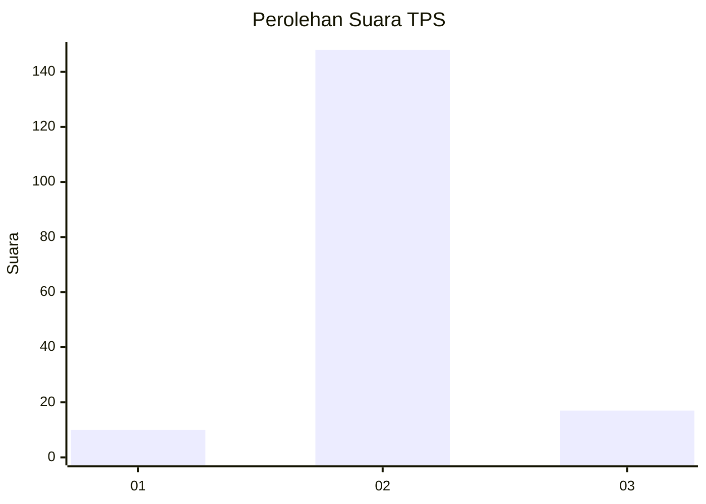
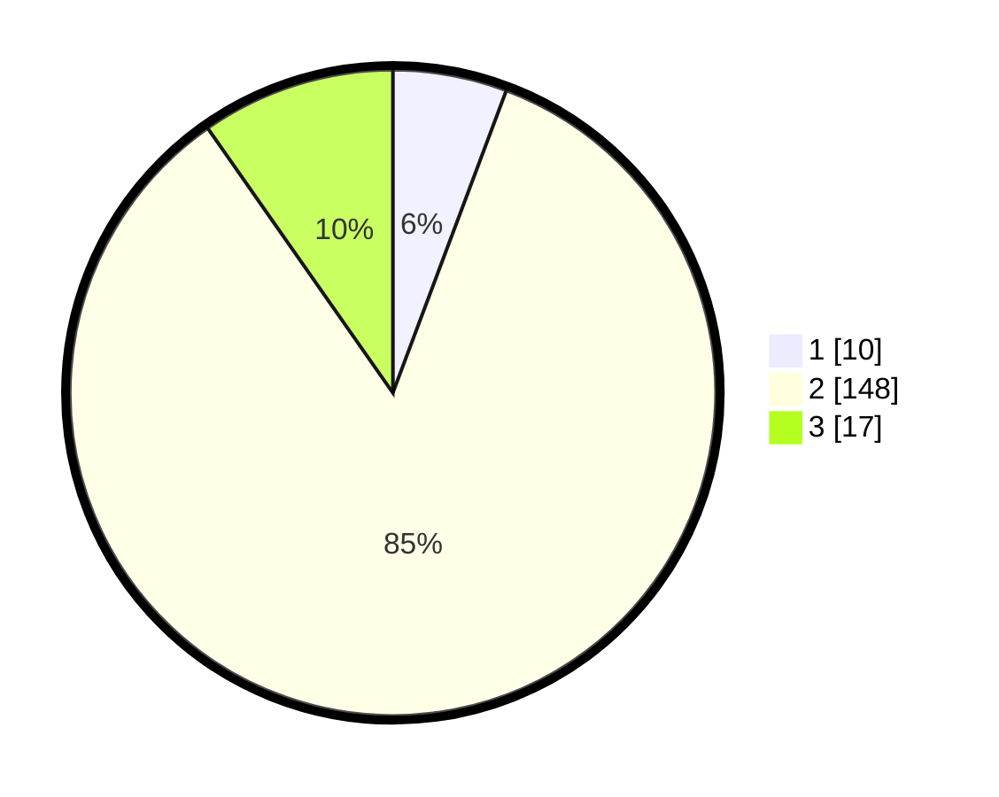

# Hasil

## Grafik

## Tabel

| No. | Nama Paslon    | Suara | Suara (raw) | Persentase |
|:--- |:-------------- | -----:| -----------:| ----------:|
| 1   | ANIES MUHAIMIN | 10    | [10][p-1]   | 5,71       |
| 2   | PRABOWO GIBRAN | 148   | [148][p-2]  | 84,57      |
| 3   | GANJAR MAHFUD  | 17    | [17][p-3]   | 9,71       |

[p-1]: https://github.com/gigit-pemilu/pemilu-2024-16-sumatera-selatan/blob/main/pilpres/hitung-suara/sub/16-sumatera-selatan/sub/04-lahat/sub/31-lahat-selatan/sub/2009-talang-sawah/sub/002-tps/sub/paslon-1.txt
[p-2]: https://github.com/gigit-pemilu/pemilu-2024-16-sumatera-selatan/blob/main/pilpres/hitung-suara/sub/16-sumatera-selatan/sub/04-lahat/sub/31-lahat-selatan/sub/2009-talang-sawah/sub/002-tps/sub/paslon-2.txt
[p-3]: https://github.com/gigit-pemilu/pemilu-2024-16-sumatera-selatan/blob/main/pilpres/hitung-suara/sub/16-sumatera-selatan/sub/04-lahat/sub/31-lahat-selatan/sub/2009-talang-sawah/sub/002-tps/sub/paslon-3.txt

## Foto C Plano

https://sirekap-obj-formc.kpu.go.id/6897/pemilu/ppwp/16/04/31/20/09/1604312009002-20240221-153544--9952ca7a-928f-40cc-b84d-bc7528c09327.jpg

https://sirekap-obj-formc.kpu.go.id/6897/pemilu/ppwp/16/04/31/20/09/1604312009002-20240221-153624--894cd1da-c8e5-4894-b6d5-fd89c5348064.jpg

https://sirekap-obj-formc.kpu.go.id/6897/pemilu/ppwp/16/04/31/20/09/1604312009002-20240221-153800--6b57ef30-3bf5-4317-8c07-f88b9798962f.jpg

## Metadata

| Key        | Value               |
| ---------- | ------------------- |
| Time Stamp | 2024-02-25 17:00:00 |

