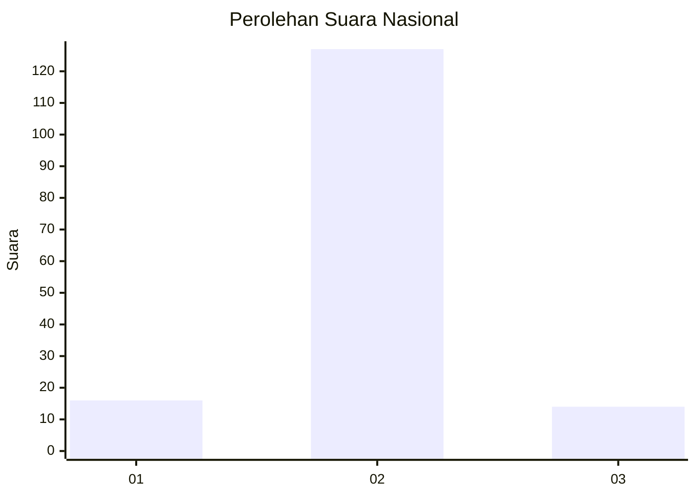
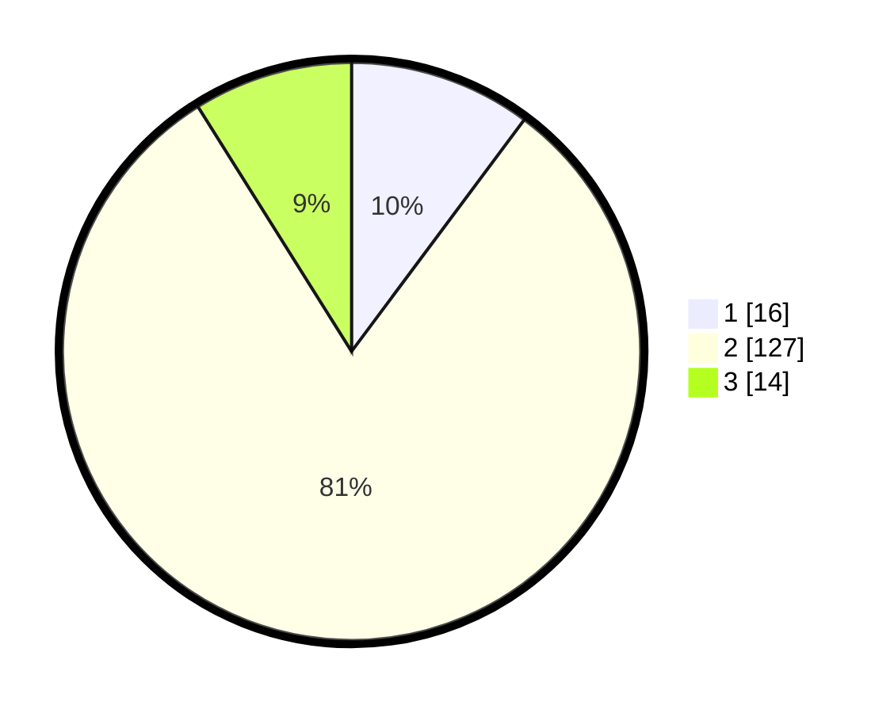

# Hasil

## Grafik

## Tabel

| No. | Nama Paslon    | Suara | Suara (raw) | Persentase |
|:--- |:-------------- | -----:| -----------:| ----------:|
| 1   | ANIES MUHAIMIN | 16    | [16][p-1]   | 10,19      |
| 2   | PRABOWO GIBRAN | 127   | [127][p-2]  | 80,89      |
| 3   | GANJAR MAHFUD  | 14    | [14][p-3]   | 8,92       |

[p-1]: https://github.com/gigit-pemilu/pemilu-2024/blob/main/pilpres/hitung-suara/sub/16-sumatera-selatan/sub/04-lahat/sub/31-lahat-selatan/sub/2009-talang-sawah/sub/003-tps/sub/paslon-1.txt
[p-2]: https://github.com/gigit-pemilu/pemilu-2024/blob/main/pilpres/hitung-suara/sub/16-sumatera-selatan/sub/04-lahat/sub/31-lahat-selatan/sub/2009-talang-sawah/sub/003-tps/sub/paslon-2.txt
[p-3]: https://github.com/gigit-pemilu/pemilu-2024/blob/main/pilpres/hitung-suara/sub/16-sumatera-selatan/sub/04-lahat/sub/31-lahat-selatan/sub/2009-talang-sawah/sub/003-tps/sub/paslon-3.txt

## Foto C Plano

https://sirekap-obj-formc.kpu.go.id/9e62/pemilu/ppwp/16/04/31/20/09/1604312009003-20240215-033506--a983bd65-233c-4ce9-b76a-ecd402b3da57.jpg

https://sirekap-obj-formc.kpu.go.id/9e62/pemilu/ppwp/16/04/31/20/09/1604312009003-20240215-033616--7480d4a3-1c0d-422a-a1d4-1d766a2a29b2.jpg

https://sirekap-obj-formc.kpu.go.id/9e62/pemilu/ppwp/16/04/31/20/09/1604312009003-20240215-002057--e770b2d1-187e-4c7c-a8bb-a7bfac54c383.jpg

## Metadata

| Key        | Value               |
| ---------- | ------------------- |
| Time Stamp | 2024-02-15 15:00:29 |

