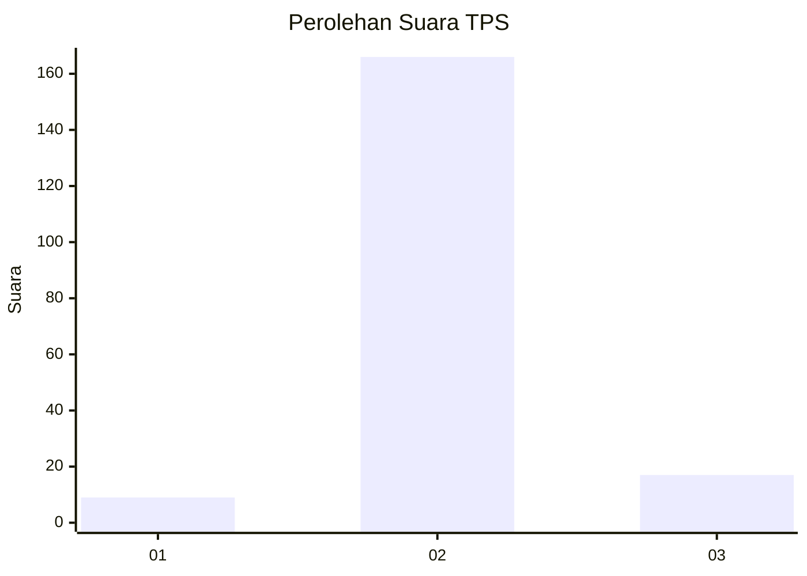
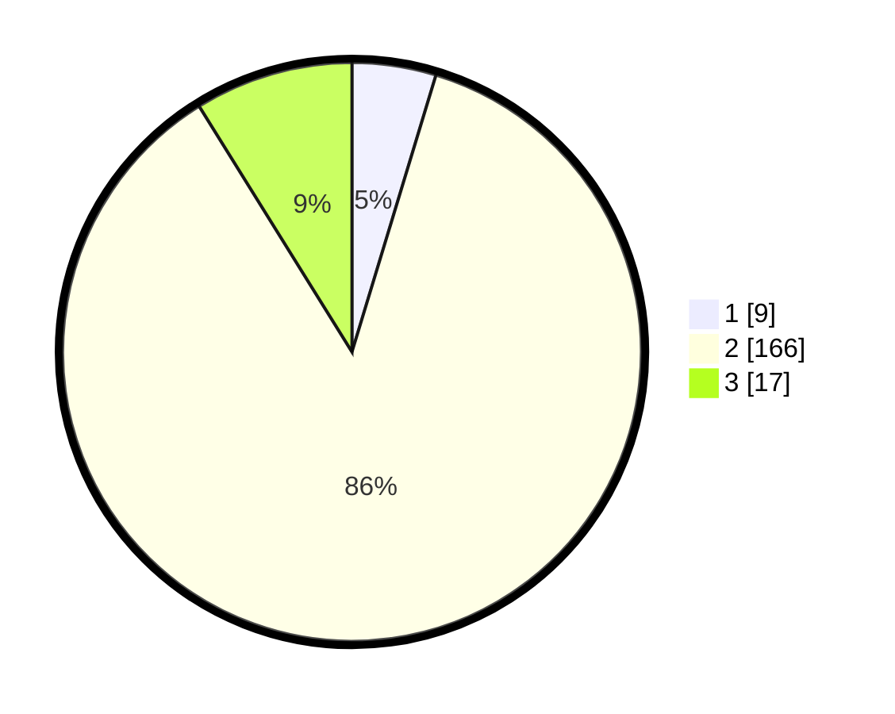

# Hasil

## Grafik

## Tabel

| No. | Nama Paslon    | Suara | Suara (raw) | Persentase |
|:--- |:-------------- | -----:| -----------:| ----------:|
| 1   | ANIES MUHAIMIN | 9     | [9][p-1]    | 4,69       |
| 2   | PRABOWO GIBRAN | 166   | [166][p-2]  | 86,46      |
| 3   | GANJAR MAHFUD  | 17    | [17][p-3]   | 8,85       |

[p-1]: https://github.com/gigit-pemilu/pemilu-2024-16-sumatera-selatan/blob/main/pilpres/hitung-suara/sub/16-sumatera-selatan/sub/05-musi-rawas/sub/02-muara-lakitan/sub/1019-muara-lakitan/sub/001-tps/sub/paslon-1.txt
[p-2]: https://github.com/gigit-pemilu/pemilu-2024-16-sumatera-selatan/blob/main/pilpres/hitung-suara/sub/16-sumatera-selatan/sub/05-musi-rawas/sub/02-muara-lakitan/sub/1019-muara-lakitan/sub/001-tps/sub/paslon-2.txt
[p-3]: https://github.com/gigit-pemilu/pemilu-2024-16-sumatera-selatan/blob/main/pilpres/hitung-suara/sub/16-sumatera-selatan/sub/05-musi-rawas/sub/02-muara-lakitan/sub/1019-muara-lakitan/sub/001-tps/sub/paslon-3.txt

## Foto C Plano

https://sirekap-obj-formc.kpu.go.id/adab/pemilu/ppwp/16/05/02/10/19/1605021019001-20240218-113304--77092313-c54d-4692-af25-a71269005a77.jpg

https://sirekap-obj-formc.kpu.go.id/adab/pemilu/ppwp/16/05/02/10/19/1605021019001-20240218-112828--f4f88ca8-54cf-45aa-9685-3a697ef02308.jpg

https://sirekap-obj-formc.kpu.go.id/adab/pemilu/ppwp/16/05/02/10/19/1605021019001-20240218-112953--88a86a28-574f-4bdc-b56e-cfaa66abdf92.jpg

## Metadata

| Key        | Value               |
| ---------- | ------------------- |
| Time Stamp | 2024-02-20 16:00:00 |

