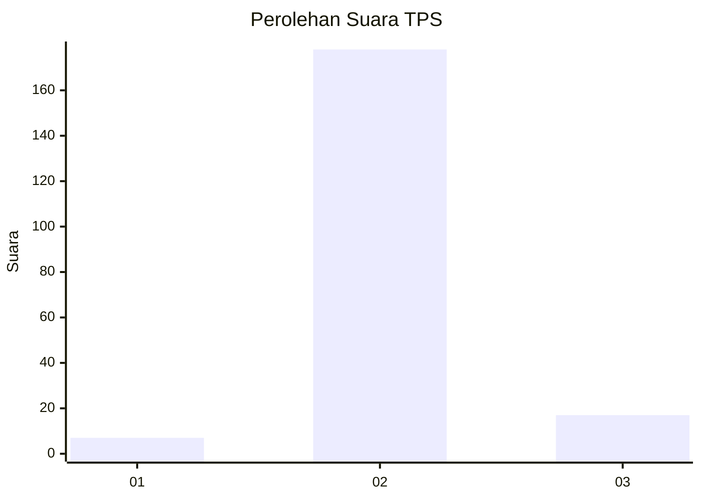
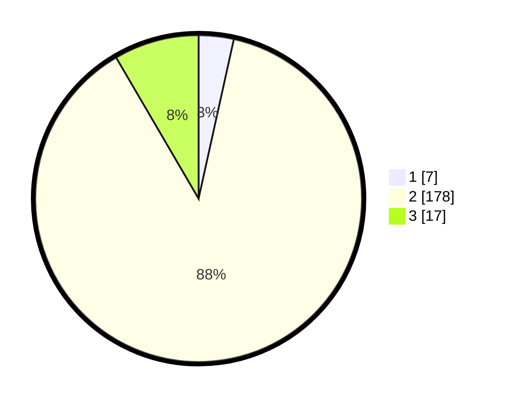

# Hasil

## Grafik

## Tabel

| No. | Nama Paslon    | Suara | Suara (raw) | Persentase |
|:--- |:-------------- | -----:| -----------:| ----------:|
| 1   | ANIES MUHAIMIN | 7     | [7][p-1]    | 3,47       |
| 2   | PRABOWO GIBRAN | 178   | [178][p-2]  | 88,12      |
| 3   | GANJAR MAHFUD  | 17    | [17][p-3]   | 8,42       |

[p-1]: https://github.com/gigit-pemilu/pemilu-2024-16-sumatera-selatan/blob/main/pilpres/hitung-suara/sub/16-sumatera-selatan/sub/05-musi-rawas/sub/02-muara-lakitan/sub/1019-muara-lakitan/sub/002-tps/sub/paslon-1.txt
[p-2]: https://github.com/gigit-pemilu/pemilu-2024-16-sumatera-selatan/blob/main/pilpres/hitung-suara/sub/16-sumatera-selatan/sub/05-musi-rawas/sub/02-muara-lakitan/sub/1019-muara-lakitan/sub/002-tps/sub/paslon-2.txt
[p-3]: https://github.com/gigit-pemilu/pemilu-2024-16-sumatera-selatan/blob/main/pilpres/hitung-suara/sub/16-sumatera-selatan/sub/05-musi-rawas/sub/02-muara-lakitan/sub/1019-muara-lakitan/sub/002-tps/sub/paslon-3.txt

## Foto C Plano

https://sirekap-obj-formc.kpu.go.id/84ca/pemilu/ppwp/16/05/02/10/19/1605021019002-20240218-114405--ea65d074-9013-404e-8cf5-de98a45834f0.jpg

https://sirekap-obj-formc.kpu.go.id/84ca/pemilu/ppwp/16/05/02/10/19/1605021019002-20240214-211653--636ed9cd-500c-4d48-96d4-812b7ea50868.jpg

https://sirekap-obj-formc.kpu.go.id/84ca/pemilu/ppwp/16/05/02/10/19/1605021019002-20240218-114953--87e9ff68-5522-4dff-b97e-2c58c777bc22.jpg

## Metadata

| Key        | Value               |
| ---------- | ------------------- |
| Time Stamp | 2024-02-20 16:00:00 |

