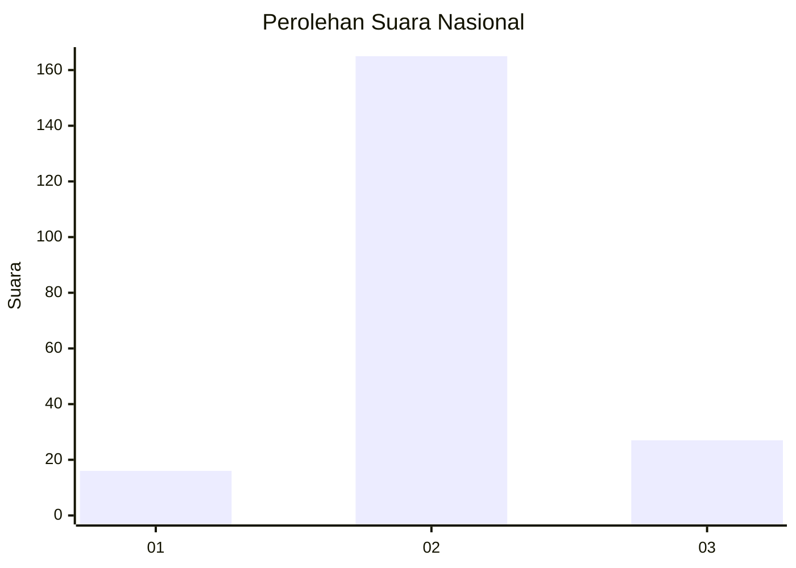
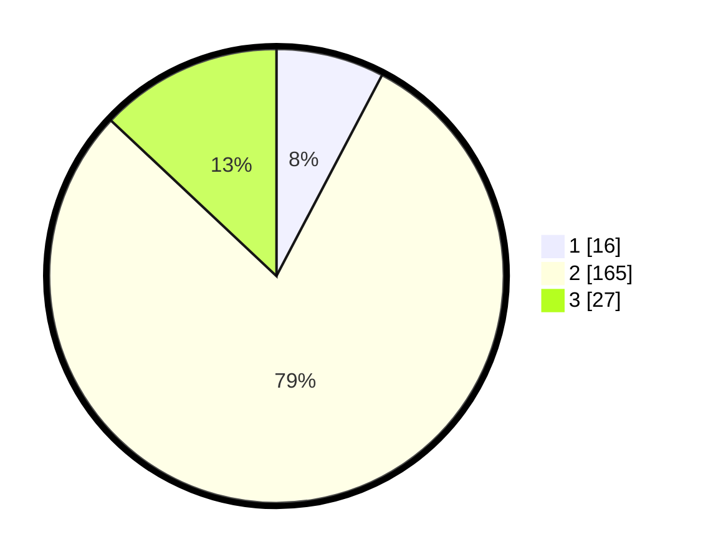

# Hasil

## Grafik

## Tabel

| No. | Nama Paslon    | Suara | Suara (raw) | Persentase |
|:--- |:-------------- | -----:| -----------:| ----------:|
| 1   | ANIES MUHAIMIN | 16    | [16][p-1]   | 7,69       |
| 2   | PRABOWO GIBRAN | 165   | [165][p-2]  | 79,33      |
| 3   | GANJAR MAHFUD  | 27    | [27][p-3]   | 12,98      |

[p-1]: https://github.com/gigit-pemilu/pemilu-2024/blob/main/pilpres/hitung-suara/sub/16-sumatera-selatan/sub/05-musi-rawas/sub/02-muara-lakitan/sub/1019-muara-lakitan/sub/003-tps/sub/paslon-1.txt
[p-2]: https://github.com/gigit-pemilu/pemilu-2024/blob/main/pilpres/hitung-suara/sub/16-sumatera-selatan/sub/05-musi-rawas/sub/02-muara-lakitan/sub/1019-muara-lakitan/sub/003-tps/sub/paslon-2.txt
[p-3]: https://github.com/gigit-pemilu/pemilu-2024/blob/main/pilpres/hitung-suara/sub/16-sumatera-selatan/sub/05-musi-rawas/sub/02-muara-lakitan/sub/1019-muara-lakitan/sub/003-tps/sub/paslon-3.txt

## Foto C Plano

https://sirekap-obj-formc.kpu.go.id/b426/pemilu/ppwp/16/05/02/10/19/1605021019003-20240218-115121--8e21aa0d-2344-42a8-8554-96558e9b84f2.jpg

https://sirekap-obj-formc.kpu.go.id/b426/pemilu/ppwp/16/05/02/10/19/1605021019003-20240218-115216--056ccded-fefb-41f0-9496-087c57c0ac4d.jpg

https://sirekap-obj-formc.kpu.go.id/b426/pemilu/ppwp/16/05/02/10/19/1605021019003-20240218-115311--d4e602e1-d351-41b3-9884-aefba2027da5.jpg

## Metadata

| Key        | Value               |
| ---------- | ------------------- |
| Time Stamp | 2024-02-20 16:00:00 |

