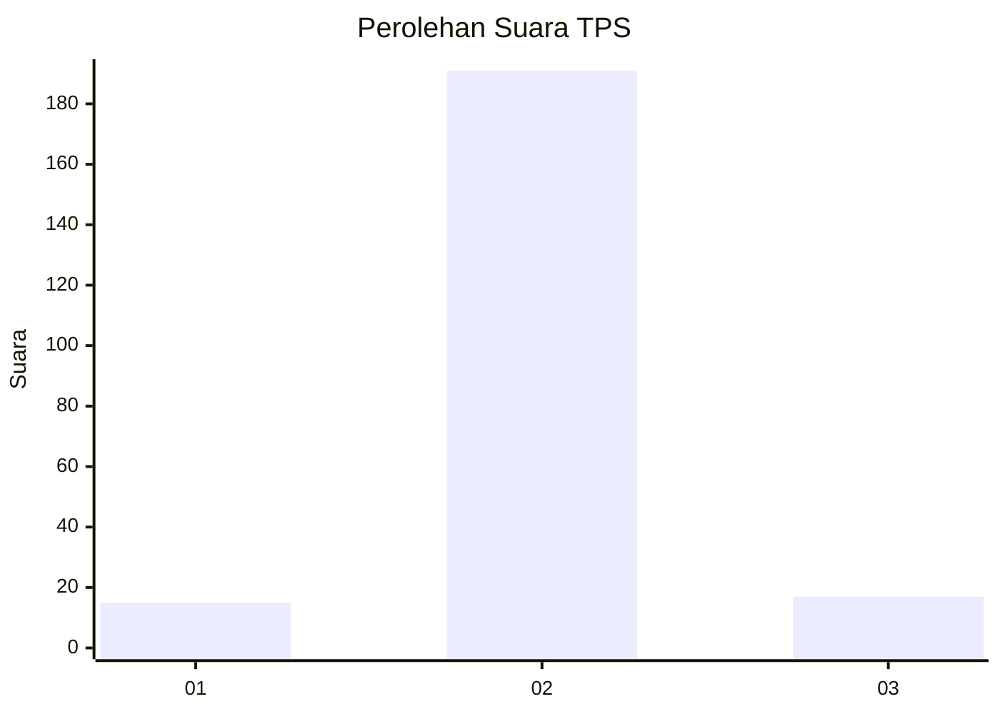
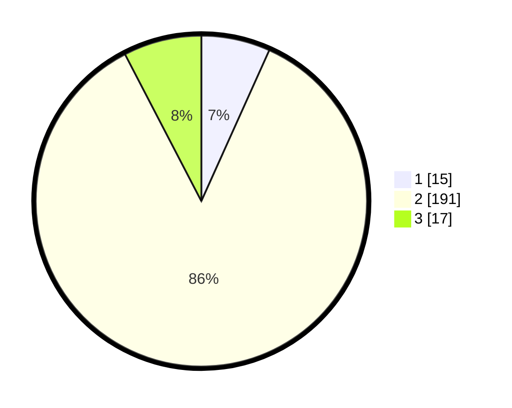

# Hasil

## Grafik

## Tabel

| No. | Nama Paslon    | Suara | Suara (raw) | Persentase |
|:--- |:-------------- | -----:| -----------:| ----------:|
| 1   | ANIES MUHAIMIN | 15    | [15][p-1]   | 6,73       |
| 2   | PRABOWO GIBRAN | 191   | [191][p-2]  | 85,65      |
| 3   | GANJAR MAHFUD  | 17    | [17][p-3]   | 7,62       |

[p-1]: https://github.com/gigit-pemilu/pemilu-2024-16-sumatera-selatan/blob/main/pilpres/hitung-suara/sub/16-sumatera-selatan/sub/05-musi-rawas/sub/02-muara-lakitan/sub/1019-muara-lakitan/sub/005-tps/sub/paslon-1.txt
[p-2]: https://github.com/gigit-pemilu/pemilu-2024-16-sumatera-selatan/blob/main/pilpres/hitung-suara/sub/16-sumatera-selatan/sub/05-musi-rawas/sub/02-muara-lakitan/sub/1019-muara-lakitan/sub/005-tps/sub/paslon-2.txt
[p-3]: https://github.com/gigit-pemilu/pemilu-2024-16-sumatera-selatan/blob/main/pilpres/hitung-suara/sub/16-sumatera-selatan/sub/05-musi-rawas/sub/02-muara-lakitan/sub/1019-muara-lakitan/sub/005-tps/sub/paslon-3.txt

## Foto C Plano

https://sirekap-obj-formc.kpu.go.id/b368/pemilu/ppwp/16/05/02/10/19/1605021019005-20240218-120920--fa57d565-f286-4d27-b065-ab7fa5317103.jpg

https://sirekap-obj-formc.kpu.go.id/b368/pemilu/ppwp/16/05/02/10/19/1605021019005-20240218-121013--fdd9d767-0e59-4391-a14d-ce5c54c2beb0.jpg

https://sirekap-obj-formc.kpu.go.id/b368/pemilu/ppwp/16/05/02/10/19/1605021019005-20240218-121119--6c4794d6-0096-48a7-8c59-9510d87ec2ab.jpg

## Metadata

| Key        | Value               |
| ---------- | ------------------- |
| Time Stamp | 2024-02-20 16:00:00 |

