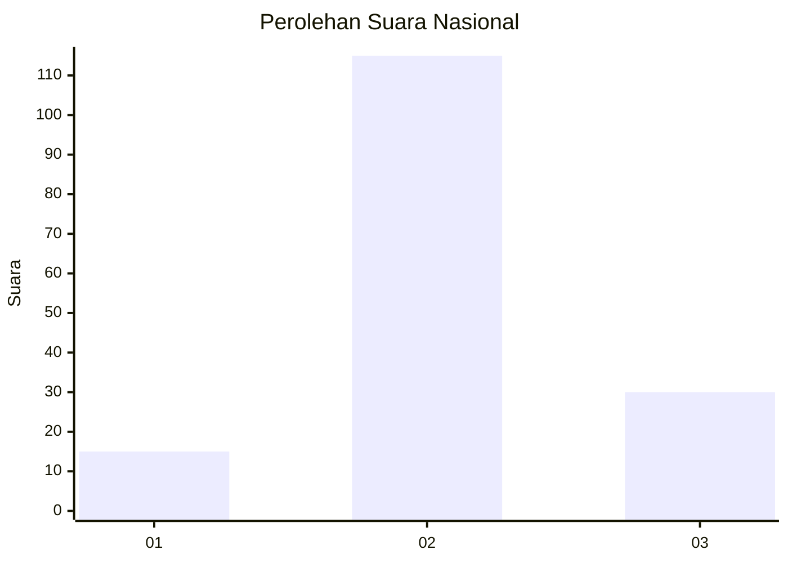
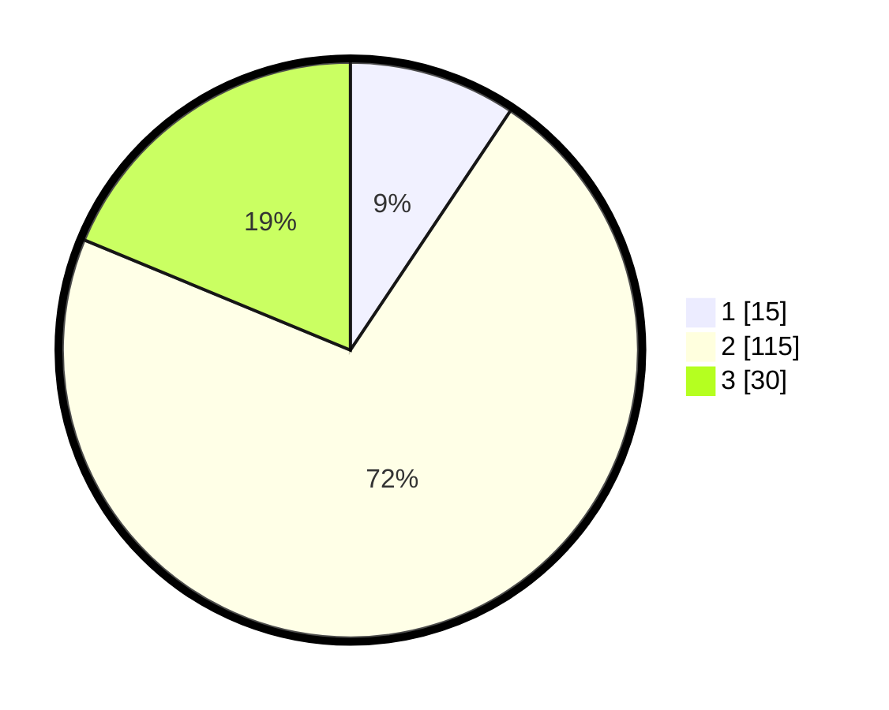

# Hasil

## Grafik

## Tabel

| No. | Nama Paslon    | Suara | Suara (raw) | Persentase |
|:--- |:-------------- | -----:| -----------:| ----------:|
| 1   | ANIES MUHAIMIN | 15    | [15][p-1]   | 9,38       |
| 2   | PRABOWO GIBRAN | 115   | [115][p-2]  | 71,88      |
| 3   | GANJAR MAHFUD  | 30    | [30][p-3]   | 18,75      |

[p-1]: https://github.com/gigit-pemilu/pemilu-2024/blob/main/pilpres/hitung-suara/sub/16-sumatera-selatan/sub/05-musi-rawas/sub/02-muara-lakitan/sub/2001-tri-anggun-jaya/sub/003-tps/sub/paslon-1.txt
[p-2]: https://github.com/gigit-pemilu/pemilu-2024/blob/main/pilpres/hitung-suara/sub/16-sumatera-selatan/sub/05-musi-rawas/sub/02-muara-lakitan/sub/2001-tri-anggun-jaya/sub/003-tps/sub/paslon-2.txt
[p-3]: https://github.com/gigit-pemilu/pemilu-2024/blob/main/pilpres/hitung-suara/sub/16-sumatera-selatan/sub/05-musi-rawas/sub/02-muara-lakitan/sub/2001-tri-anggun-jaya/sub/003-tps/sub/paslon-3.txt

## Foto C Plano

https://sirekap-obj-formc.kpu.go.id/ebff/pemilu/ppwp/16/05/02/20/01/1605022001003-20240214-233627--cca44b4f-5030-482a-993e-1a8bc3aab0e2.jpg

https://sirekap-obj-formc.kpu.go.id/ebff/pemilu/ppwp/16/05/02/20/01/1605022001003-20240215-001337--c1d840d4-2e3c-4949-a4d9-d88ba1f4eb20.jpg

https://sirekap-obj-formc.kpu.go.id/ebff/pemilu/ppwp/16/05/02/20/01/1605022001003-20240215-001626--ad5b26ba-fa7b-43e6-8956-3bbf68fcee60.jpg

## Metadata

| Key        | Value               |
| ---------- | ------------------- |
| Time Stamp | 2024-02-25 12:00:00 |

