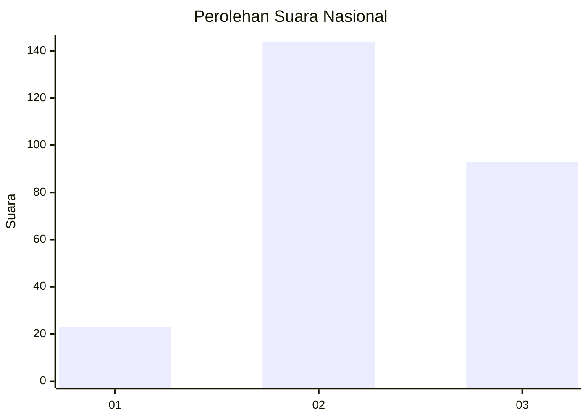
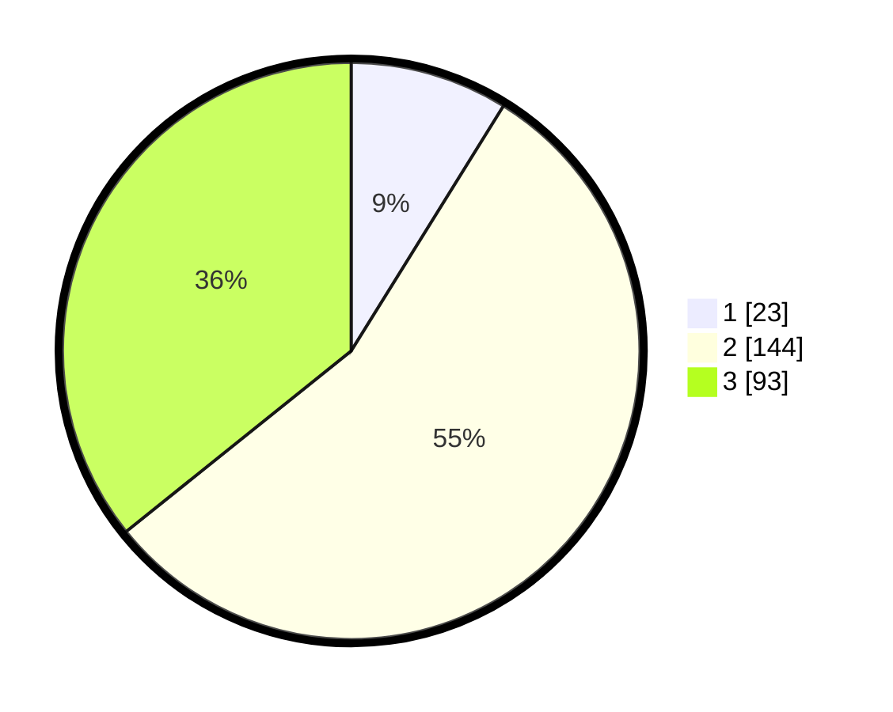

# Hasil

## Grafik

## Tabel

| No. | Nama Paslon    | Suara | Suara (raw) | Persentase |
|:--- |:-------------- | -----:| -----------:| ----------:|
| 1   | ANIES MUHAIMIN | 23    | [23][p-1]   | 8,85       |
| 2   | PRABOWO GIBRAN | 144   | [144][p-2]  | 55,38      |
| 3   | GANJAR MAHFUD  | 93    | [93][p-3]   | 35,77      |

[p-1]: https://github.com/gigit-pemilu/pemilu-2024/blob/main/pilpres/hitung-suara/sub/16-sumatera-selatan/sub/05-musi-rawas/sub/02-muara-lakitan/sub/2010-pelita-jaya/sub/006-tps/sub/paslon-1.txt
[p-2]: https://github.com/gigit-pemilu/pemilu-2024/blob/main/pilpres/hitung-suara/sub/16-sumatera-selatan/sub/05-musi-rawas/sub/02-muara-lakitan/sub/2010-pelita-jaya/sub/006-tps/sub/paslon-2.txt
[p-3]: https://github.com/gigit-pemilu/pemilu-2024/blob/main/pilpres/hitung-suara/sub/16-sumatera-selatan/sub/05-musi-rawas/sub/02-muara-lakitan/sub/2010-pelita-jaya/sub/006-tps/sub/paslon-3.txt

## Foto C Plano

https://sirekap-obj-formc.kpu.go.id/facc/pemilu/ppwp/16/05/02/20/10/1605022010006-20240215-064618--7cce4111-9eab-4c48-b9e1-bc2c7653938f.jpg

https://sirekap-obj-formc.kpu.go.id/facc/pemilu/ppwp/16/05/02/20/10/1605022010006-20240215-064622--5dd274b3-3a63-4aab-b7ef-26416bfe0f61.jpg

https://sirekap-obj-formc.kpu.go.id/facc/pemilu/ppwp/16/05/02/20/10/1605022010006-20240215-064627--553e44bc-9573-4a10-9ba9-62e1104ad2a2.jpg

## Metadata

| Key        | Value               |
| ---------- | ------------------- |
| Time Stamp | 2024-02-20 19:00:00 |

