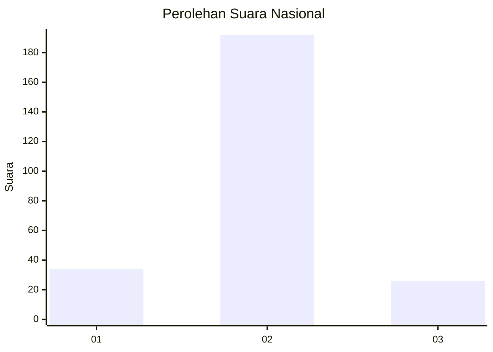
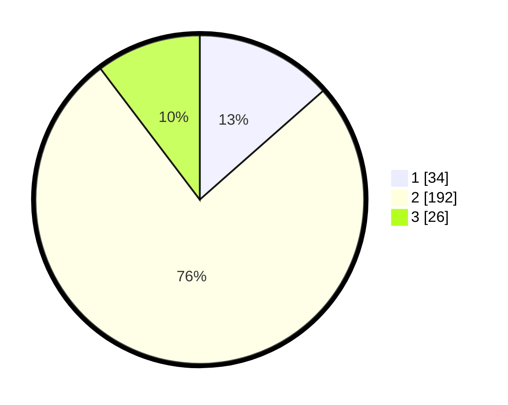

# Hasil

## Grafik

## Tabel

| No. | Nama Paslon    | Suara | Suara (raw) | Persentase |
|:--- |:-------------- | -----:| -----------:| ----------:|
| 1   | ANIES MUHAIMIN | 34    | [34][p-1]   | 13,49      |
| 2   | PRABOWO GIBRAN | 192   | [192][p-2]  | 76,19      |
| 3   | GANJAR MAHFUD  | 26    | [26][p-3]   | 10,32      |

[p-1]: https://github.com/gigit-pemilu/pemilu-2024/blob/main/pilpres/hitung-suara/sub/16-sumatera-selatan/sub/05-musi-rawas/sub/03-muara-kelingi/sub/2003-tanjung-lama/sub/004-tps/sub/paslon-1.txt
[p-2]: https://github.com/gigit-pemilu/pemilu-2024/blob/main/pilpres/hitung-suara/sub/16-sumatera-selatan/sub/05-musi-rawas/sub/03-muara-kelingi/sub/2003-tanjung-lama/sub/004-tps/sub/paslon-2.txt
[p-3]: https://github.com/gigit-pemilu/pemilu-2024/blob/main/pilpres/hitung-suara/sub/16-sumatera-selatan/sub/05-musi-rawas/sub/03-muara-kelingi/sub/2003-tanjung-lama/sub/004-tps/sub/paslon-3.txt

## Foto C Plano

https://sirekap-obj-formc.kpu.go.id/b987/pemilu/ppwp/16/05/03/20/03/1605032003004-20240217-123412--1ef129c5-d86b-4031-bd06-153c73938d6a.jpg

https://sirekap-obj-formc.kpu.go.id/b987/pemilu/ppwp/16/05/03/20/03/1605032003004-20240217-123434--bf012556-57f0-4a42-b2a3-36b558e84bd3.jpg

https://sirekap-obj-formc.kpu.go.id/b987/pemilu/ppwp/16/05/03/20/03/1605032003004-20240217-123628--c424cdbf-e2f2-4e56-8ad8-e0e34e1ab4ca.jpg

## Metadata

| Key        | Value               |
| ---------- | ------------------- |
| Time Stamp | 2024-02-24 23:00:00 |

