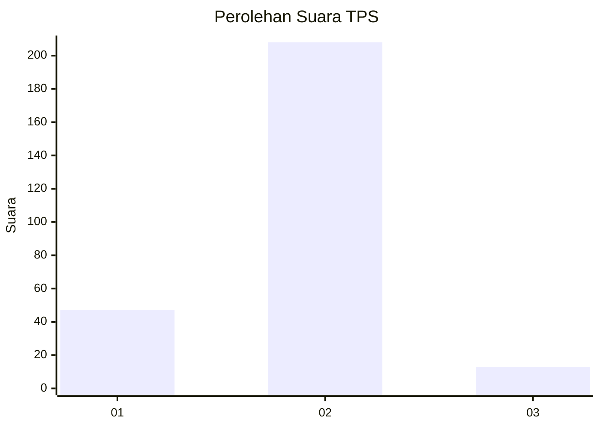
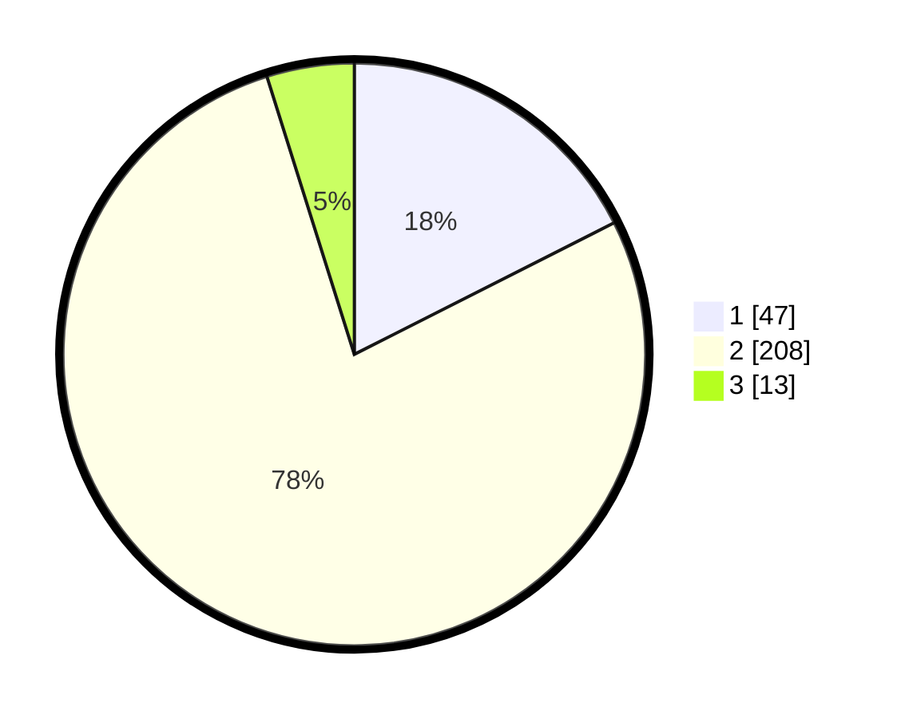

# Hasil

## Grafik

## Tabel

| No. | Nama Paslon    | Suara | Suara (raw) | Persentase |
|:--- |:-------------- | -----:| -----------:| ----------:|
| 1   | ANIES MUHAIMIN | 47    | [47][p-1]   | 17,54      |
| 2   | PRABOWO GIBRAN | 208   | [208][p-2]  | 77,61      |
| 3   | GANJAR MAHFUD  | 13    | [13][p-3]   | 4,85       |

[p-1]: https://github.com/gigit-pemilu/pemilu-2024-16-sumatera-selatan/blob/main/pilpres/hitung-suara/sub/16-sumatera-selatan/sub/05-musi-rawas/sub/03-muara-kelingi/sub/2015-mambang/sub/004-tps/sub/paslon-1.txt
[p-2]: https://github.com/gigit-pemilu/pemilu-2024-16-sumatera-selatan/blob/main/pilpres/hitung-suara/sub/16-sumatera-selatan/sub/05-musi-rawas/sub/03-muara-kelingi/sub/2015-mambang/sub/004-tps/sub/paslon-2.txt
[p-3]: https://github.com/gigit-pemilu/pemilu-2024-16-sumatera-selatan/blob/main/pilpres/hitung-suara/sub/16-sumatera-selatan/sub/05-musi-rawas/sub/03-muara-kelingi/sub/2015-mambang/sub/004-tps/sub/paslon-3.txt

## Foto C Plano

https://sirekap-obj-formc.kpu.go.id/f155/pemilu/ppwp/16/05/03/20/15/1605032015004-20240215-000605--8615cf78-9b23-4aec-8b3b-4e03305aaacf.jpg

https://sirekap-obj-formc.kpu.go.id/f155/pemilu/ppwp/16/05/03/20/15/1605032015004-20240215-000812--cc8ef5ec-5471-463c-9e1d-f38dd92433bf.jpg

https://sirekap-obj-formc.kpu.go.id/f155/pemilu/ppwp/16/05/03/20/15/1605032015004-20240215-000952--d87a4635-a35c-45b0-ad1c-42805d33f9ee.jpg

## Metadata

| Key        | Value               |
| ---------- | ------------------- |
| Time Stamp | 2024-02-25 16:00:00 |

