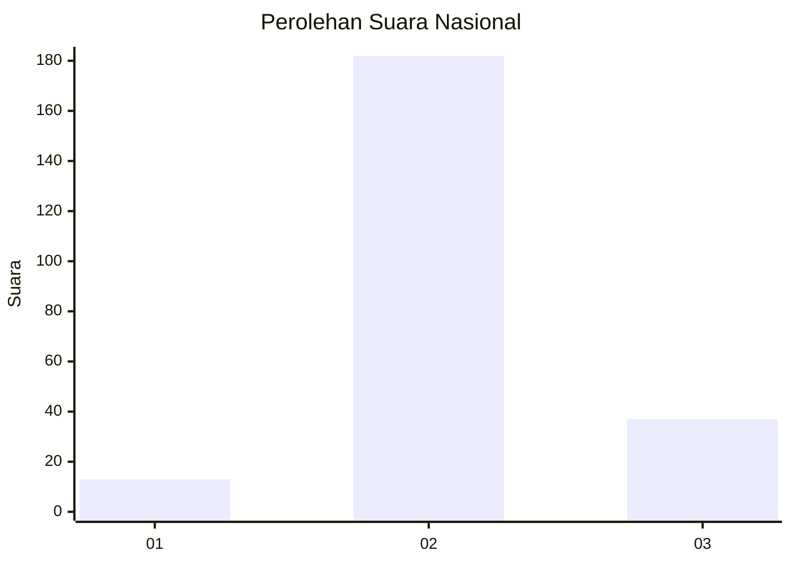
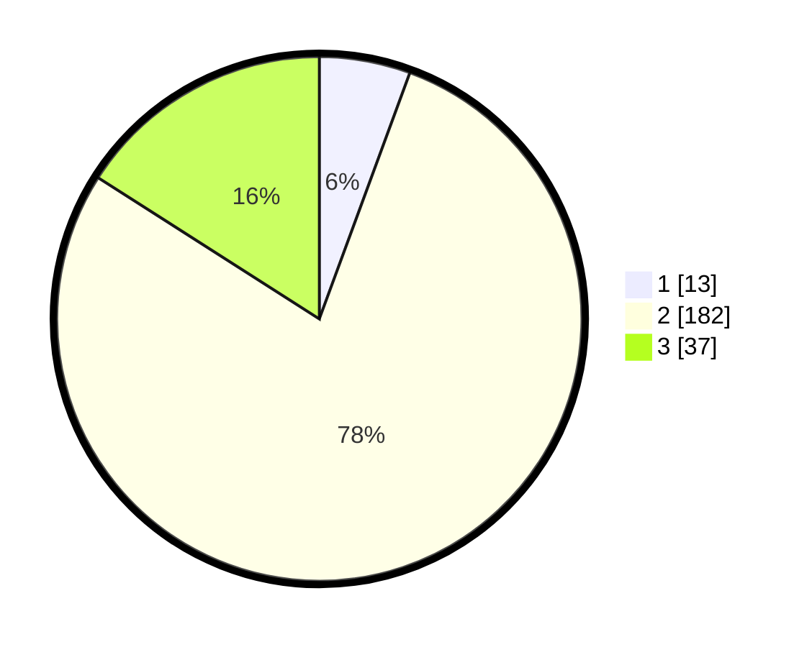

# Hasil

## Grafik

## Tabel

| No. | Nama Paslon    | Suara | Suara (raw) | Persentase |
|:--- |:-------------- | -----:| -----------:| ----------:|
| 1   | ANIES MUHAIMIN | 13    | [13][p-1]   | 5,60       |
| 2   | PRABOWO GIBRAN | 182   | [182][p-2]  | 78,45      |
| 3   | GANJAR MAHFUD  | 37    | [37][p-3]   | 15,95      |

[p-1]: https://github.com/gigit-pemilu/pemilu-2024/blob/main/pilpres/hitung-suara/sub/16-sumatera-selatan/sub/05-musi-rawas/sub/03-muara-kelingi/sub/2017-tugu-sempurna/sub/002-tps/sub/paslon-1.txt
[p-2]: https://github.com/gigit-pemilu/pemilu-2024/blob/main/pilpres/hitung-suara/sub/16-sumatera-selatan/sub/05-musi-rawas/sub/03-muara-kelingi/sub/2017-tugu-sempurna/sub/002-tps/sub/paslon-2.txt
[p-3]: https://github.com/gigit-pemilu/pemilu-2024/blob/main/pilpres/hitung-suara/sub/16-sumatera-selatan/sub/05-musi-rawas/sub/03-muara-kelingi/sub/2017-tugu-sempurna/sub/002-tps/sub/paslon-3.txt

## Foto C Plano

https://sirekap-obj-formc.kpu.go.id/e8eb/pemilu/ppwp/16/05/03/20/17/1605032017002-20240214-214843--d896e2c2-4765-4fad-b1dc-9f52eb30a312.jpg

https://sirekap-obj-formc.kpu.go.id/e8eb/pemilu/ppwp/16/05/03/20/17/1605032017002-20240214-213539--498bedd8-c385-4ed5-9fe2-510983678633.jpg

https://sirekap-obj-formc.kpu.go.id/e8eb/pemilu/ppwp/16/05/03/20/17/1605032017002-20240214-215036--0816c643-c16c-4975-aeea-4e5ea7ae9379.jpg

## Metadata

| Key        | Value               |
| ---------- | ------------------- |
| Time Stamp | 2024-02-25 11:00:00 |

