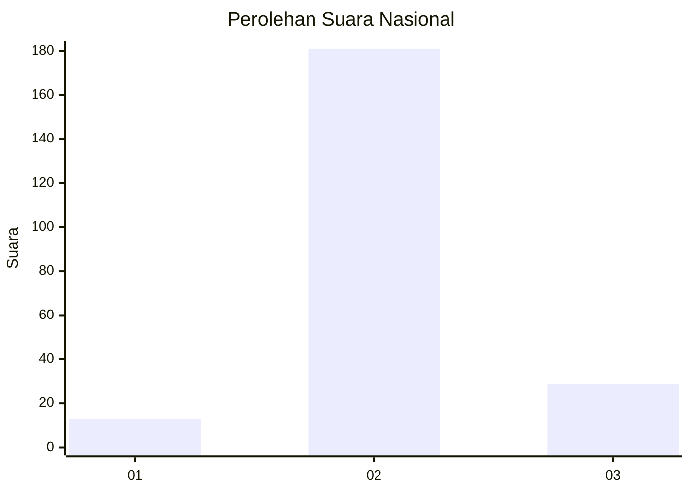
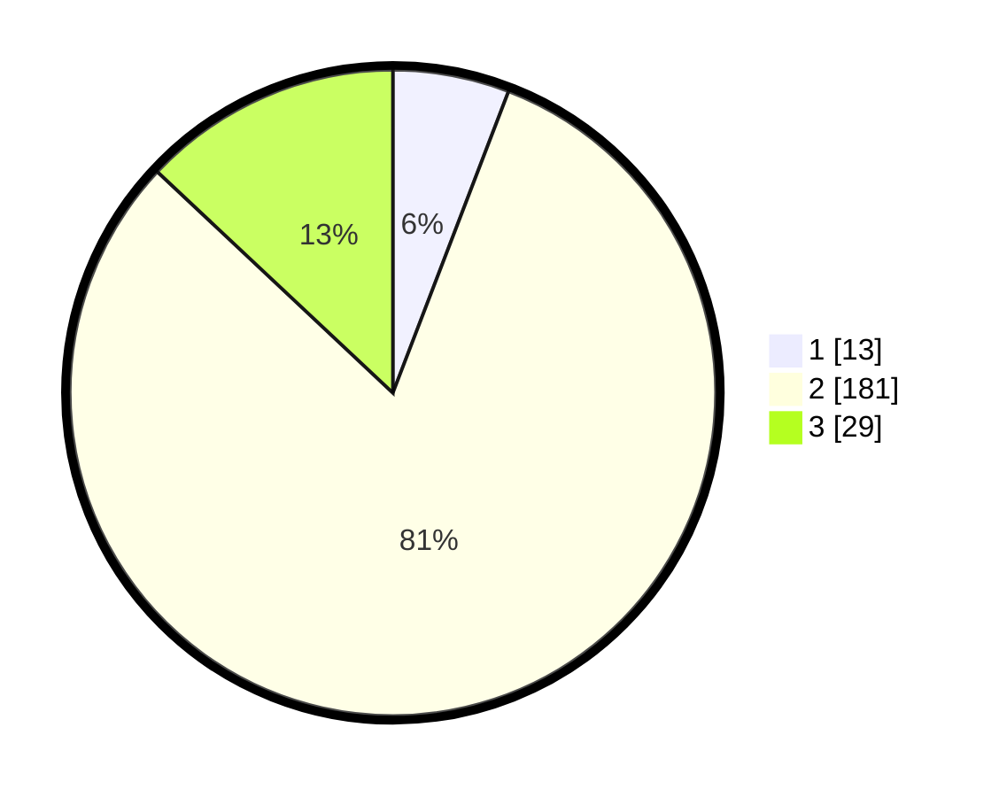

# Hasil

## Grafik

## Tabel

| No. | Nama Paslon    | Suara | Suara (raw) | Persentase |
|:--- |:-------------- | -----:| -----------:| ----------:|
| 1   | ANIES MUHAIMIN | 13    | [13][p-1]   | 5,83       |
| 2   | PRABOWO GIBRAN | 181   | [181][p-2]  | 81,17      |
| 3   | GANJAR MAHFUD  | 29    | [29][p-3]   | 13,00      |

[p-1]: https://github.com/gigit-pemilu/pemilu-2024/blob/main/pilpres/hitung-suara/sub/16-sumatera-selatan/sub/05-musi-rawas/sub/03-muara-kelingi/sub/2019-marga-sakti/sub/004-tps/sub/paslon-1.txt
[p-2]: https://github.com/gigit-pemilu/pemilu-2024/blob/main/pilpres/hitung-suara/sub/16-sumatera-selatan/sub/05-musi-rawas/sub/03-muara-kelingi/sub/2019-marga-sakti/sub/004-tps/sub/paslon-2.txt
[p-3]: https://github.com/gigit-pemilu/pemilu-2024/blob/main/pilpres/hitung-suara/sub/16-sumatera-selatan/sub/05-musi-rawas/sub/03-muara-kelingi/sub/2019-marga-sakti/sub/004-tps/sub/paslon-3.txt

## Foto C Plano

https://sirekap-obj-formc.kpu.go.id/f83a/pemilu/ppwp/16/05/03/20/19/1605032019004-20240218-233118--0387854c-a12a-47e0-afcf-1256ce047d0c.jpg

https://sirekap-obj-formc.kpu.go.id/f83a/pemilu/ppwp/16/05/03/20/19/1605032019004-20240218-233703--be8696b0-4b32-47f6-a7ad-6f3e6a01a083.jpg

https://sirekap-obj-formc.kpu.go.id/f83a/pemilu/ppwp/16/05/03/20/19/1605032019004-20240218-234008--66073279-123f-4cf5-9c53-23017c4a08ac.jpg

## Metadata

| Key        | Value               |
| ---------- | ------------------- |
| Time Stamp | 2024-02-25 17:00:00 |

