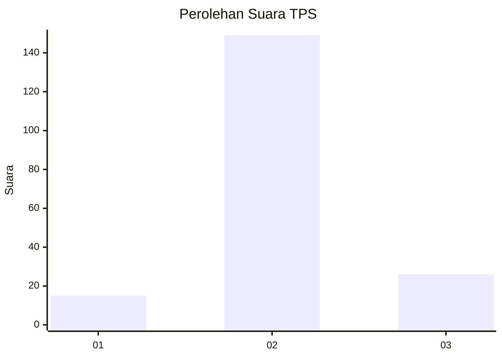
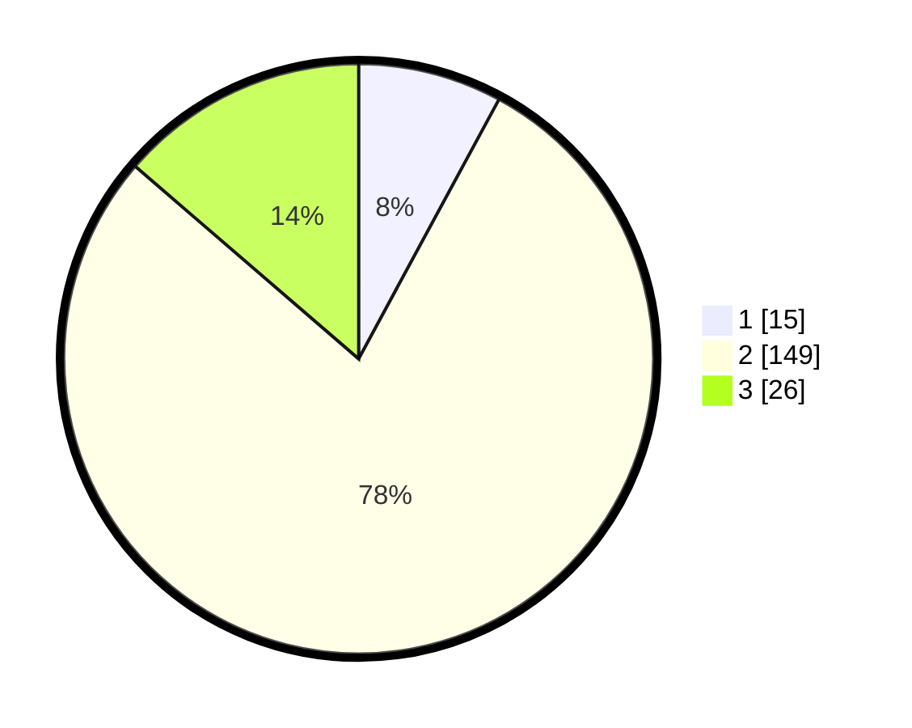

# Hasil

## Grafik

## Tabel

| No. | Nama Paslon    | Suara | Suara (raw) | Persentase |
|:--- |:-------------- | -----:| -----------:| ----------:|
| 1   | ANIES MUHAIMIN | 15    | [15][p-1]   | 7,89       |
| 2   | PRABOWO GIBRAN | 149   | [149][p-2]  | 78,42      |
| 3   | GANJAR MAHFUD  | 26    | [26][p-3]   | 13,68      |

[p-1]: https://github.com/gigit-pemilu/pemilu-2024-16-sumatera-selatan/blob/main/pilpres/hitung-suara/sub/16-sumatera-selatan/sub/05-musi-rawas/sub/08-jayaloka/sub/2001-giri-yoso/sub/001-tps/sub/paslon-1.txt
[p-2]: https://github.com/gigit-pemilu/pemilu-2024-16-sumatera-selatan/blob/main/pilpres/hitung-suara/sub/16-sumatera-selatan/sub/05-musi-rawas/sub/08-jayaloka/sub/2001-giri-yoso/sub/001-tps/sub/paslon-2.txt
[p-3]: https://github.com/gigit-pemilu/pemilu-2024-16-sumatera-selatan/blob/main/pilpres/hitung-suara/sub/16-sumatera-selatan/sub/05-musi-rawas/sub/08-jayaloka/sub/2001-giri-yoso/sub/001-tps/sub/paslon-3.txt

## Foto C Plano

https://sirekap-obj-formc.kpu.go.id/a836/pemilu/ppwp/16/05/08/20/01/1605082001001-20240214-194824--6c31ad7b-fa1f-41f1-8709-e918175f3f2c.jpg

https://sirekap-obj-formc.kpu.go.id/a836/pemilu/ppwp/16/05/08/20/01/1605082001001-20240214-194831--311cfe35-648d-4bca-8298-fc0a85ae9c01.jpg

https://sirekap-obj-formc.kpu.go.id/a836/pemilu/ppwp/16/05/08/20/01/1605082001001-20240214-194839--3f808e3c-390f-4ac6-ac5c-42004d9dff19.jpg

## Metadata

| Key        | Value               |
| ---------- | ------------------- |
| Time Stamp | 2024-02-26 14:00:00 |

