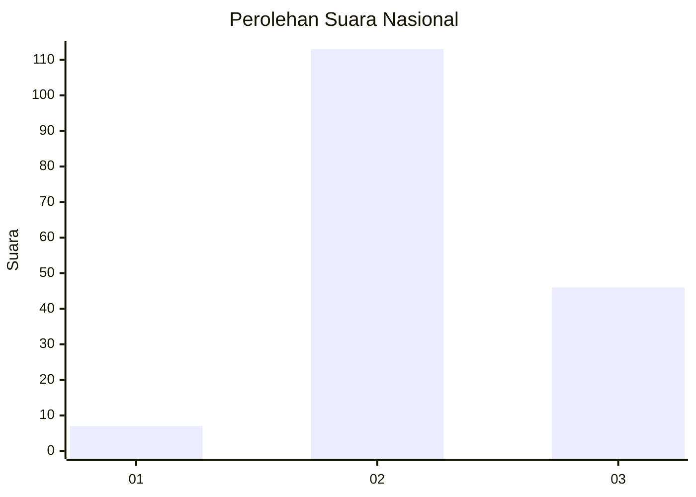
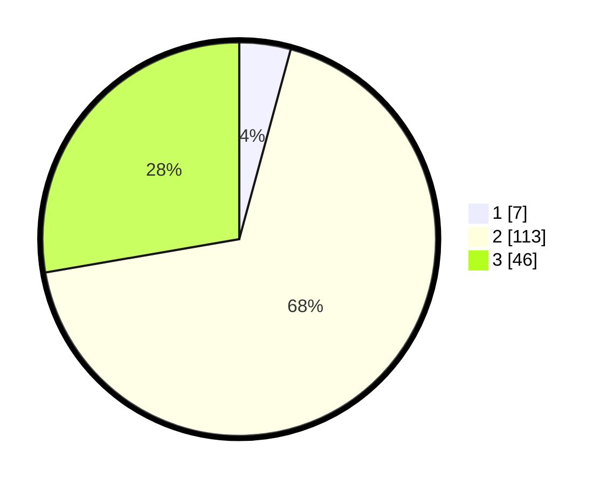

# Hasil

## Grafik

## Tabel

| No. | Nama Paslon    | Suara | Suara (raw) | Persentase |
|:--- |:-------------- | -----:| -----------:| ----------:|
| 1   | ANIES MUHAIMIN | 7     | [7][p-1]    | 4,22       |
| 2   | PRABOWO GIBRAN | 113   | [113][p-2]  | 68,07      |
| 3   | GANJAR MAHFUD  | 46    | [46][p-3]   | 27,71      |

[p-1]: https://github.com/gigit-pemilu/pemilu-2024/blob/main/pilpres/hitung-suara/sub/16-sumatera-selatan/sub/05-musi-rawas/sub/08-jayaloka/sub/2016-ngesti-boga-ii/sub/001-tps/sub/paslon-1.txt
[p-2]: https://github.com/gigit-pemilu/pemilu-2024/blob/main/pilpres/hitung-suara/sub/16-sumatera-selatan/sub/05-musi-rawas/sub/08-jayaloka/sub/2016-ngesti-boga-ii/sub/001-tps/sub/paslon-2.txt
[p-3]: https://github.com/gigit-pemilu/pemilu-2024/blob/main/pilpres/hitung-suara/sub/16-sumatera-selatan/sub/05-musi-rawas/sub/08-jayaloka/sub/2016-ngesti-boga-ii/sub/001-tps/sub/paslon-3.txt

## Foto C Plano

https://sirekap-obj-formc.kpu.go.id/7424/pemilu/ppwp/16/05/08/20/16/1605082016001-20240215-012350--c90b81b9-c909-48e2-b097-d77e77d2abfa.jpg

https://sirekap-obj-formc.kpu.go.id/7424/pemilu/ppwp/16/05/08/20/16/1605082016001-20240215-012522--404fabdc-b617-4e4c-9068-83cbc52f7d8d.jpg

https://sirekap-obj-formc.kpu.go.id/7424/pemilu/ppwp/16/05/08/20/16/1605082016001-20240215-012832--2d9fc562-f0fc-4098-b330-ac8b9d83a935.jpg

## Metadata

| Key        | Value               |
| ---------- | ------------------- |
| Time Stamp | 2024-02-24 22:31:28 |

