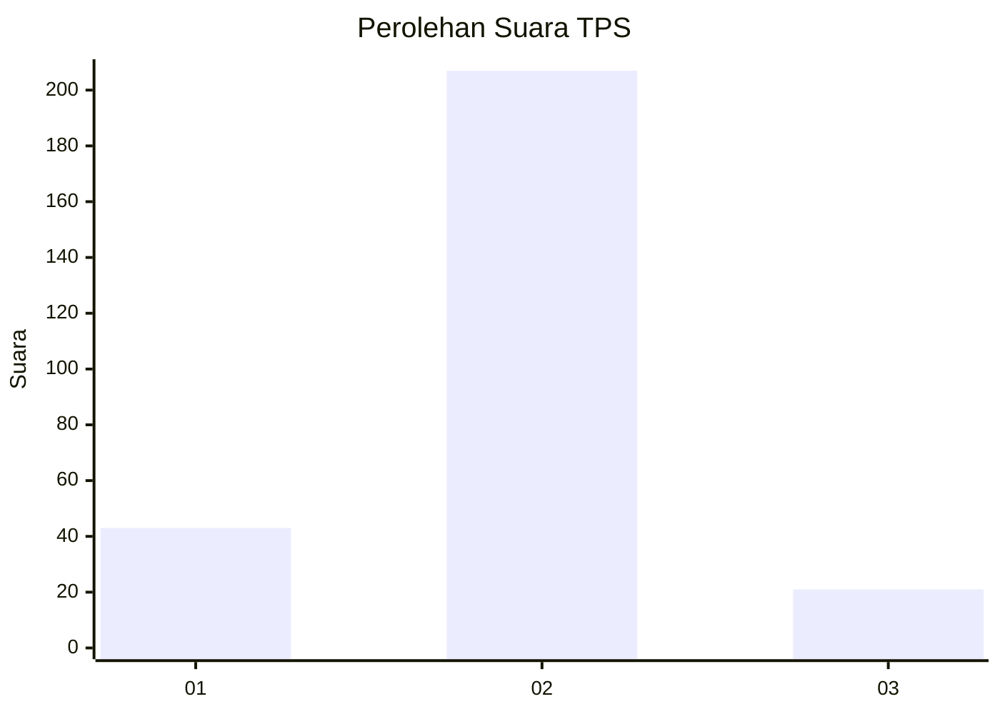
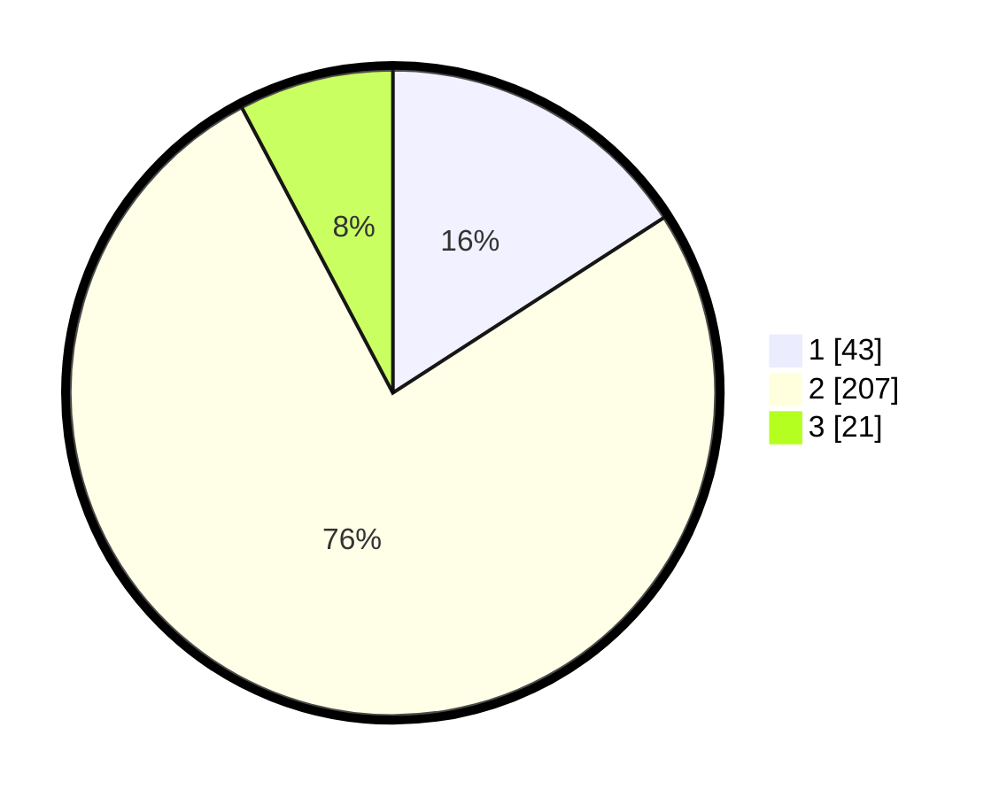

# Hasil

## Grafik

## Tabel

| No. | Nama Paslon    | Suara | Suara (raw) | Persentase |
|:--- |:-------------- | -----:| -----------:| ----------:|
| 1   | ANIES MUHAIMIN | 43    | [43][p-1]   | 15,87      |
| 2   | PRABOWO GIBRAN | 207   | [207][p-2]  | 76,38      |
| 3   | GANJAR MAHFUD  | 21    | [21][p-3]   | 7,75       |

[p-1]: https://github.com/gigit-pemilu/pemilu-2024-16-sumatera-selatan/blob/main/pilpres/hitung-suara/sub/16-sumatera-selatan/sub/05-musi-rawas/sub/09-muara-beliti/sub/1003-pasar-muara-beliti/sub/002-tps/sub/paslon-1.txt
[p-2]: https://github.com/gigit-pemilu/pemilu-2024-16-sumatera-selatan/blob/main/pilpres/hitung-suara/sub/16-sumatera-selatan/sub/05-musi-rawas/sub/09-muara-beliti/sub/1003-pasar-muara-beliti/sub/002-tps/sub/paslon-2.txt
[p-3]: https://github.com/gigit-pemilu/pemilu-2024-16-sumatera-selatan/blob/main/pilpres/hitung-suara/sub/16-sumatera-selatan/sub/05-musi-rawas/sub/09-muara-beliti/sub/1003-pasar-muara-beliti/sub/002-tps/sub/paslon-3.txt

## Foto C Plano

https://sirekap-obj-formc.kpu.go.id/7cbc/pemilu/ppwp/16/05/09/10/03/1605091003002-20240215-034608--ad89436a-6529-4b58-9eac-4cb85629e3a8.jpg

https://sirekap-obj-formc.kpu.go.id/7cbc/pemilu/ppwp/16/05/09/10/03/1605091003002-20240215-014357--f0d6aacf-acb6-41e1-9c30-e7f9d6aac680.jpg

https://sirekap-obj-formc.kpu.go.id/7cbc/pemilu/ppwp/16/05/09/10/03/1605091003002-20240214-155608--6f13121f-ef22-40b7-b2d6-1cb67e66299c.jpg

## Metadata

| Key        | Value               |
| ---------- | ------------------- |
| Time Stamp | 2024-02-25 20:00:00 |

