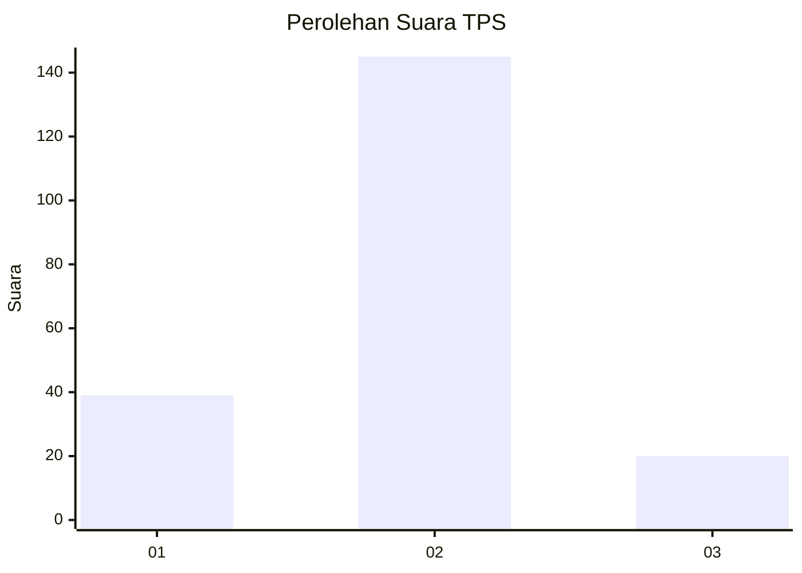
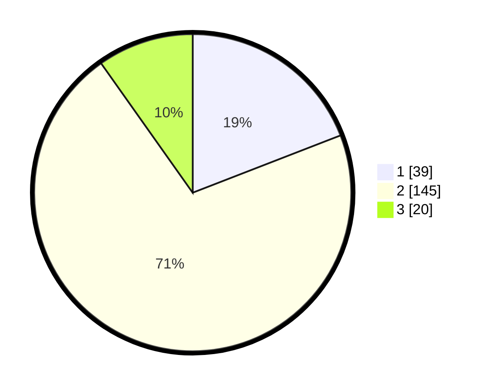

# Hasil

## Grafik

## Tabel

| No. | Nama Paslon    | Suara | Suara (raw) | Persentase |
|:--- |:-------------- | -----:| -----------:| ----------:|
| 1   | ANIES MUHAIMIN | 39    | [39][p-1]   | 19,12      |
| 2   | PRABOWO GIBRAN | 145   | [145][p-2]  | 71,08      |
| 3   | GANJAR MAHFUD  | 20    | [20][p-3]   | 9,80       |

[p-1]: https://github.com/gigit-pemilu/pemilu-2024-16-sumatera-selatan/blob/main/pilpres/hitung-suara/sub/16-sumatera-selatan/sub/05-musi-rawas/sub/09-muara-beliti/sub/1003-pasar-muara-beliti/sub/003-tps/sub/paslon-1.txt
[p-2]: https://github.com/gigit-pemilu/pemilu-2024-16-sumatera-selatan/blob/main/pilpres/hitung-suara/sub/16-sumatera-selatan/sub/05-musi-rawas/sub/09-muara-beliti/sub/1003-pasar-muara-beliti/sub/003-tps/sub/paslon-2.txt
[p-3]: https://github.com/gigit-pemilu/pemilu-2024-16-sumatera-selatan/blob/main/pilpres/hitung-suara/sub/16-sumatera-selatan/sub/05-musi-rawas/sub/09-muara-beliti/sub/1003-pasar-muara-beliti/sub/003-tps/sub/paslon-3.txt

## Foto C Plano

https://sirekap-obj-formc.kpu.go.id/8ca5/pemilu/ppwp/16/05/09/10/03/1605091003003-20240215-035842--5023910f-57b4-4de4-b0c5-4f133285acdc.jpg

https://sirekap-obj-formc.kpu.go.id/8ca5/pemilu/ppwp/16/05/09/10/03/1605091003003-20240215-035932--6cf3acab-f556-4d1b-88f3-8715d46ac5cb.jpg

https://sirekap-obj-formc.kpu.go.id/8ca5/pemilu/ppwp/16/05/09/10/03/1605091003003-20240215-040009--954d426f-ea66-4fe4-aaed-69c26db4e5c1.jpg

## Metadata

| Key        | Value               |
| ---------- | ------------------- |
| Time Stamp | 2024-02-15 17:00:25 |

