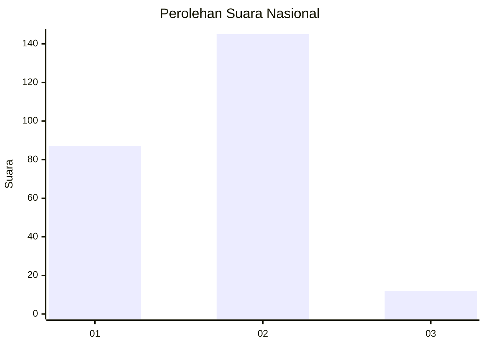
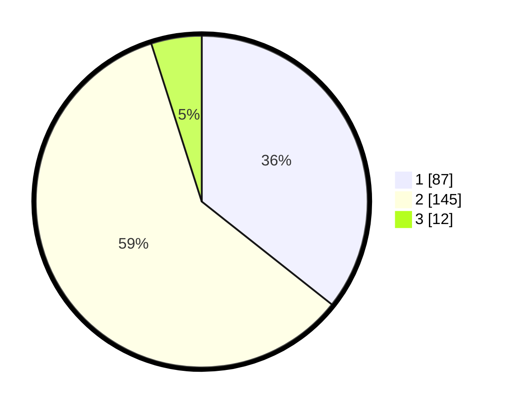

# Hasil

## Grafik

## Tabel

| No. | Nama Paslon    | Suara | Suara (raw) | Persentase |
|:--- |:-------------- | -----:| -----------:| ----------:|
| 1   | ANIES MUHAIMIN | 87    | [87][p-1]   | 35,66      |
| 2   | PRABOWO GIBRAN | 145   | [145][p-2]  | 59,43      |
| 3   | GANJAR MAHFUD  | 12    | [12][p-3]   | 4,92       |

[p-1]: https://github.com/gigit-pemilu/pemilu-2024/blob/main/pilpres/hitung-suara/sub/16-sumatera-selatan/sub/05-musi-rawas/sub/09-muara-beliti/sub/2002-muara-beliti-baru/sub/005-tps/sub/paslon-1.txt
[p-2]: https://github.com/gigit-pemilu/pemilu-2024/blob/main/pilpres/hitung-suara/sub/16-sumatera-selatan/sub/05-musi-rawas/sub/09-muara-beliti/sub/2002-muara-beliti-baru/sub/005-tps/sub/paslon-2.txt
[p-3]: https://github.com/gigit-pemilu/pemilu-2024/blob/main/pilpres/hitung-suara/sub/16-sumatera-selatan/sub/05-musi-rawas/sub/09-muara-beliti/sub/2002-muara-beliti-baru/sub/005-tps/sub/paslon-3.txt

## Foto C Plano

https://sirekap-obj-formc.kpu.go.id/e11c/pemilu/ppwp/16/05/09/20/02/1605092002005-20240214-155243--fd761e39-026b-4ab2-996c-a05a53fe328f.jpg

https://sirekap-obj-formc.kpu.go.id/e11c/pemilu/ppwp/16/05/09/20/02/1605092002005-20240214-223632--c4447d49-7fb4-4b20-95b7-968d259e75a8.jpg

https://sirekap-obj-formc.kpu.go.id/e11c/pemilu/ppwp/16/05/09/20/02/1605092002005-20240214-212808--25bda0db-ecd7-40df-8183-5fb0b68bcf3f.jpg

## Metadata

| Key        | Value               |
| ---------- | ------------------- |
| Time Stamp | 2024-02-20 18:00:00 |

