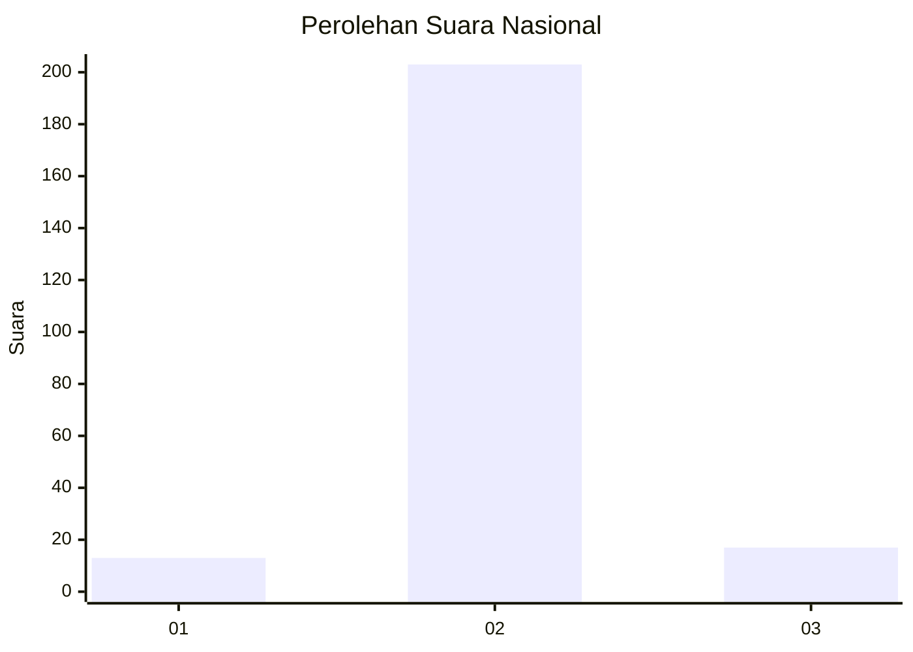
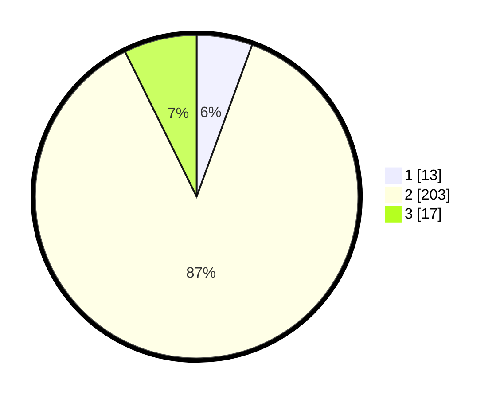

# Hasil

## Grafik

## Tabel

| No. | Nama Paslon    | Suara | Suara (raw) | Persentase |
|:--- |:-------------- | -----:| -----------:| ----------:|
| 1   | ANIES MUHAIMIN | 13    | [13][p-1]   | 5,58       |
| 2   | PRABOWO GIBRAN | 203   | [203][p-2]  | 87,12      |
| 3   | GANJAR MAHFUD  | 17    | [17][p-3]   | 7,30       |

[p-1]: https://github.com/gigit-pemilu/pemilu-2024/blob/main/pilpres/hitung-suara/sub/16-sumatera-selatan/sub/05-musi-rawas/sub/09-muara-beliti/sub/2002-muara-beliti-baru/sub/902-tps/sub/paslon-1.txt
[p-2]: https://github.com/gigit-pemilu/pemilu-2024/blob/main/pilpres/hitung-suara/sub/16-sumatera-selatan/sub/05-musi-rawas/sub/09-muara-beliti/sub/2002-muara-beliti-baru/sub/902-tps/sub/paslon-2.txt
[p-3]: https://github.com/gigit-pemilu/pemilu-2024/blob/main/pilpres/hitung-suara/sub/16-sumatera-selatan/sub/05-musi-rawas/sub/09-muara-beliti/sub/2002-muara-beliti-baru/sub/902-tps/sub/paslon-3.txt

## Foto C Plano

https://sirekap-obj-formc.kpu.go.id/ec32/pemilu/ppwp/16/05/09/20/02/1605092002902-20240215-030644--7a52d3ef-fabd-4aad-ad93-9253643c8af8.jpg

https://sirekap-obj-formc.kpu.go.id/ec32/pemilu/ppwp/16/05/09/20/02/1605092002902-20240215-030453--98ea9bbc-d133-49eb-b0f9-93f250a7701a.jpg

https://sirekap-obj-formc.kpu.go.id/ec32/pemilu/ppwp/16/05/09/20/02/1605092002902-20240215-030532--1b7e08cc-33a5-4577-8aa2-ea1dca14c640.jpg

## Metadata

| Key        | Value               |
| ---------- | ------------------- |
| Time Stamp | 2024-02-24 22:31:28 |

