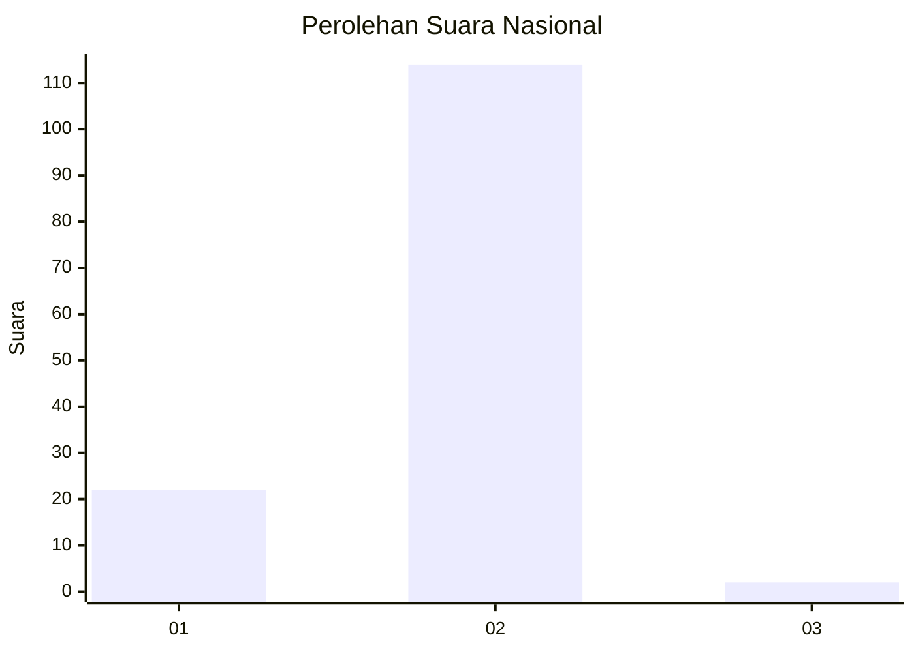
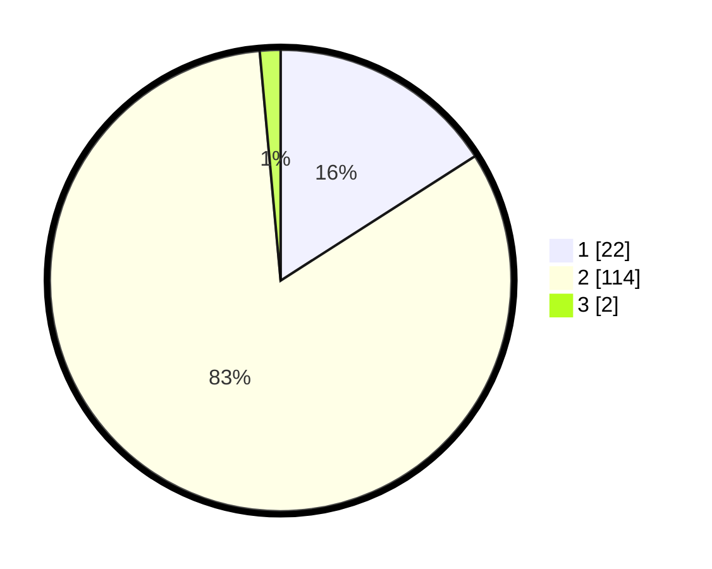

# Hasil

## Grafik

## Tabel

| No. | Nama Paslon    | Suara | Suara (raw) | Persentase |
|:--- |:-------------- | -----:| -----------:| ----------:|
| 1   | ANIES MUHAIMIN | 22    | [22][p-1]   | 15,94      |
| 2   | PRABOWO GIBRAN | 114   | [114][p-2]  | 82,61      |
| 3   | GANJAR MAHFUD  | 2     | [2][p-3]    | 1,45       |

[p-1]: https://github.com/gigit-pemilu/pemilu-2024/blob/main/pilpres/hitung-suara/sub/16-sumatera-selatan/sub/05-musi-rawas/sub/09-muara-beliti/sub/2014-suro/sub/011-tps/sub/paslon-1.txt
[p-2]: https://github.com/gigit-pemilu/pemilu-2024/blob/main/pilpres/hitung-suara/sub/16-sumatera-selatan/sub/05-musi-rawas/sub/09-muara-beliti/sub/2014-suro/sub/011-tps/sub/paslon-2.txt
[p-3]: https://github.com/gigit-pemilu/pemilu-2024/blob/main/pilpres/hitung-suara/sub/16-sumatera-selatan/sub/05-musi-rawas/sub/09-muara-beliti/sub/2014-suro/sub/011-tps/sub/paslon-3.txt

## Foto C Plano

https://sirekap-obj-formc.kpu.go.id/144d/pemilu/ppwp/16/05/09/20/14/1605092014011-20240215-040527--b02e17a3-7ab0-493d-a8a3-5bd93ff00c31.jpg

https://sirekap-obj-formc.kpu.go.id/144d/pemilu/ppwp/16/05/09/20/14/1605092014011-20240215-040550--c640ff52-39fd-4791-af64-8a8abd378be4.jpg

https://sirekap-obj-formc.kpu.go.id/144d/pemilu/ppwp/16/05/09/20/14/1605092014011-20240215-040616--9dfaf37f-2e64-4159-8a10-61752e657937.jpg

## Metadata

| Key        | Value               |
| ---------- | ------------------- |
| Time Stamp | 2024-02-25 01:00:00 |

