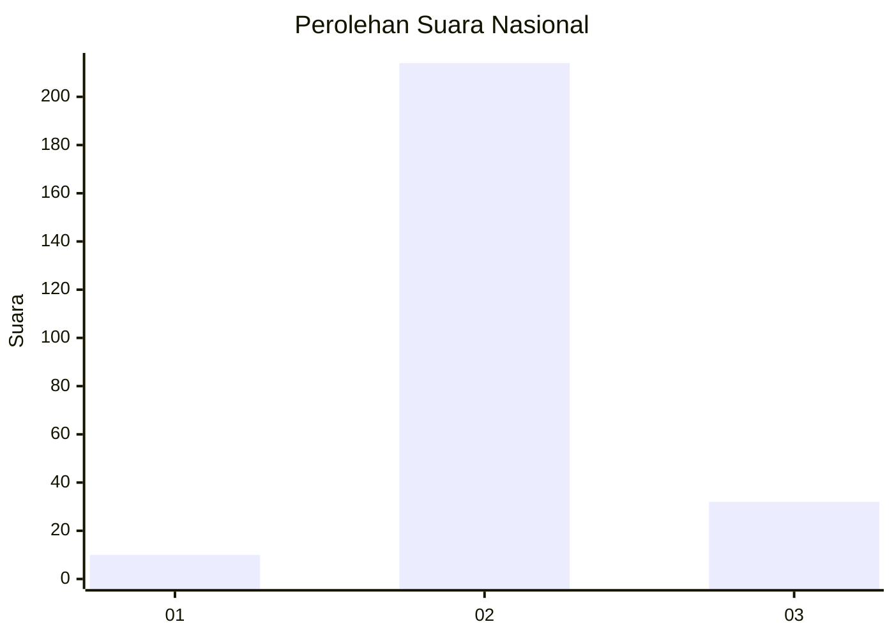
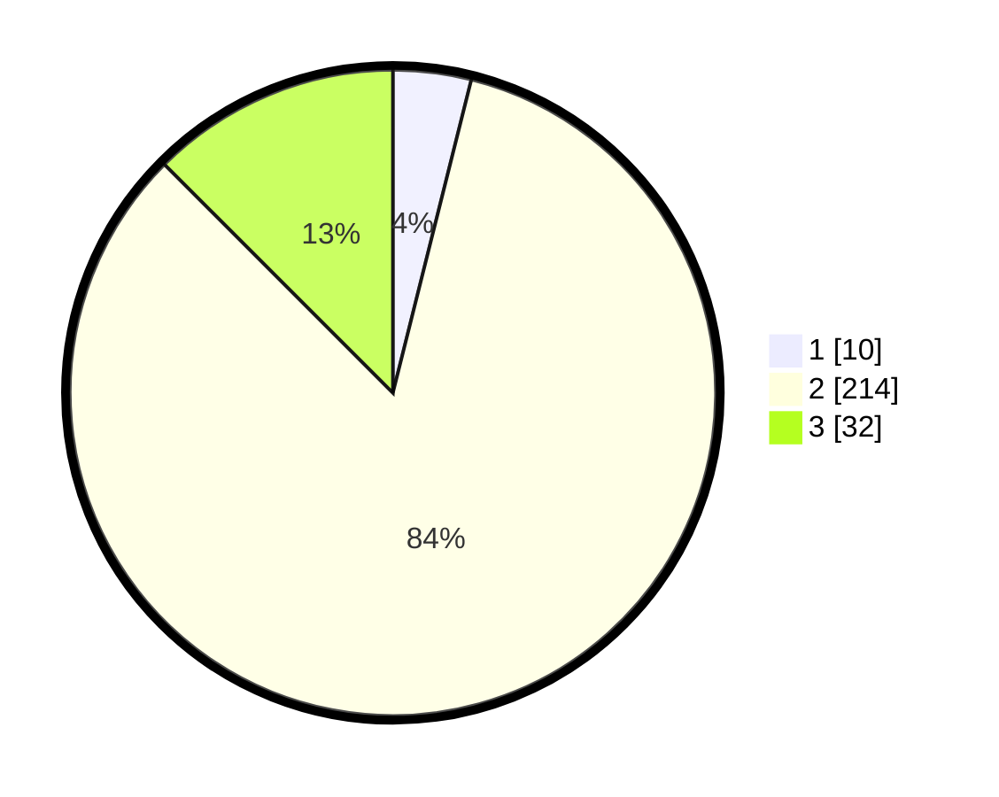

# Hasil

## Grafik

## Tabel

| No. | Nama Paslon    | Suara | Suara (raw) | Persentase |
|:--- |:-------------- | -----:| -----------:| ----------:|
| 1   | ANIES MUHAIMIN | 10    | [10][p-1]   | 3,91       |
| 2   | PRABOWO GIBRAN | 214   | [214][p-2]  | 83,59      |
| 3   | GANJAR MAHFUD  | 32    | [32][p-3]   | 12,50      |

[p-1]: https://github.com/gigit-pemilu/pemilu-2024/blob/main/pilpres/hitung-suara/sub/16-sumatera-selatan/sub/05-musi-rawas/sub/10-stl-ulu-terawas/sub/2011-sri-mulyo/sub/007-tps/sub/paslon-1.txt
[p-2]: https://github.com/gigit-pemilu/pemilu-2024/blob/main/pilpres/hitung-suara/sub/16-sumatera-selatan/sub/05-musi-rawas/sub/10-stl-ulu-terawas/sub/2011-sri-mulyo/sub/007-tps/sub/paslon-2.txt
[p-3]: https://github.com/gigit-pemilu/pemilu-2024/blob/main/pilpres/hitung-suara/sub/16-sumatera-selatan/sub/05-musi-rawas/sub/10-stl-ulu-terawas/sub/2011-sri-mulyo/sub/007-tps/sub/paslon-3.txt

## Foto C Plano

https://sirekap-obj-formc.kpu.go.id/db57/pemilu/ppwp/16/05/10/20/11/1605102011007-20240220-154047--c9817b5c-b680-4427-984d-f3d8f4b2f618.jpg

https://sirekap-obj-formc.kpu.go.id/db57/pemilu/ppwp/16/05/10/20/11/1605102011007-20240220-154441--527e5345-8d6c-4e07-bfcc-736cbb0d5636.jpg

https://sirekap-obj-formc.kpu.go.id/db57/pemilu/ppwp/16/05/10/20/11/1605102011007-20240220-154335--c1376ce6-ae34-4e92-befb-7f4a9b80fb13.jpg

## Metadata

| Key        | Value               |
| ---------- | ------------------- |
| Time Stamp | 2024-02-20 18:00:00 |

