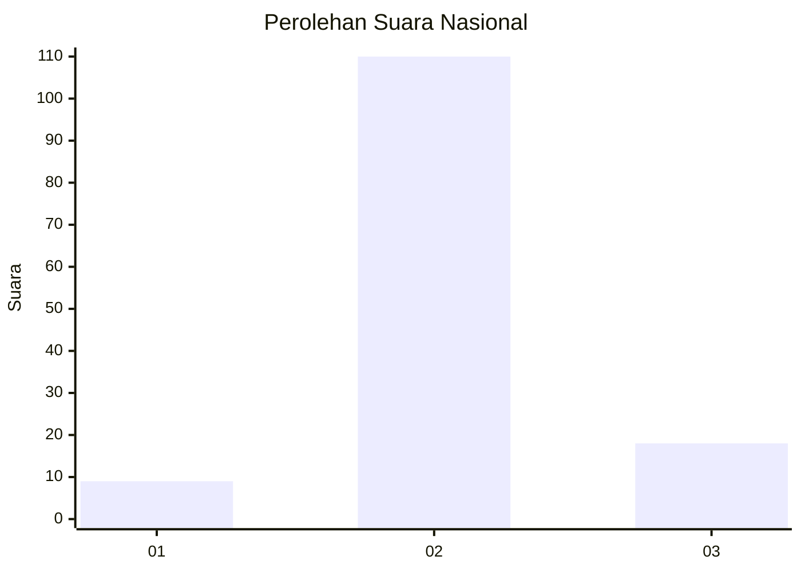
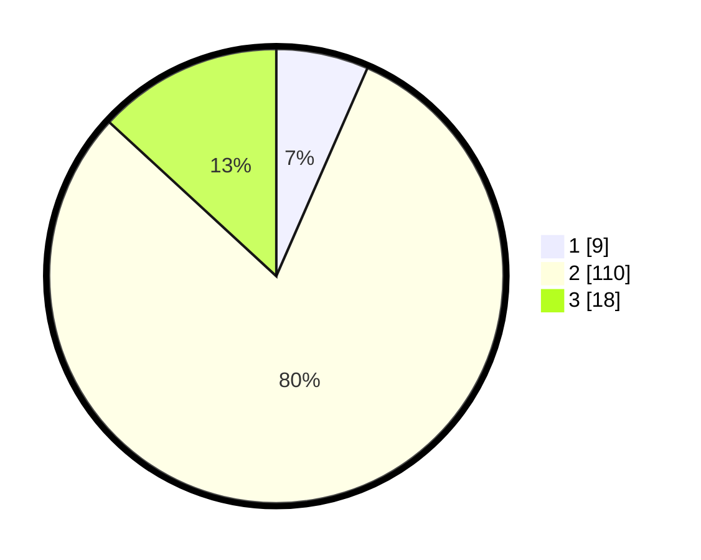

# Hasil

## Grafik

## Tabel

| No. | Nama Paslon    | Suara | Suara (raw) | Persentase |
|:--- |:-------------- | -----:| -----------:| ----------:|
| 1   | ANIES MUHAIMIN | 9     | [9][p-1]    | 6,57       |
| 2   | PRABOWO GIBRAN | 110   | [110][p-2]  | 80,29      |
| 3   | GANJAR MAHFUD  | 18    | [18][p-3]   | 13,14      |

[p-1]: https://github.com/gigit-pemilu/pemilu-2024/blob/main/pilpres/hitung-suara/sub/16-sumatera-selatan/sub/05-musi-rawas/sub/10-stl-ulu-terawas/sub/2014-sukamerindu/sub/003-tps/sub/paslon-1.txt
[p-2]: https://github.com/gigit-pemilu/pemilu-2024/blob/main/pilpres/hitung-suara/sub/16-sumatera-selatan/sub/05-musi-rawas/sub/10-stl-ulu-terawas/sub/2014-sukamerindu/sub/003-tps/sub/paslon-2.txt
[p-3]: https://github.com/gigit-pemilu/pemilu-2024/blob/main/pilpres/hitung-suara/sub/16-sumatera-selatan/sub/05-musi-rawas/sub/10-stl-ulu-terawas/sub/2014-sukamerindu/sub/003-tps/sub/paslon-3.txt

## Foto C Plano

https://sirekap-obj-formc.kpu.go.id/786d/pemilu/ppwp/16/05/10/20/14/1605102014003-20240221-175459--85b78615-cacd-42b0-b5f8-ae60fc139f53.jpg

https://sirekap-obj-formc.kpu.go.id/786d/pemilu/ppwp/16/05/10/20/14/1605102014003-20240221-175353--3619919f-1309-4624-b0ba-f0c1ad20670b.jpg

https://sirekap-obj-formc.kpu.go.id/786d/pemilu/ppwp/16/05/10/20/14/1605102014003-20240221-175546--8aafa5fd-55c5-422d-a2c6-381bb63834c7.jpg

## Metadata

| Key        | Value               |
| ---------- | ------------------- |
| Time Stamp | 2024-02-25 14:00:00 |

